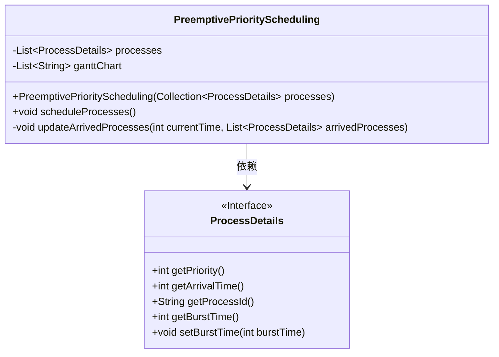
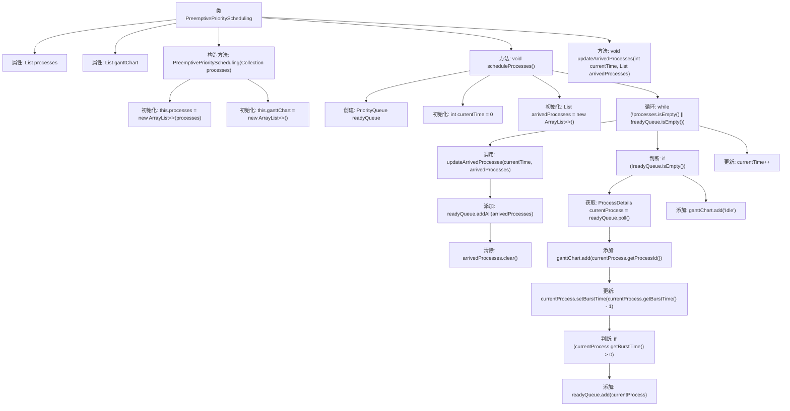

# 基础信息

|      |      |
|------|------|
| 名称 | PreemptivePriorityScheduling |
| 编码语言 | .java |
| 代码路径 | Java/src/main/java/com/thealgorithms/scheduling/PreemptivePriorityScheduling.java |
| 包名 | com.thealgorithms.scheduling |
| 依赖项 | ['com.thealgorithms.devutils.entities.ProcessDetails', 'java.util.ArrayList', 'java.util.Collection', 'java.util.Comparator', 'java.util.List', 'java.util.PriorityQueue'] |
| 概述说明 | 优先调度算法通过优先队列和甘特图实现进程调度。 |

# 说明

优先调度算法通过优先队列实现进程调度，确保高优先级进程优先执行。甘特图用于记录进程的执行顺序，直观展示各进程的调度和执行时间。该算法有效管理进程优先级，提升系统资源利用率和响应效率。

# 类列表 Class Summary

| 名称   | 类型  | 说明 |
|-------|------|-------------|
| PreemptivePriorityScheduling | class | 优先调度算法实现进程调度，使用优先队列和甘特图记录执行顺序。 |

## 类 PreemptivePriorityScheduling

|      |      |
|------|------|
| 访问范围 | public |
| 类型 | class |
| 名称 | PreemptivePriorityScheduling |
| 说明 | 优先调度算法实现进程调度，使用优先队列和甘特图记录执行顺序。 |

### UML类图

**描述：**  
`PreemptivePriorityScheduling` 类实现了一个抢占式优先级调度算法，用于管理进程的执行顺序。该类包含一个进程列表和一个甘特图列表，用于记录进程的执行情况。`scheduleProcesses` 方法通过优先队列和当前时间动态更新到达的进程，并根据优先级和到达时间调度进程执行。`updateArrivedProcesses` 方法用于更新当前时间到达的进程列表。`ProcessDetails` 接口定义了进程的优先级、到达时间、进程ID和剩余执行时间等关键属性。

### 内部方法调用关系图

这段代码实现了一个抢占式优先级调度算法。它通过维护一个优先级队列来处理进程调度，根据进程的优先级和到达时间来决定下一个执行的进程。代码中，`scheduleProcesses`方法负责调度进程，`updateArrivedProcesses`方法用于更新当前时间到达的进程列表。整个流程通过循环不断更新进程状态，直到所有进程执行完毕。

### 字段列表 Field List

| 名称  | 类型  | 说明 |
|-------|-------|------|
| ganttChart | List<String> | 保护性最终字符串列表ganttChart。 |
| processes | List<ProcessDetails> | 受保护的最终进程详情列表。 |

### 方法列表 Method List

| 名称  | 类型  | 说明 |
|-------|-------|------|
| updateArrivedProcesses | void | 方法更新到达进程列表，移除并添加当前时间前到达的进程。 |
| scheduleProcesses | void | 调度进程，按优先级和到达时间排序，更新到达进程，处理并更新甘特图。 |

