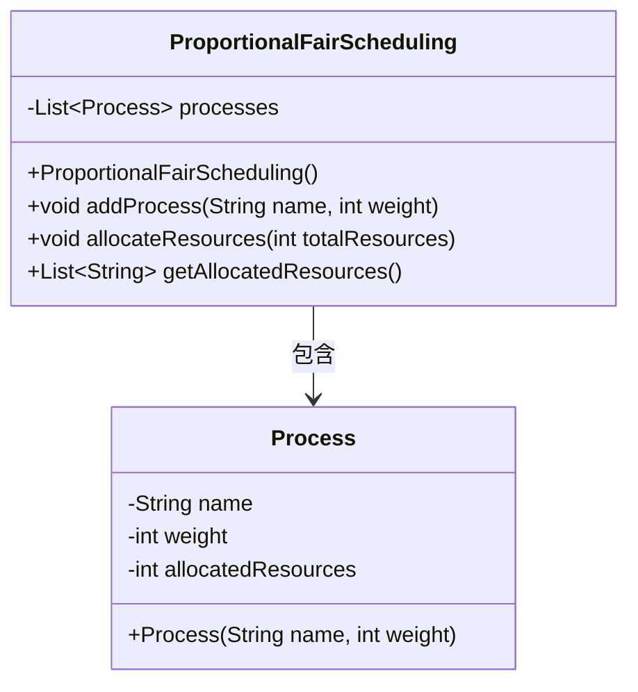
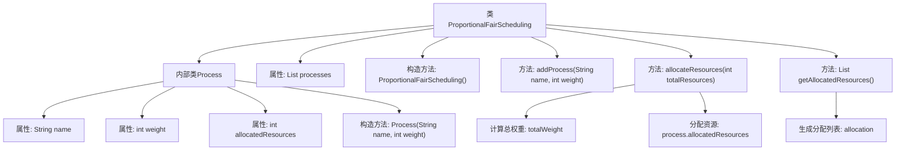

# 基础信息

|      |      |
|------|------|
| 名称 | ProportionalFairScheduling |
| 编码语言 | .java |
| 代码路径 | Java/src/main/java/com/thealgorithms/scheduling/ProportionalFairScheduling.java |
| 包名 | com.thealgorithms.scheduling |
| 依赖项 | ['java.util.ArrayList', 'java.util.List'] |
| 概述说明 | 比例公平调度算法按权重分配资源。 |

# 说明

比例公平调度算法是一种资源分配机制，旨在根据各任务的权重公平地分配系统资源。该算法通过动态调整资源分配比例，确保高权重任务获得更多资源，同时兼顾低权重任务的基本需求。其核心在于实时计算各任务的资源需求与权重比例，并根据计算结果进行资源调度。这种算法广泛应用于云计算、网络带宽分配等领域，能够有效提高资源利用率，确保系统运行的公平性和效率。

# 类列表 Class Summary

| 名称   | 类型  | 说明 |
|-------|------|-------------|
| ProportionalFairScheduling | class | 比例公平调度算法实现资源按权重分配。 |

## 类 ProportionalFairScheduling

|      |      |
|------|------|
| 访问范围 | public final |
| 类型 | class |
| 名称 | ProportionalFairScheduling |
| 说明 | 比例公平调度算法实现资源按权重分配。 |

### UML类图

**描述：**  
`ProportionalFairScheduling` 类实现了一个比例公平调度算法，用于分配资源给多个进程。它包含一个内部类 `Process`，用于表示每个进程的名称、权重和已分配的资源。`ProportionalFairScheduling` 类提供了添加进程、分配资源和获取已分配资源列表的方法。资源分配基于每个进程的权重占总权重的比例进行计算。

### 内部方法调用关系图

这段代码实现了一个比例公平调度算法，用于分配资源给多个进程。代码的核心是通过计算每个进程的权重占总权重的比例，然后按比例分配资源。流程图展示了类的结构、内部类的属性、构造方法以及主要方法的调用关系。`allocateResources`方法负责计算和分配资源，而`getAllocatedResources`方法则生成并返回资源分配列表。

### 字段列表 Field List

| 名称  | 类型  | 说明 |
|-------|-------|------|
| processes | List<Process> | 私有不可变进程列表。 |

### 方法列表 Method List

| 名称  | 类型  | 说明 |
|-------|-------|------|
| allocateResources | void | 根据权重分配资源给所有进程。 |
| addProcess | void | 添加一个名为name、权重为weight的进程到processes列表。 |
| getAllocatedResources | List<String> | 方法获取所有进程及其分配的资源列表。 |

