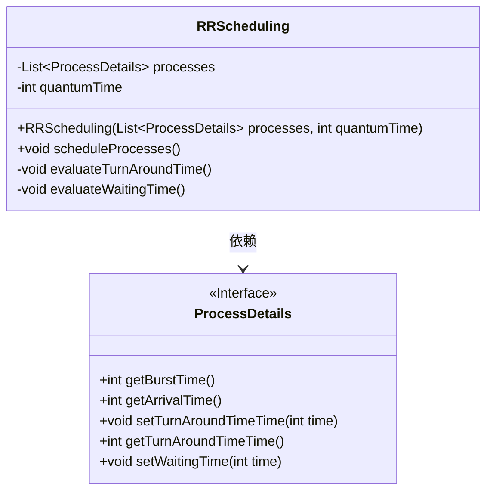
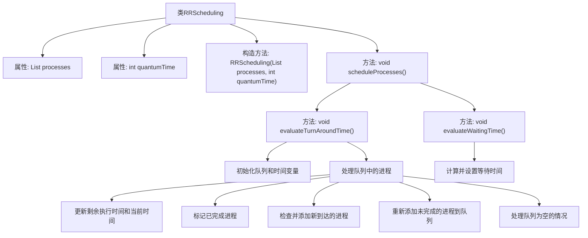

# 基础信息

|      |      |
|------|------|
| 名称 | RRScheduling |
| 编码语言 | .java |
| 代码路径 | Java/src/main/java/com/thealgorithms/scheduling/RRScheduling.java |
| 包名 | com.thealgorithms.scheduling |
| 依赖项 | ['com.thealgorithms.devutils.entities.ProcessDetails', 'java.util.Arrays', 'java.util.LinkedList', 'java.util.List', 'java.util.Queue'] |
| 概述说明 | RR调度算法实现，计算进程周转时间和等待时间。 |

# 说明

RR调度算法是一种基于时间片轮转的进程调度方法，旨在公平分配CPU资源。该算法通过为每个进程分配固定的时间片，确保所有进程都能获得执行机会。实现过程中，首先需要定义时间片大小，然后按照到达顺序将进程加入就绪队列。调度器依次从队列中取出进程，分配时间片执行。若进程在时间片内未完成，则将其重新加入队列尾部。计算周转时间时，记录进程从进入系统到完成的总时间；计算等待时间时，记录进程在就绪队列中等待CPU的总时间。该算法适用于多任务环境，能够有效减少长进程的等待时间。

# 类列表 Class Summary

| 名称   | 类型  | 说明 |
|-------|------|-------------|
| RRScheduling | class | RR调度算法实现，计算进程周转时间和等待时间。 |

## 类 RRScheduling

|      |      |
|------|------|
| 访问范围 | public |
| 类型 | class |
| 名称 | RRScheduling |
| 说明 | RR调度算法实现，计算进程周转时间和等待时间。 |

### UML类图

**描述：**  
`RRScheduling` 类实现了基于时间片的轮转调度算法，用于调度一组进程。它包含两个主要方法：`evaluateTurnAroundTime` 和 `evaluateWaitingTime`，分别用于计算每个进程的周转时间和等待时间。`ProcessDetails` 接口定义了进程的基本属性和方法，`RRScheduling` 类依赖于该接口来获取和设置进程的相关信息。调度算法通过维护一个队列来管理进程的执行顺序，并根据时间片和剩余执行时间进行调度。

### 内部方法调用关系图

该流程图描述了`RRScheduling`类的结构及其主要方法的执行流程。`RRScheduling`类用于实现轮转调度算法，包含进程列表和时间片长度两个属性。`scheduleProcesses`方法依次调用`evaluateTurnAroundTime`和`evaluateWaitingTime`方法，分别计算进程的周转时间和等待时间。`evaluateTurnAroundTime`方法通过队列管理进程的执行顺序，处理时间片的分配和进程的完成状态。`evaluateWaitingTime`方法则根据周转时间和执行时间计算每个进程的等待时间。整个流程确保了调度算法的正确执行。

### 字段列表 Field List

| 名称  | 类型  | 说明 |
|-------|-------|------|
| quantumTime | int | 定义私有整型变量quantumTime。 |
| processes | List<ProcessDetails> | 私有变量processes存储ProcessDetails类型的列表。 |

### 方法列表 Method List

| 名称  | 类型  | 说明 |
|-------|-------|------|
| scheduleProcesses | void | 该方法用于调度进程，评估周转时间和等待时间。 |
| evaluateTurnAroundTime | void | 该方法计算进程周转时间，使用队列和剩余执行时间进行调度。 |
| evaluateWaitingTime | void | 计算各进程等待时间，等于周转时间减去执行时间。 |

