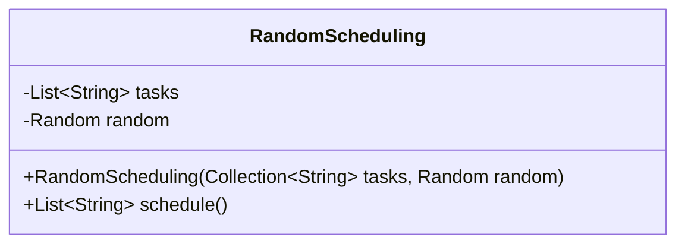
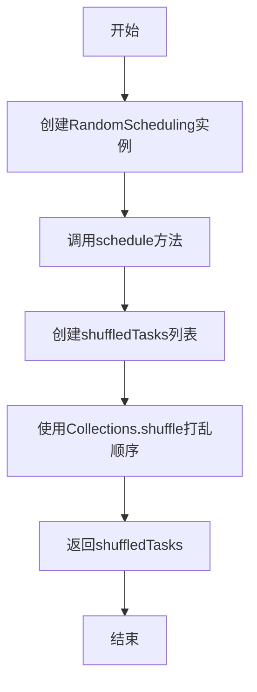
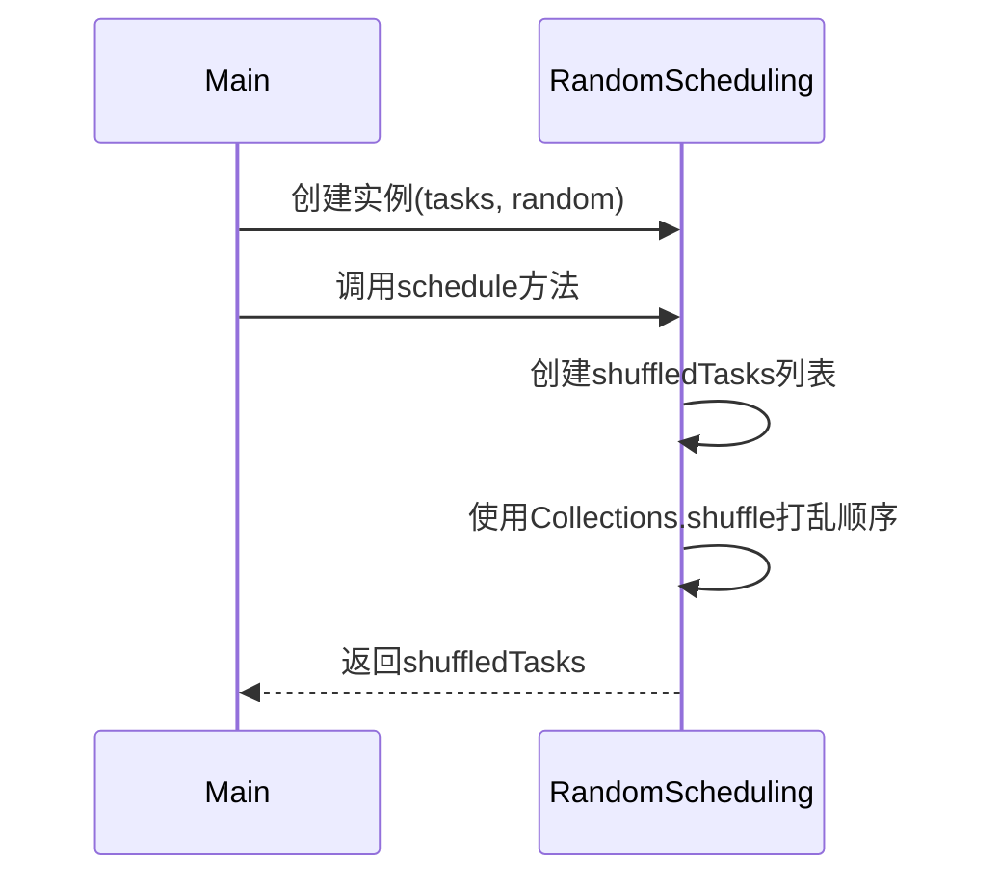
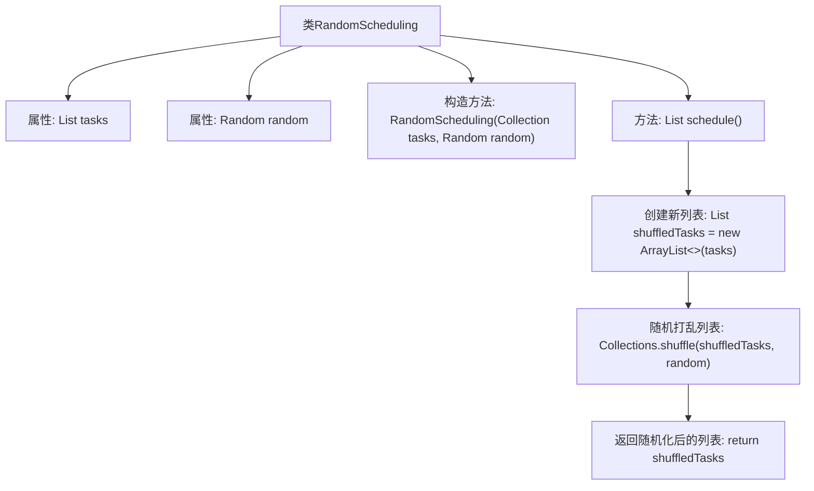

# 基础信息

|      |      |
|------|------|
| 名称 | RandomScheduling |
| 编码语言 | .java |
| 代码路径 | Java/src/main/java/com/thealgorithms/scheduling/RandomScheduling.java |
| 包名 | com.thealgorithms.scheduling |
| 依赖项 | ['java.util.ArrayList', 'java.util.Collection', 'java.util.Collections', 'java.util.List', 'java.util.Random'] |
| 概述说明 | 随机调度类接收任务集合和随机数生成器，返回随机排序的任务列表。 |

# 说明

随机调度类是一个用于处理任务集合的工具，它接受一组任务和一个随机数生成器作为输入。该类的核心功能是通过随机数生成器对任务集合进行随机排序，最终返回一个经过随机排列的任务列表。这种随机化处理确保了任务执行顺序的不可预测性，适用于需要随机调度任务的场景。

# 类列表 Class Summary

| 名称   | 类型  | 说明 |
|-------|------|-------------|
| RandomScheduling | class | 随机调度类，接受任务集合和随机数生成器，返回随机排序的任务列表。 |

## 类 RandomScheduling

|      |      |
|------|------|
| 访问范围 | public final |
| 类型 | class |
| 名称 | RandomScheduling |
| 说明 | 随机调度类，接受任务集合和随机数生成器，返回随机排序的任务列表。 |

### UML类图

### 描述
`RandomScheduling` 类用于随机调度任务列表。它包含一个任务列表和一个随机数生成器。通过 `schedule` 方法，任务列表会被随机打乱顺序，并返回打乱后的列表。该类的主要功能是确保任务执行的顺序是随机的，适用于需要随机调度任务的场景。

### 内部方法调用关系图

该流程图描述了`RandomScheduling`类的结构和主要方法调用关系。类包含两个属性`tasks`和`random`，以及一个构造方法和一个`schedule`方法。`schedule`方法通过创建一个新的任务列表并对其进行随机打乱，最终返回随机化后的任务列表。该流程图清晰地展示了类内部方法的调用顺序和数据流动。

### 字段列表 Field List

| 名称  | 类型  | 说明 |
|-------|-------|------|
| tasks | List<String> | 私有不可变字符串任务列表。 |
| random | Random | 私有且不可变的随机数生成器实例。 |

### 方法列表 Method List

| 名称  | 类型  | 说明 |
|-------|-------|------|
| schedule | List<String> | 该方法返回一个随机打乱的任务列表。 |

