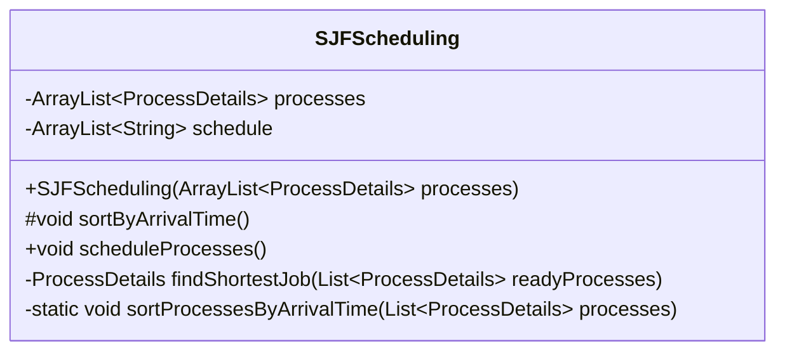
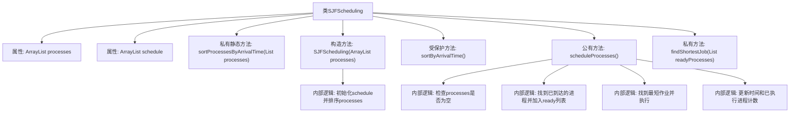

# 基础信息

|      |      |
|------|------|
| 名称 | SJFScheduling |
| 编码语言 | .java |
| 代码路径 | Java/src/main/java/com/thealgorithms/scheduling/SJFScheduling.java |
| 包名 | com.thealgorithms.scheduling |
| 依赖项 | ['com.thealgorithms.devutils.entities.ProcessDetails', 'java.util.ArrayList', 'java.util.List'] |
| 概述说明 | SJFScheduling类实现短作业优先调度，按到达时间排序执行最短作业。 |

# 说明

SJFScheduling类实现了短作业优先调度算法，该算法首先根据作业的到达时间进行排序，然后选择执行时间最短的作业优先执行。这种方法旨在优化系统的响应时间和吞吐量，确保短作业能够尽快完成，从而提高整体调度效率。

# 类列表 Class Summary

| 名称   | 类型  | 说明 |
|-------|------|-------------|
| SJFScheduling | class | SJFScheduling类实现短作业优先调度算法，按到达时间排序并执行最短作业。 |

## 类 SJFScheduling

|      |      |
|------|------|
| 访问范围 | public |
| 类型 | class |
| 名称 | SJFScheduling |
| 说明 | SJFScheduling类实现短作业优先调度算法，按到达时间排序并执行最短作业。 |

### UML类图

类图描述：  
`SJFScheduling` 类实现了一个短作业优先（SJF）调度算法，用于管理进程的执行顺序。类中包含两个主要成员变量：`processes` 存储待调度的进程列表，`schedule` 存储最终的调度顺序。类提供了构造方法 `SJFScheduling` 用于初始化进程列表并排序，`scheduleProcesses` 方法用于执行调度逻辑，`findShortestJob` 方法用于找到最短作业，`sortByArrivalTime` 和 `sortProcessesByArrivalTime` 方法用于按到达时间排序进程。

### 内部方法调用关系图

这段代码实现了一个最短作业优先（SJF）调度算法。`SJFScheduling`类包含两个主要属性：`processes`存储所有进程，`schedule`存储调度顺序。代码通过`sortProcessesByArrivalTime`方法按到达时间排序进程，`scheduleProcesses`方法实现调度逻辑，`findShortestJob`方法找到最短作业并执行。流程图展示了类内部方法调用关系和调度逻辑的执行顺序。

### 字段列表 Field List

| 名称  | 类型  | 说明 |
|-------|-------|------|
| processes | ArrayList<ProcessDetails> | 保护类型为ArrayList的进程详情列表。 |
| schedule | ArrayList<String> | 保护类型为ArrayList的字符串列表schedule。 |

### 方法列表 Method List

| 名称  | 类型  | 说明 |
|-------|-------|------|
| sortByArrivalTime | void | 按到达时间排序进程。 |
| sortProcessesByArrivalTime | void | 按到达时间排序进程列表。 |
| findShortestJob | ProcessDetails | 查找就绪进程中执行时间最短的任务。 |
| scheduleProcesses | void | 调度进程，按最短作业优先执行，更新时间和完成状态。 |

