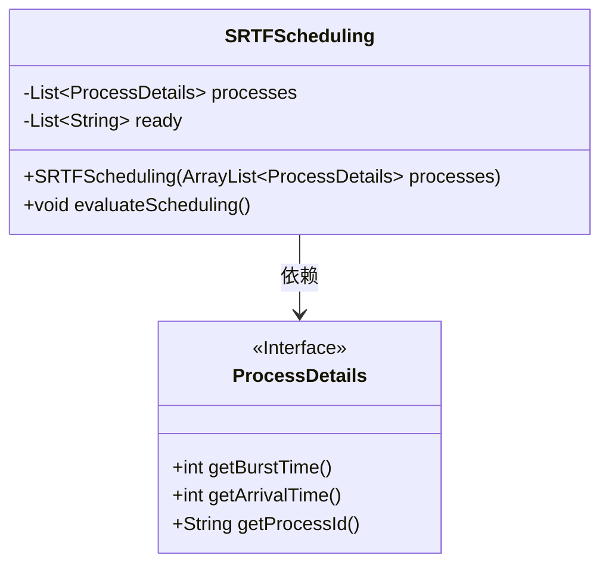
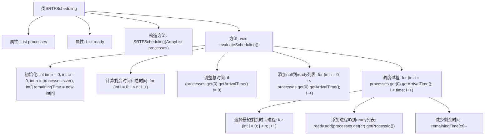

# 基础信息

|      |      |
|------|------|
| 名称 | SRTFScheduling |
| 编码语言 | .java |
| 代码路径 | Java/src/main/java/com/thealgorithms/scheduling/SRTFScheduling.java |
| 包名 | com.thealgorithms.scheduling |
| 依赖项 | ['com.thealgorithms.devutils.entities.ProcessDetails', 'java.util.ArrayList', 'java.util.List'] |
| 概述说明 | SRTFScheduling类实现最短剩余时间优先调度算法，进行进程调度计算与执行。 |

# 说明

SRTFScheduling类实现了最短剩余时间优先调度算法，该算法用于计算并执行进程调度。最短剩余时间优先调度是一种动态优先级调度方法，总是选择剩余执行时间最短的进程进行调度，以确保系统资源的高效利用和进程的快速完成。通过该类，系统能够根据进程的剩余执行时间动态调整调度顺序，从而优化整体调度效率。

# 类列表 Class Summary

| 名称   | 类型  | 说明 |
|-------|------|-------------|
| SRTFScheduling | class | SRTFScheduling类实现最短剩余时间优先调度算法，计算并执行进程调度。 |

## 类 SRTFScheduling

|      |      |
|------|------|
| 访问范围 | public |
| 类型 | class |
| 名称 | SRTFScheduling |
| 说明 | SRTFScheduling类实现最短剩余时间优先调度算法，计算并执行进程调度。 |

### UML类图

**描述：**

`SRTFScheduling` 类实现了最短剩余时间优先（SRTF）调度算法。它包含一个 `ProcessDetails` 接口的列表，用于存储进程的详细信息，以及一个 `ready` 列表，用于记录每个时间单位执行的进程ID。`evaluateScheduling` 方法通过计算每个进程的剩余时间，并根据剩余时间动态选择下一个执行的进程，最终生成调度结果。`ProcessDetails` 接口定义了获取进程的突发时间、到达时间和进程ID的方法，供 `SRTFScheduling` 类使用。

### 内部方法调用关系图

这段代码实现了一个最短剩余时间优先（SRTF）调度算法。首先，代码初始化了时间和进程剩余时间数组，然后计算了所有进程的总执行时间。如果第一个进程的到达时间不为0，代码会调整总时间并在ready列表中添加null。接着，代码在每个时间单位内选择剩余时间最短的进程执行，并将其ID添加到ready列表中，同时减少该进程的剩余时间。整个过程模拟了SRTF调度算法的执行流程。

### 字段列表 Field List

| 名称  | 类型  | 说明 |
|-------|-------|------|
| processes | List<ProcessDetails> | 受保护的进程详情列表变量。 |
| ready | List<String> | 保护类型为List<String>的ready变量。 |

### 方法列表 Method List

| 名称  | 类型  | 说明 |
|-------|-------|------|
| evaluateScheduling | void | 方法评估进程调度，计算剩余时间，按时间单位执行进程。 |

