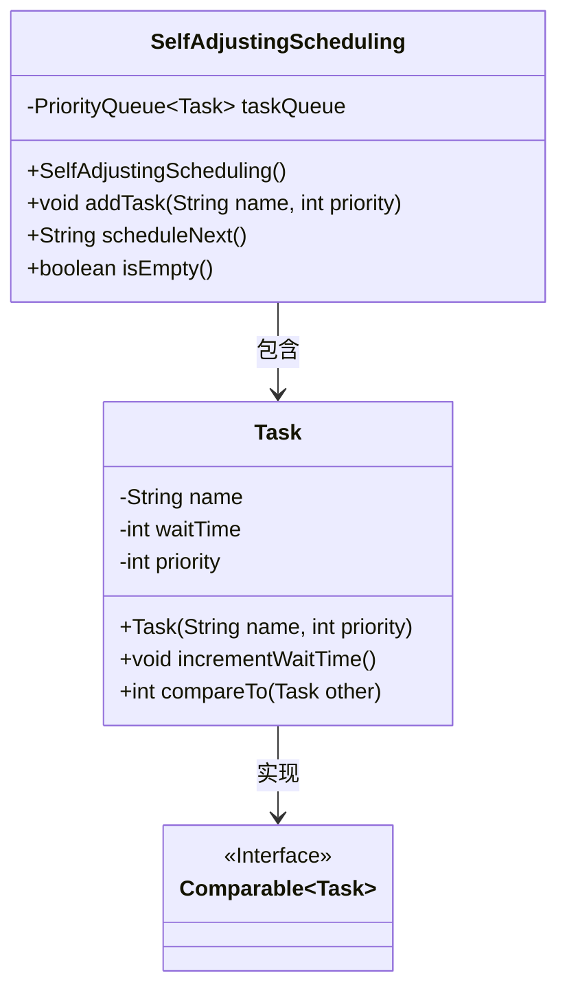
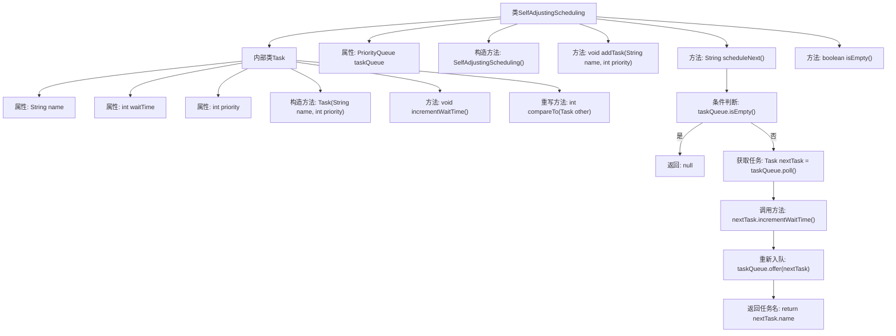

# 基础信息

|      |      |
|------|------|
| 名称 | SelfAdjustingScheduling |
| 编码语言 | .java |
| 代码路径 | Java/src/main/java/com/thealgorithms/scheduling/SelfAdjustingScheduling.java |
| 包名 | com.thealgorithms.scheduling |
| 依赖项 | ['java.util.PriorityQueue'] |
| 概述说明 | 自调整调度类含任务队列，支持任务添加和调度。 |

# 说明

自调整调度类是一个用于管理任务队列的组件，支持添加新任务和调度下一个任务。它通过内部机制自动调整任务执行顺序，确保任务按照优先级或特定规则进行处理。该调度类适用于需要动态管理任务执行顺序的场景，能够有效提高任务处理的效率和灵活性。

# 类列表 Class Summary

| 名称   | 类型  | 说明 |
|-------|------|-------------|
| SelfAdjustingScheduling | class | 自调整调度类，包含任务队列，支持添加任务和调度下一个任务。 |

## 类 SelfAdjustingScheduling

|      |      |
|------|------|
| 访问范围 | public final |
| 类型 | class |
| 名称 | SelfAdjustingScheduling |
| 说明 | 自调整调度类，包含任务队列，支持添加任务和调度下一个任务。 |

### UML类图

这段代码定义了一个名为 `SelfAdjustingScheduling` 的类，用于实现一种自适应的任务调度机制。该类内部包含一个 `Task` 类，表示待调度的任务，任务具有名称、等待时间和优先级属性。`SelfAdjustingScheduling` 类通过 `PriorityQueue` 来管理任务队列，并根据任务的优先级和等待时间动态调整任务的执行顺序。`Task` 类实现了 `Comparable` 接口，以便在优先队列中进行排序。`SelfAdjustingScheduling` 类提供了添加任务、调度下一个任务以及检查队列是否为空的方法。

### 内部方法调用关系图

这段代码定义了一个名为`SelfAdjustingScheduling`的类，用于实现一种自调整的任务调度机制。内部类`Task`表示任务，包含任务名称、等待时间和优先级等属性，并实现了`Comparable`接口以便在优先级队列中进行比较。`SelfAdjustingScheduling`类通过优先级队列管理任务，提供添加任务、调度下一个任务以及检查队列是否为空的功能。调度任务时，任务的等待时间会增加，并重新计算优先级以确保任务的公平调度。

### 字段列表 Field List

| 名称  | 类型  | 说明 |
|-------|-------|------|
| taskQueue | PriorityQueue<Task> | 私有优先队列存储任务对象。 |

### 方法列表 Method List

| 名称  | 类型  | 说明 |
|-------|-------|------|
| isEmpty | boolean | 检查任务队列是否为空。 |
| scheduleNext | String | 调度任务队列中的下一个任务，更新等待时间并返回任务名称。 |
| addTask | void | 添加任务到队列，包含任务名称和优先级。 |

