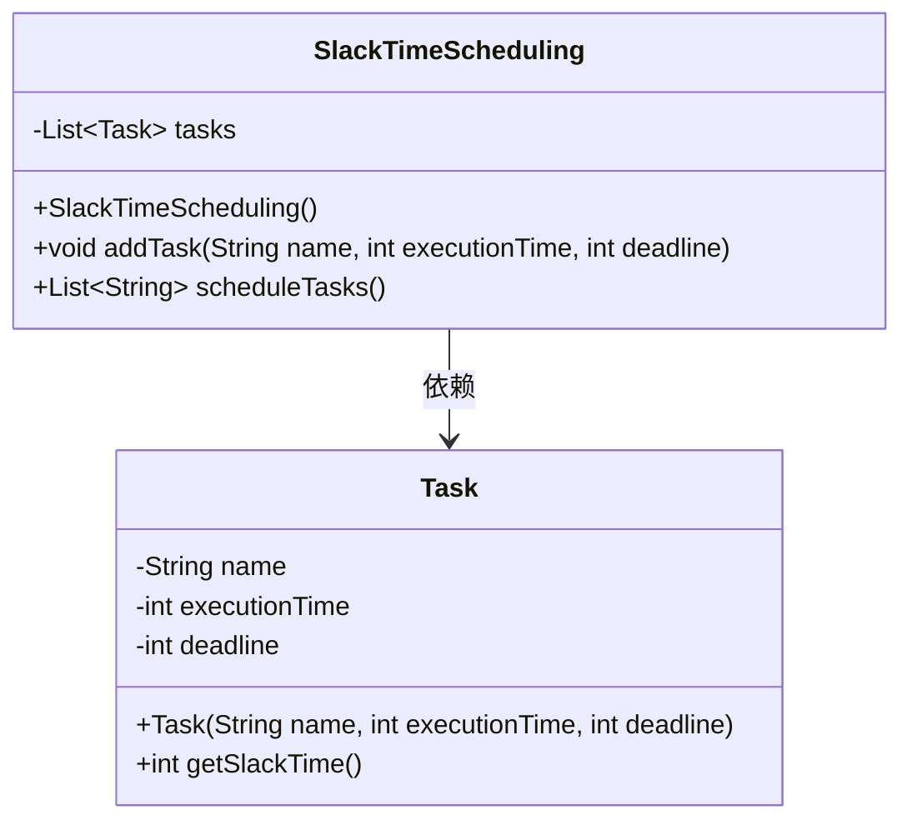
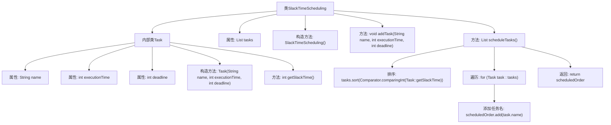

# 基础信息

|      |      |
|------|------|
| 名称 | SlackTimeScheduling |
| 编码语言 | .java |
| 代码路径 | Java/src/main/java/com/thealgorithms/scheduling/SlackTimeScheduling.java |
| 包名 | com.thealgorithms.scheduling |
| 依赖项 | ['java.util.ArrayList', 'java.util.Comparator', 'java.util.List'] |
| 概述说明 | SlackTimeScheduling类按任务松弛时间排序并调度任务。 |

# 说明

SlackTimeScheduling类的主要功能是根据任务的松弛时间进行排序和调度。松弛时间是指任务在截止时间前可以延迟的时间，通过计算任务的松弛时间，该类能够合理安排任务的执行顺序，从而优化任务调度过程。这种调度方法有助于确保任务在截止时间内完成，同时提高系统的整体效率。

# 类列表 Class Summary

| 名称   | 类型  | 说明 |
|-------|------|-------------|
| SlackTimeScheduling | class | SlackTimeScheduling类用于根据任务松弛时间排序并调度任务。 |

## 类 SlackTimeScheduling

|      |      |
|------|------|
| 访问范围 | public |
| 类型 | class |
| 名称 | SlackTimeScheduling |
| 说明 | SlackTimeScheduling类用于根据任务松弛时间排序并调度任务。 |

### UML类图

类图描述：`SlackTimeScheduling` 类用于调度任务，其内部包含一个 `Task` 类的列表。`Task` 类表示单个任务，包含任务名称、执行时间和截止时间，并提供了计算松弛时间的方法。`SlackTimeScheduling` 类提供了添加任务和基于松弛时间调度任务的功能，最终返回按松弛时间排序的任务执行顺序。

### 内部方法调用关系图

这段代码定义了一个`SlackTimeScheduling`类，用于调度任务。内部类`Task`包含任务名称、执行时间和截止时间，并计算任务的松弛时间。`SlackTimeScheduling`类通过`addTask`方法添加任务，并通过`scheduleTasks`方法根据任务的松弛时间对任务进行排序，返回任务的执行顺序。流程图展示了类的结构和方法调用关系，清晰地描述了任务的添加和调度过程。

### 字段列表 Field List

| 名称  | 类型  | 说明 |
|-------|-------|------|
| tasks | List<Task> | 私有任务列表变量tasks。 |

### 方法列表 Method List

| 名称  | 类型  | 说明 |
|-------|-------|------|
| addTask | void | 添加任务，包含名称、执行时间和截止日期。 |
| scheduleTasks | List<String> | 按任务松弛时间排序并返回任务名称列表。 |

