# 基础信息

|      |      |
|------|------|
| 名称 | scheduling |
| 编码语言 | .java |
| 代码路径 | Java/src/main/java/com/thealgorithms/scheduling |
| 包名 | Java.src.main.java.com.thealgorithms.scheduling |
| 概述说明 | 多种进程调度算法实现，优化系统资源利用和任务执行效率。 |

# 说明

## 概述
该代码模块实现了一系列进程调度算法，涵盖了多种调度策略，旨在优化系统资源的分配和进程的执行顺序，以提高系统的响应速度、吞吐量和资源利用率。模块中的各个类分别实现了不同的调度算法，包括先来先服务（FCFS）、短作业优先（SJF）、优先级调度、时间片轮转（RR）、最高响应比优先（HRRN）、多级反馈队列（MLFQ）等。这些算法通过不同的策略处理进程调度，模拟进程的执行过程，并计算相关的性能指标，如等待时间、周转时间等，以帮助系统更高效地管理进程调度。

## 主要业务场景
该模块的主要业务场景包括：
1. **进程调度优化**：通过实现多种进程调度算法，模块能够根据不同的需求优化进程的执行顺序，减少进程的等待时间和周转时间，提升系统的响应速度和吞吐量。
2. **资源分配管理**：模块中的各个类能够根据进程的优先级、执行时间、剩余时间等属性动态调整资源分配，确保高优先级或短作业能够优先执行，从而提高资源利用率。
3. **系统性能提升**：通过优化进程调度顺序，模块能够有效减少进程的等待时间和周转时间，从而提高系统的整体性能，特别是在高并发进程调度场景下表现尤为突出。
4. **多种调度策略支持**：模块支持多种调度策略，用户可以根据具体需求选择合适的算法，例如FCFS、SJF、优先级调度、RR、HRRN、MLFQ等，以满足不同的性能优化需求。
5. **公平性和动态调整**：模块中的一些算法（如比例公平调度、老化调度等）通过动态调整进程的优先级或资源分配比例，确保系统在资源分配上的公平性，并避免长时间未执行的进程被忽略。

该模块适用于需要高效处理进程调度的系统，如操作系统、实时系统、云计算平台等，能够显著提升系统的调度效率和资源利用率。

### 包内部结构视图

```mermaid
graph TD
    scheduling --> FCFSScheduling.java
    scheduling --> SJFScheduling.java
    scheduling --> NonPreemptivePriorityScheduling.java
    scheduling --> PreemptivePriorityScheduling.java
    scheduling --> RRScheduling.java
    scheduling --> ProportionalFairScheduling.java
    scheduling --> GangScheduling.java
    scheduling --> HighestResponseRatioNextScheduling.java
    scheduling --> RandomScheduling.java
    scheduling --> JobSchedulingWithDeadline.java
    scheduling --> MLFQScheduler.java
    scheduling --> SelfAdjustingScheduling.java
    scheduling --> SlackTimeScheduling.java
    scheduling --> LotteryScheduling.java
    scheduling --> diskscheduling
    scheduling --> EDFScheduling.java
    scheduling --> FairShareScheduling.java
    scheduling --> AgingScheduling.java
    scheduling --> MultiAgentScheduling.java
    scheduling --> SRTFScheduling.java
    diskscheduling --> ScanScheduling.java
    diskscheduling --> LookScheduling.java
    diskscheduling --> CircularLookScheduling.java
    diskscheduling --> SSFScheduling.java
    diskscheduling --> CircularScanScheduling.java
```

该流程图展示了调度算法模块的层级结构，其中`scheduling`文件夹下包含了多种调度算法的实现文件，如`FCFSScheduling.java`、`SJFScheduling.java`等，同时还有一个`diskscheduling`子文件夹，专门用于磁盘调度算法的实现，如`ScanScheduling.java`和`LookScheduling.java`。整个结构清晰地反映了调度算法模块的组织方式。

# 文件列表 File List

| 名称   | 类型  | 说明 |
|-------|------|-------------|
| [MultiAgentScheduling.java](MultiAgentScheduling.md) | file | 多代理调度类支持代理添加、任务分配及计划获取。 |
| [SelfAdjustingScheduling.java](SelfAdjustingScheduling.md) | file | 自调整调度类含任务队列，支持任务添加和调度。 |
| [HighestResponseRatioNextScheduling.java](HighestResponseRatioNextScheduling.md) | file | 实现最高响应比优先调度算法，计算进程周转时间和等待时间。 |
| [PreemptivePriorityScheduling.java](PreemptivePriorityScheduling.md) | file | 优先调度算法通过优先队列和甘特图实现进程调度。 |
| [SJFScheduling.java](SJFScheduling.md) | file | SJFScheduling类实现短作业优先调度，按到达时间排序执行最短作业。 |
| [SRTFScheduling.java](SRTFScheduling.md) | file | SRTFScheduling类实现最短剩余时间优先调度算法，进行进程调度计算与执行。 |
| [AgingScheduling.java](AgingScheduling.md) | file | AgingScheduling类实现任务调度，任务优先级随等待时间增加。 |
| [FairShareScheduling.java](FairShareScheduling.md) | file | 公平调度类实现用户资源分配，支持添加用户、任务及按权重分配资源。 |
| [EDFScheduling.java](EDFScheduling.md) | file | EDFScheduling类实现最早截止期优先调度，模拟进程执行并计算时间。 |
| [LotteryScheduling.java](LotteryScheduling.md) | file | 彩票调度算法随机选进程，计算等待与周转时间。 |
| [SlackTimeScheduling.java](SlackTimeScheduling.md) | file | SlackTimeScheduling类按任务松弛时间排序并调度任务。 |
| [MLFQScheduler.java](MLFQScheduler.md) | file | MLFQScheduler实现多级反馈队列调度，支持进程优先级和时间片调整。Process类包含进程信息和执行功能。 |
| [JobSchedulingWithDeadline.java](JobSchedulingWithDeadline.md) | file | JobSchedulingWithDeadline类按利润最大化调度任务，考虑到达和截止时间。 |
| [RandomScheduling.java](RandomScheduling.md) | file | 随机调度类接收任务集合和随机数生成器，返回随机排序的任务列表。 |
| [GangScheduling.java](GangScheduling.md) | file | GangScheduling类管理任务组及任务，支持添加组、任务和获取计划。 |
| [ProportionalFairScheduling.java](ProportionalFairScheduling.md) | file | 比例公平调度算法按权重分配资源。 |
| [RRScheduling.java](RRScheduling.md) | file | RR调度算法实现，计算进程周转时间和等待时间。 |
| [NonPreemptivePriorityScheduling.java](NonPreemptivePriorityScheduling.md) | file | 非抢占式优先级调度算法，按优先级和到达时间调度进程，计算平均等待和周转时间。 |
| [FCFSScheduling.java](FCFSScheduling.md) | file | FCFS调度算法计算进程等待和周转时间。 |
| [diskscheduling](diskscheduling/_module.md) | package | ScanScheduling类优化磁头移动，LookScheduling类按方向处理请求，CircularLookScheduling类结合循环扫描，SSFScheduling类优先处理最近请求，CircularScanScheduling类模拟磁盘旋转。 |

