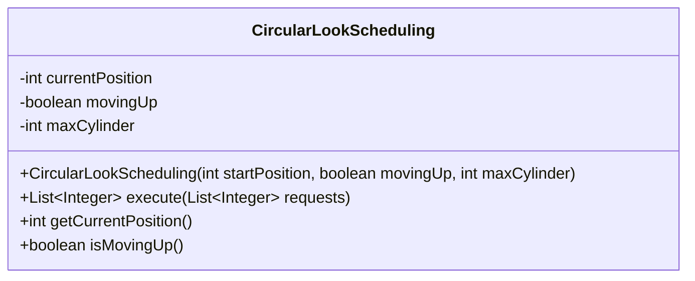
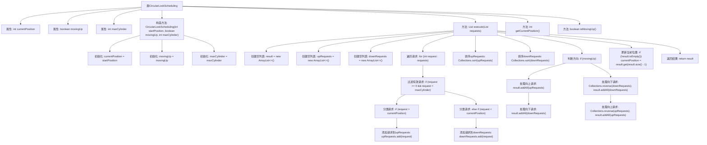

# 基础信息

|      |      |
|------|------|
| 名称 | CircularLookScheduling |
| 编码语言 | .java |
| 代码路径 | Java/src/main/java/com/thealgorithms/scheduling/diskscheduling/CircularLookScheduling.java |
| 包名 | com.thealgorithms.scheduling.diskscheduling |
| 依赖项 | ['java.util.ArrayList', 'java.util.Collections', 'java.util.List'] |
| 概述说明 | CircularLookScheduling类实现磁盘调度，按方向排序处理请求。 |

# 说明

CircularLookScheduling类实现了磁盘调度算法，主要用于处理磁盘请求并按照特定方向进行排序。该算法通过优化请求的顺序，减少磁头移动距离，从而提高磁盘访问效率。它结合了循环扫描和查找策略，确保在处理请求时兼顾响应时间和系统性能。

# 类列表 Class Summary

| 名称   | 类型  | 说明 |
|-------|------|-------------|
| CircularLookScheduling | class | CircularLookScheduling类实现磁盘调度算法，处理请求并按方向排序。 |

## 类 CircularLookScheduling

|      |      |
|------|------|
| 访问范围 | public |
| 类型 | class |
| 名称 | CircularLookScheduling |
| 说明 | CircularLookScheduling类实现磁盘调度算法，处理请求并按方向排序。 |

### UML类图

**描述：**  
`CircularLookScheduling` 类实现了一个循环LOOK调度算法，用于处理磁盘请求调度。该类维护当前磁头位置 (`currentPosition`)、移动方向 (`movingUp`) 和最大柱面数 (`maxCylinder`)。`execute` 方法根据当前移动方向处理请求列表，返回按调度顺序排列的请求列表。该类还提供了获取当前磁头位置和移动方向的方法。

### 内部方法调用关系图

这段代码实现了一个循环LOOK调度算法，用于处理磁盘请求。它根据当前移动方向（向上或向下）对请求进行分类和排序，然后按照顺序处理这些请求，并更新当前位置。代码通过过滤无效请求、分类请求、排序请求以及根据移动方向处理请求来实现调度逻辑，最终返回处理后的请求列表并更新当前位置。

### 字段列表 Field List

| 名称  | 类型  | 说明 |
|-------|-------|------|
| currentPosition | int | 定义私有整型变量currentPosition。 |
| movingUp | boolean | 布尔变量movingUp用于标识是否向上移动。 |
| maxCylinder | int | 私有整型变量maxCylinder，表示最大气缸数。 |

### 方法列表 Method List

| 名称  | 类型  | 说明 |
|-------|-------|------|
| getCurrentPosition | int | 获取当前位置的整数值。 |
| execute | List<Integer> | 处理请求列表，按方向过滤排序后返回结果并更新当前位置。 |
| isMovingUp | boolean | 方法`isMovingUp`返回布尔值`movingUp`，表示是否向上移动。 |

