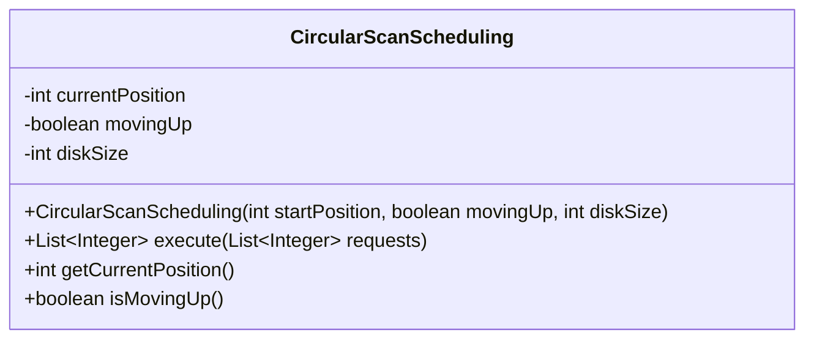
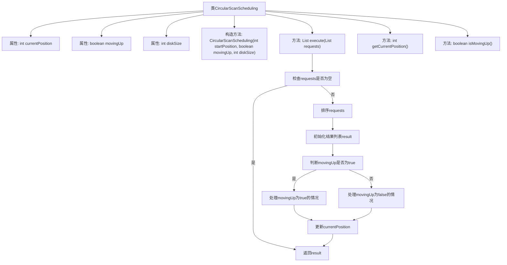

# 基础信息

|      |      |
|------|------|
| 名称 | CircularScanScheduling |
| 编码语言 | .java |
| 代码路径 | Java/src/main/java/com/thealgorithms/scheduling/diskscheduling/CircularScanScheduling.java |
| 包名 | com.thealgorithms.scheduling.diskscheduling |
| 依赖项 | ['java.util.ArrayList', 'java.util.Collections', 'java.util.List'] |
| 概述说明 | 循环扫描算法调度磁盘请求，确定处理顺序并更新当前位置。 |

# 说明

循环扫描调度算法是一种用于处理磁盘请求的调度策略，通过模拟磁盘的旋转机制，按顺序扫描并处理请求。该算法从当前位置开始，沿一个方向扫描所有请求，直到到达磁盘的末端，然后返回磁盘的起点继续扫描，形成一个循环。在处理过程中，算法会返回请求的处理顺序，并动态更新当前位置，以优化磁盘访问效率，减少寻道时间。

# 类列表 Class Summary

| 名称   | 类型  | 说明 |
|-------|------|-------------|
| CircularScanScheduling | class | 循环扫描调度算法实现，处理磁盘请求，返回处理顺序并更新当前位置。 |

## 类 CircularScanScheduling

|      |      |
|------|------|
| 访问范围 | public |
| 类型 | class |
| 名称 | CircularScanScheduling |
| 说明 | 循环扫描调度算法实现，处理磁盘请求，返回处理顺序并更新当前位置。 |

### UML类图

这段代码定义了一个 `CircularScanScheduling` 类，用于模拟磁盘调度算法中的循环扫描（Circular SCAN）算法。该类通过 `currentPosition` 记录当前磁头位置，`movingUp` 表示磁头移动方向，`diskSize` 表示磁盘大小。`execute` 方法根据磁头移动方向和请求列表，计算出最优的请求处理顺序，并更新磁头位置。该类通过 `getCurrentPosition` 和 `isMovingUp` 方法提供磁头位置和移动方向的查询功能。

### 内部方法调用关系图

**描述：**  
该代码实现了一个循环扫描调度算法（Circular Scan Scheduling），用于处理磁盘调度请求。类`CircularScanScheduling`包含当前磁盘位置、移动方向和磁盘大小等属性。`execute`方法根据移动方向处理请求列表，首先处理当前方向上的请求，然后跳转到相反方向的起点继续处理。最后更新当前磁盘位置并返回处理结果。流程图展示了类的属性和方法调用关系，以及`execute`方法的具体执行流程。

### 字段列表 Field List

| 名称  | 类型  | 说明 |
|-------|-------|------|
| currentPosition | int | 定义私有整型变量currentPosition。 |
| diskSize | int | 私有整型变量diskSize，用于存储磁盘大小。 |
| movingUp | boolean | 变量movingUp为私有布尔类型。 |

### 方法列表 Method List

| 名称  | 类型  | 说明 |
|-------|-------|------|
| getCurrentPosition | int | 获取当前位置的方法，返回整型变量currentPosition。 |
| execute | List<Integer> | 处理请求列表，根据移动方向排序并返回结果，更新当前位置。 |
| isMovingUp | boolean | 方法isMovingUp()返回布尔值movingUp的状态。 |

