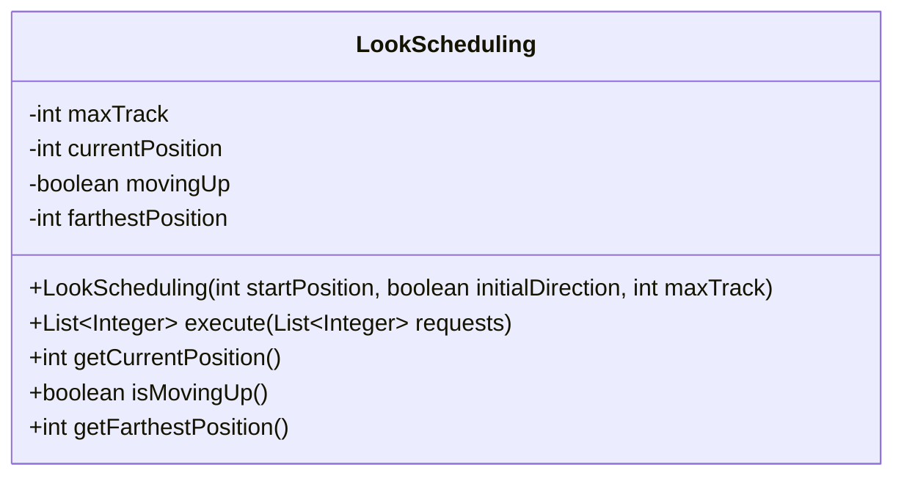
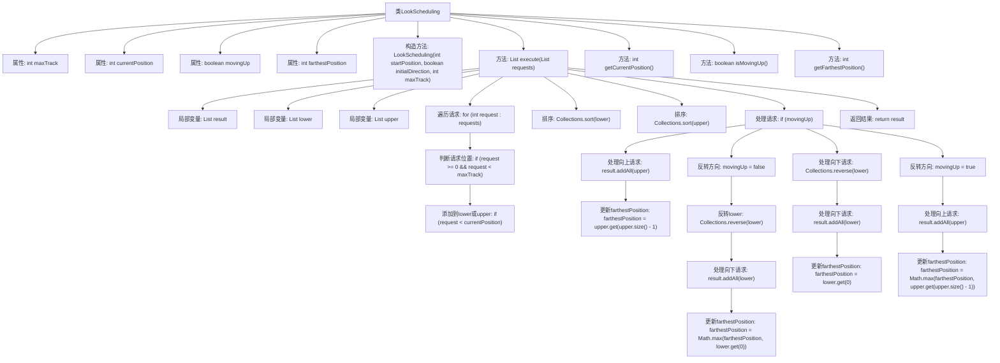

# 基础信息

|      |      |
|------|------|
| 名称 | LookScheduling |
| 编码语言 | .java |
| 代码路径 | Java/src/main/java/com/thealgorithms/scheduling/diskscheduling/LookScheduling.java |
| 包名 | com.thealgorithms.scheduling.diskscheduling |
| 依赖项 | ['java.util.ArrayList', 'java.util.Collections', 'java.util.List'] |
| 概述说明 | LookScheduling类实现磁盘调度算法，按方向处理请求并返回顺序。 |

# 说明

LookScheduling类用于实现磁盘调度算法，其主要功能是根据指定的方向处理磁盘请求，并返回请求的处理顺序。该类的核心任务是优化磁盘访问顺序，以提高磁盘操作的效率。通过按方向处理请求，LookScheduling类能够有效地减少磁头移动距离，从而提升系统性能。

# 类列表 Class Summary

| 名称   | 类型  | 说明 |
|-------|------|-------------|
| LookScheduling | class | LookScheduling类实现磁盘调度算法，按方向处理请求并返回处理顺序。 |

## 类 LookScheduling

|      |      |
|------|------|
| 访问范围 | public |
| 类型 | class |
| 名称 | LookScheduling |
| 说明 | LookScheduling类实现磁盘调度算法，按方向处理请求并返回处理顺序。 |

### UML类图

这段代码实现了一个磁盘调度算法中的LOOK算法。`LookScheduling`类通过`execute`方法处理磁盘请求列表，根据当前磁头位置和移动方向，将请求分为向上和向下两部分进行处理。类中包含了最大磁道数、当前磁头位置、移动方向和最远位置的属性，并通过构造函数初始化这些属性。`execute`方法返回处理请求的顺序，同时更新最远位置和移动方向。其他方法用于获取当前磁头位置、移动方向和最远位置。

### 内部方法调用关系图

这段代码实现了一个Look调度算法，用于处理磁盘请求。代码首先根据当前磁头位置将请求分为两部分，然后根据初始移动方向处理这些请求。如果初始方向向上，则先处理上方的请求，再反转方向处理下方的请求；反之亦然。最后返回处理顺序的结果。代码还包含了获取当前磁头位置、移动方向和最远位置的辅助方法。

### 字段列表 Field List

| 名称  | 类型  | 说明 |
|-------|-------|------|
| maxTrack | int | 私有整型变量maxTrack，用于存储最大轨道数。 |
| movingUp | boolean | 布尔变量movingUp用于控制向上移动状态。 |
| currentPosition | int | 私有整型变量currentPosition。 |
| farthestPosition | int | 私有整型变量，记录最远位置。 |

### 方法列表 Method List

| 名称  | 类型  | 说明 |
|-------|-------|------|
| getCurrentPosition | int | 获取当前位置的方法，返回currentPosition值。 |
| getFarthestPosition | int | 获取最远位置的方法。 |
| execute | List<Integer> | 根据请求位置和移动方向处理并排序列表，返回处理结果。 |
| isMovingUp | boolean | 方法isMovingUp返回布尔值movingUp，表示是否向上移动。 |

