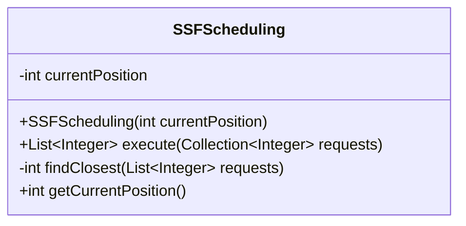
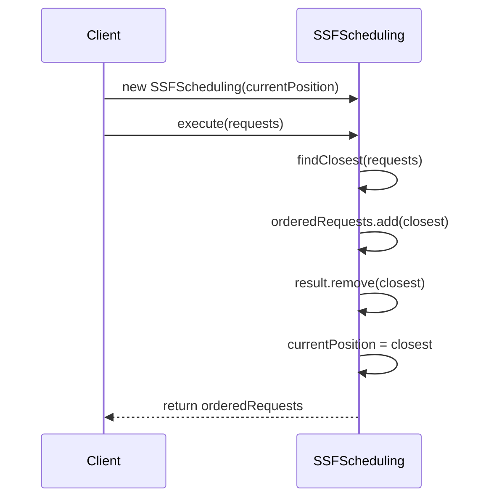
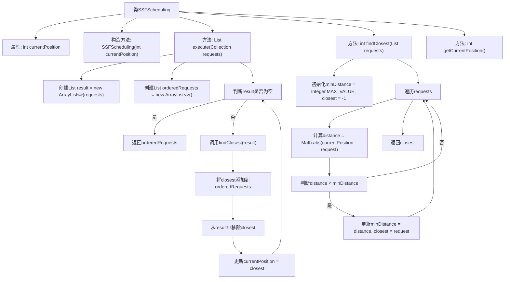

# 基础信息

|      |      |
|------|------|
| 名称 | SSFScheduling |
| 编码语言 | .java |
| 代码路径 | Java/src/main/java/com/thealgorithms/scheduling/diskscheduling/SSFScheduling.java |
| 包名 | com.thealgorithms.scheduling.diskscheduling |
| 依赖项 | ['java.util.ArrayList', 'java.util.Collection', 'java.util.List'] |
| 概述说明 | SSFScheduling类实现最短寻道优先调度算法，按最近请求顺序处理任务。 |

# 说明

SSFScheduling类实现了最短寻道优先调度算法，该算法通过按最近请求的顺序处理任务来优化调度效率。该算法优先处理距离当前磁头位置最近的请求，从而减少磁头移动距离，提高磁盘访问性能。

# 类列表 Class Summary

| 名称   | 类型  | 说明 |
|-------|------|-------------|
| SSFScheduling | class | SSFScheduling类实现最短寻道优先调度算法，按最近请求顺序处理任务。 |

## 类 SSFScheduling

|      |      |
|------|------|
| 访问范围 | public |
| 类型 | class |
| 名称 | SSFScheduling |
| 说明 | SSFScheduling类实现最短寻道优先调度算法，按最近请求顺序处理任务。 |

### UML类图

**描述：**
`SSFScheduling` 类实现了一个最短寻道时间优先（SSF）调度算法，用于处理磁盘调度请求。该类包含一个私有字段 `currentPosition` 表示当前磁头位置，以及一个公有方法 `execute` 用于执行调度算法。`execute` 方法通过调用私有方法 `findClosest` 找到距离当前磁头位置最近的请求，并将其添加到有序请求列表中，直到所有请求都被处理完毕。最后，`execute` 方法返回有序的请求列表。

### 内部方法调用关系图

这段代码实现了一个最短寻道时间优先（SSF）调度算法，用于磁盘调度。它通过不断寻找距离当前磁头位置最近的请求，并将其添加到有序请求列表中，直到所有请求都被处理。流程图展示了类SSFScheduling的结构及其方法之间的调用关系，特别是execute方法如何通过findClosest方法找到最近的请求，并更新当前磁头位置。

### 字段列表 Field List

| 名称  | 类型  | 说明 |
|-------|-------|------|
| currentPosition | int | 当前位置变量，类型为私有整型。 |

### 方法列表 Method List

| 名称  | 类型  | 说明 |
|-------|-------|------|
| getCurrentPosition | int | 获取当前位置的方法，返回整数值。 |
| execute | List<Integer> | 该方法对整数集合排序，按最近原则生成有序列表。 |
| findClosest | int | 查找列表中与当前位置最接近的请求。 |

