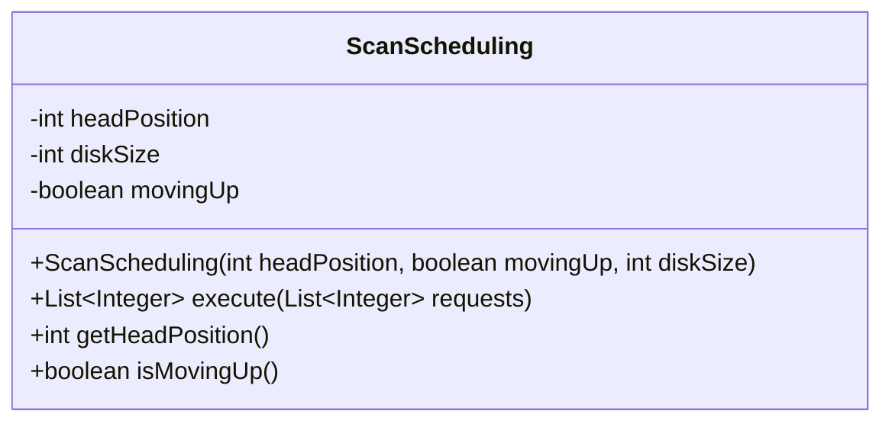
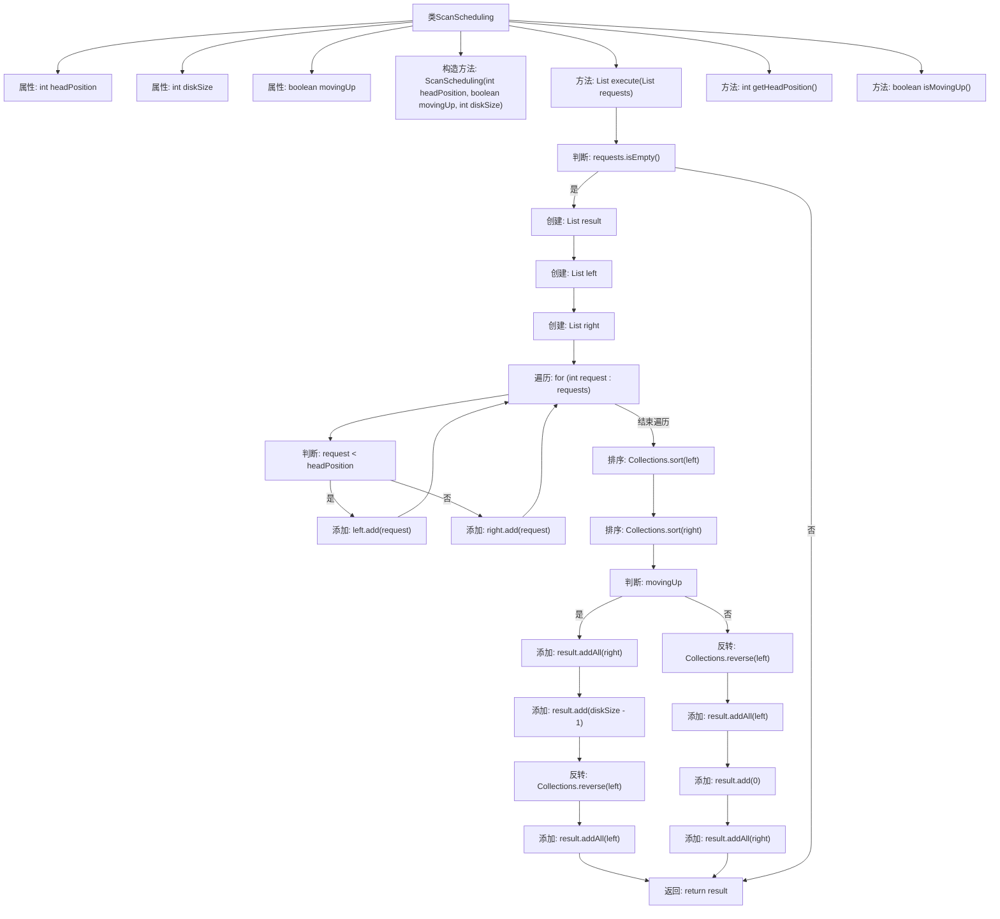

# 基础信息

|      |      |
|------|------|
| 名称 | ScanScheduling |
| 编码语言 | .java |
| 代码路径 | Java/src/main/java/com/thealgorithms/scheduling/diskscheduling/ScanScheduling.java |
| 包名 | com.thealgorithms.scheduling.diskscheduling |
| 依赖项 | ['java.util.ArrayList', 'java.util.Collections', 'java.util.List'] |
| 概述说明 | ScanScheduling类实现磁盘扫描调度算法，处理请求列表并模拟磁头移动。 |

# 说明

ScanScheduling类主要负责实现磁盘扫描调度算法，用于处理磁盘请求列表并模拟磁头的移动过程。该类通过调度算法优化磁头的移动路径，从而提高磁盘访问效率，减少磁头移动时间。其核心功能包括接收请求列表、计算磁头移动顺序、模拟磁头移动以及输出调度结果。通过这种方式，ScanScheduling类能够有效管理磁盘访问请求，提升系统整体性能。

# 类列表 Class Summary

| 名称   | 类型  | 说明 |
|-------|------|-------------|
| ScanScheduling | class | ScanScheduling类实现磁盘扫描调度算法，处理请求列表并模拟磁头移动。 |

## 类 ScanScheduling

|      |      |
|------|------|
| 访问范围 | public |
| 类型 | class |
| 名称 | ScanScheduling |
| 说明 | ScanScheduling类实现磁盘扫描调度算法，处理请求列表并模拟磁头移动。 |

### UML类图

**描述：**  
`ScanScheduling` 类实现了一个磁盘调度算法中的 SCAN（电梯）算法。它通过初始化磁头位置、磁盘大小和移动方向来模拟磁盘头的移动。`execute` 方法接收请求列表，根据磁头移动方向（向上或向下）处理请求，并返回处理顺序的列表。该类还提供了获取当前磁头位置和移动方向的方法。

### 内部方法调用关系图

### 描述
这段代码实现了一个磁盘调度算法中的SCAN算法。类`ScanScheduling`包含三个属性：`headPosition`表示磁头当前位置，`diskSize`表示磁盘大小，`movingUp`表示磁头移动方向。`execute`方法接收请求列表，根据磁头移动方向将请求分为左右两部分，分别排序后模拟磁头移动，最终返回处理顺序。代码通过判断请求列表是否为空、磁头移动方向等条件，确保正确执行SCAN算法。

### 字段列表 Field List

| 名称  | 类型  | 说明 |
|-------|-------|------|
| headPosition | int | 私有整型变量headPosition。 |
| diskSize | int | 私有整型变量，用于存储磁盘大小。 |
| movingUp | boolean | 变量movingUp用于标识是否向上移动。 |

### 方法列表 Method List

| 名称  | 类型  | 说明 |
|-------|-------|------|
| getHeadPosition | int | 获取头部位置的整数值。 |
| execute | List<Integer> | 方法处理请求列表，按磁盘头移动方向排序并返回结果。 |
| isMovingUp | boolean | 该方法返回布尔值，表示对象是否向上移动。 |

