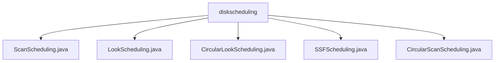

# 基础信息

|      |      |
|------|------|
| 名称 | diskscheduling |
| 编码语言 | .java |
| 代码路径 | Java/src/main/java/com/thealgorithms/scheduling/diskscheduling |
| 包名 | Java.src.main.java.com.thealgorithms.scheduling.diskscheduling |
| 概述说明 | ScanScheduling类优化磁头移动，LookScheduling类按方向处理请求，CircularLookScheduling类结合循环扫描，SSFScheduling类优先处理最近请求，CircularScanScheduling类模拟磁盘旋转。 |

# 说明

## 概述
该代码模块主要实现了一系列磁盘调度算法，旨在优化磁盘访问请求的处理顺序，从而减少磁头移动距离，提高磁盘访问效率和系统整体性能。模块中的各个类分别实现了不同的磁盘调度策略，包括SCAN、LOOK、C-LOOK、SSF（最短寻道优先）以及C-SCAN（循环扫描）算法。这些算法通过不同的策略处理磁盘请求，模拟磁头的移动过程，并输出调度结果，以帮助系统更高效地管理磁盘访问。

## 主要业务场景
该模块的主要业务场景包括：
1. **磁盘请求调度优化**：通过实现多种磁盘调度算法，模块能够根据不同的需求优化磁盘请求的处理顺序，减少磁头移动时间，提升磁盘访问效率。
2. **磁头移动路径模拟**：模块中的各个类能够模拟磁头的移动过程，计算磁头的移动顺序，并根据算法策略动态更新磁头位置。
3. **系统性能提升**：通过优化磁盘访问顺序，模块能够有效减少寻道时间，从而提高系统的整体性能，特别是在高并发磁盘访问场景下表现尤为突出。
4. **多种调度策略支持**：模块支持多种磁盘调度策略，用户可以根据具体需求选择合适的算法，例如SCAN、LOOK、C-LOOK、SSF或C-SCAN，以满足不同的性能优化需求。

该模块适用于需要高效处理磁盘访问请求的系统，如数据库管理系统、文件服务器等，能够显著提升磁盘I/O性能。

### 包内部结构视图

该流程图展示了磁盘调度算法相关的Java文件结构。`diskscheduling`文件夹下包含了五种不同的磁盘调度算法实现文件，分别是`ScanScheduling.java`、`LookScheduling.java`、`CircularLookScheduling.java`、`SSFScheduling.java`和`CircularScanScheduling.java`。这些文件均位于同一层级，展示了不同调度算法的实现。

# 文件列表 File List

| 名称   | 类型  | 说明 |
|-------|------|-------------|
| [CircularScanScheduling.java](CircularScanScheduling.md) | file | 循环扫描算法调度磁盘请求，确定处理顺序并更新当前位置。 |
| [ScanScheduling.java](ScanScheduling.md) | file | ScanScheduling类实现磁盘扫描调度算法，处理请求列表并模拟磁头移动。 |
| [SSFScheduling.java](SSFScheduling.md) | file | SSFScheduling类实现最短寻道优先调度算法，按最近请求顺序处理任务。 |
| [CircularLookScheduling.java](CircularLookScheduling.md) | file | CircularLookScheduling类实现磁盘调度，按方向排序处理请求。 |
| [LookScheduling.java](LookScheduling.md) | file | LookScheduling类实现磁盘调度算法，按方向处理请求并返回顺序。 |

