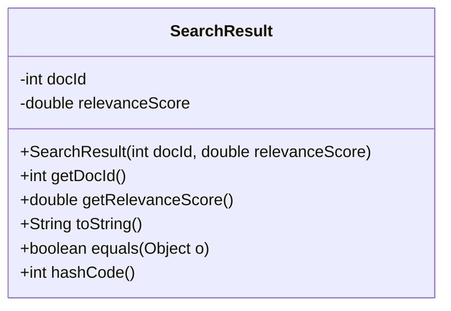
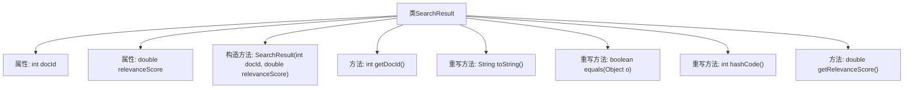
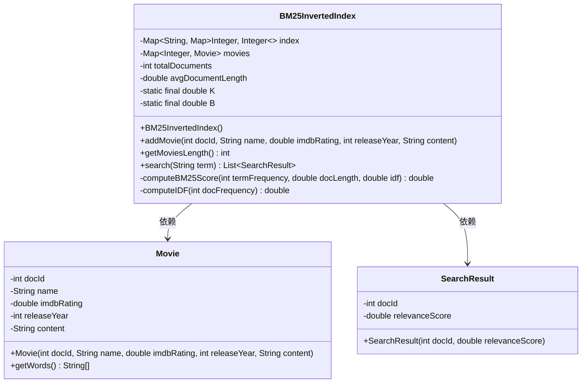
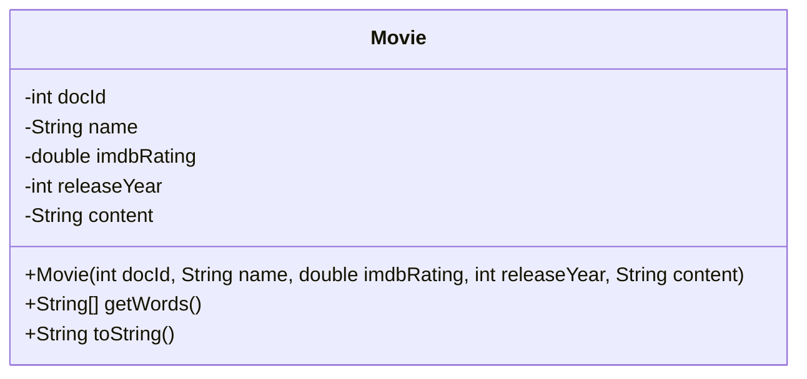
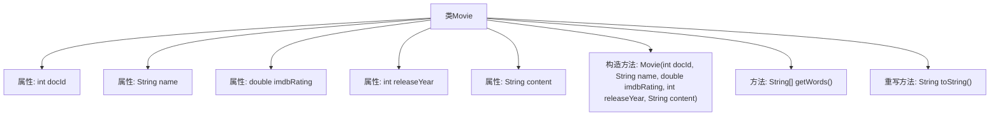

```mermaid
graph TD
    A["类BM25InvertedIndex"]
    B["属性: Map<String, Map<Integer, Integer>> index"]
    C["属性: Map<Integer, Movie> movies"]
    D["属性: int totalDocuments"]
    E["属性: double avgDocumentLength"]
    F["属性: static final double K"]
    G["属性: static final double B"]
    H["构造方法: BM25InvertedIndex()"]
    I["方法: addMovie(int docId, String name, double imdbRating, int releaseYear, String content)"]
    J["方法: getMoviesLength()"]
    K["方法: search(String term)"]
    L["方法: computeBM25Score(int termFrequency, double docLength, double idf)"]
    M["方法: computeIDF(int docFrequency)"]
    N["内部调用: Movie movie = new Movie(docId, name, imdbRating, releaseYear, content)"]
    O["内部调用: String[] terms = movie.getWords()"]
    P["内部调用: Map<Integer, Integer> docList = index.get(term)"]
    Q["内部调用: docList.put(docId, docList.getOrDefault(docId, 0) + 1)"]
    R["内部调用: double idf = computeIDF(termDocs.size())"]
    S["内部调用: double score = computeBM25Score(termFrequency, docLength, idf)"]
    T["内部调用: results.sort((r1, r2) -> Double.compare(r2.relevanceScore, r1.relevanceScore))"]

    A --> B
    A --> C
    A --> D
    A --> E
    A --> F
    A --> G
    A --> H
    A --> I
    A --> J
    A --> K
    A --> L
    A --> M
    I --> N
    I --> O
    I --> P
    I --> Q
    K --> R
    K --> S
    K --> T
```

# 基础信息

|      |      |
|------|------|
| 名称 | BM25InvertedIndex |
| 编码语言 | .java |
| 代码路径 | Java/src/main/java/com/thealgorithms/searches/BM25InvertedIndex.java |
| 包名 | com.thealgorithms.searches |
| 依赖项 | ['java.util.ArrayList', 'java.util.HashMap', 'java.util.List', 'java.util.Map', 'java.util.Objects'] |
| 概述说明 | 电影类含ID、名称、评分、年份和内容，提供单词获取。SearchResult类含ID和BM25评分，支持构造、获取、比较和哈希。BM25索引类存储电影信息，支持添加和搜索。 |

# 说明

电影类包含唯一ID、名称、IMDb评分、发行年份和内容，并提供获取单词的方法。SearchResult类包含电影文档ID和BM25相关性评分，支持构造、获取、比较和哈希操作。BM25倒排索引类用于存储电影信息，支持添加电影和搜索功能。这些类共同构成了一个基于BM25算法的电影信息检索系统，能够高效地存储和查询电影数据。

# 类列表 Class Summary

| 名称   | 类型  | 说明 |
|-------|------|-------------|
| SearchResult | class | SearchResult类包含电影文档ID和BM25相关性评分，提供构造、获取、比较和哈希方法。 |
| BM25InvertedIndex | class | BM25倒排索引类，用于存储电影信息，支持添加电影和搜索功能。 |
| Movie | class | 电影类包含唯一ID、名称、IMDb评分、发行年份和内容，提供获取单词的方法。 |

## 类 SearchResult

|      |      |
|------|------|
| 访问范围 | None |
| 类型 | class |
| 名称 | SearchResult |
| 说明 | SearchResult类包含电影文档ID和BM25相关性评分，提供构造、获取、比较和哈希方法。 |

### UML类图

**描述：**  
`SearchResult` 类用于表示搜索结果的文档信息，包含文档的唯一标识符 `docId` 和基于 BM25 算法的相关性评分 `relevanceScore`。类中提供了构造函数、获取文档 ID 和相关性评分的方法，并重写了 `toString`、`equals` 和 `hashCode` 方法，以便于对象的字符串表示、相等性比较和哈希计算。

### 内部方法调用关系图

这段代码定义了一个名为 `SearchResult` 的类，用于表示搜索结果的文档ID和相关性分数。类中包含两个属性：`docId` 和 `relevanceScore`，分别表示文档的唯一标识符和基于BM25算法的相关性分数。类中提供了构造方法、获取文档ID的方法、获取相关性分数的方法，以及重写了 `toString`、`equals` 和 `hashCode` 方法，用于对象的字符串表示、相等性比较和哈希码计算。

### 字段列表 Field List

| 名称  | 类型  | 说明 |
|-------|-------|------|
| docId | int | 定义整数类型变量docId。 |
| relevanceScore | double | 双精度相关分数变量声明。 |

### 方法列表 Method List

| 名称  | 类型  | 说明 |
|-------|-------|------|
| getRelevanceScore | double | 获取相关性分数的方法。 |
| getDocId | int | 获取文档ID的公共方法。 |
| hashCode | int | 重写hashCode方法，使用docId和relevanceScore生成哈希值。 |
| toString | String | 重写toString方法，返回包含docId和relevanceScore的字符串。 |
| equals | boolean | 重写equals方法，比较对象类型和属性值。 |

## 类 BM25InvertedIndex

|      |      |
|------|------|
| 访问范围 | public final |
| 类型 | class |
| 名称 | BM25InvertedIndex |
| 说明 | BM25倒排索引类，用于存储电影信息，支持添加电影和搜索功能。 |

### UML类图

这段代码定义了一个`BM25InvertedIndex`类，用于实现基于BM25算法的倒排索引。该类包含一个倒排索引`index`，用于存储词项到文档ID和词频的映射，以及一个`movies`映射，用于存储文档ID到`Movie`对象的映射。`BM25InvertedIndex`类提供了添加电影、计算BM25分数、计算逆文档频率（IDF）以及搜索功能。`Movie`类表示电影对象，包含电影的基本信息和内容。`SearchResult`类用于存储搜索结果，包含文档ID和相关性分数。

### 内部方法调用关系图

**描述：**  
该代码实现了一个基于BM25算法的倒排索引类 `BM25InvertedIndex`，用于存储电影数据并进行相关性搜索。类中包含多个属性，如倒排索引 `index`、电影数据 `movies`、文档总数 `totalDocuments` 和平均文档长度 `avgDocumentLength`。主要方法包括 `addMovie` 用于添加电影数据，`search` 用于搜索相关电影，`computeBM25Score` 和 `computeIDF` 用于计算BM25相关性和逆文档频率。代码通过内部调用实现了电影数据的存储、索引更新和相关性排序。

### 字段列表 Field List

| 名称  | 类型  | 说明 |
|-------|-------|------|
| movies | Map<Integer, Movie> | 私有映射，键为整数，值为电影对象。 |
| B = 0.75 | double | 定义静态常量B，值为0.75。 |
| avgDocumentLength | double | 私有双精度浮点数变量，用于存储平均文档长度。 |
| totalDocuments | int | 私有整型变量，用于存储文档总数。 |
| K = 1.5 | double | 定义了一个私有静态常量K，值为1.5。 |
| index | Map<String, Map<Integer, Integer>> | 私有映射，键为字符串，值为嵌套映射，内层键为整数，值为整数。 |

### 方法列表 Method List

| 名称  | 类型  | 说明 |
|-------|-------|------|
| getMoviesLength | int | 获取电影列表长度的整型方法。 |
| computeIDF | double | 计算文档逆频率，基于文档频率和总文档数。 |
| addMovie | void | 添加电影并更新索引，包括文档长度和词频统计。 |
| search | List<SearchResult> | 搜索方法：标准化关键词，检索相关文档，计算IDF和BM25得分，按相关性排序返回结果。 |
| computeBM25Score | double | 计算BM25评分，公式为：词频*(K+1)/(词频+K*(1-B+B*(文档长度/平均长度)))*逆文档频率。 |

## 类 Movie

|      |      |
|------|------|
| 访问范围 | None |
| 类型 | class |
| 名称 | Movie |
| 说明 | 电影类包含唯一ID、名称、IMDb评分、发行年份和内容，提供获取单词的方法。 |

### UML类图

这段代码定义了一个 `Movie` 类，用于表示电影的相关信息。类中包含电影的唯一标识符 `docId`、电影名称 `name`、IMDb 评分 `imdbRating`、发行年份 `releaseYear` 以及电影内容 `content`。类提供了一个构造函数用于初始化这些属性，并提供了 `getWords` 方法用于从电影名称和内容中提取所有单词，以及 `toString` 方法用于返回电影的字符串表示。

### 内部方法调用关系图

这段代码定义了一个名为`Movie`的类，包含五个属性：`docId`、`name`、`imdbRating`、`releaseYear`和`content`。类中有一个构造方法用于初始化这些属性，一个`getWords`方法用于从电影名称和内容中提取单词，并重写了`toString`方法以返回电影的格式化字符串表示。流程图展示了类与其属性、方法之间的层级关系。

### 字段列表 Field List

| 名称  | 类型  | 说明 |
|-------|-------|------|
| docId | int | 定义一个整型变量docId。 |
| name | String | 定义一个名为name的字符串变量。 |
| content | String | 字符串变量声明与定义。 |
| imdbRating | double | IMDb评分数据类型为双精度浮点数。 |
| releaseYear | int | 定义整型变量releaseYear，用于存储发布年份。 |

### 方法列表 Method List

| 名称  | 类型  | 说明 |
|-------|-------|------|
| toString | String | 重写toString方法，返回电影docId、名称、IMDB评分和发行年份。 |
| getWords | String[] | 方法getWords将name和content拼接后转为小写，按非单词字符分割成数组。 |

