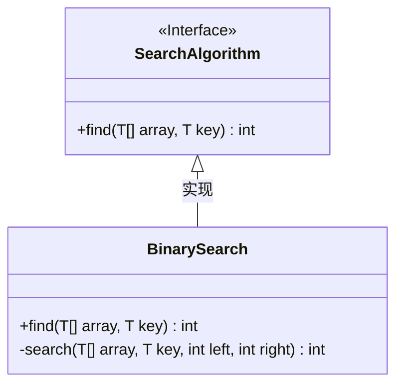
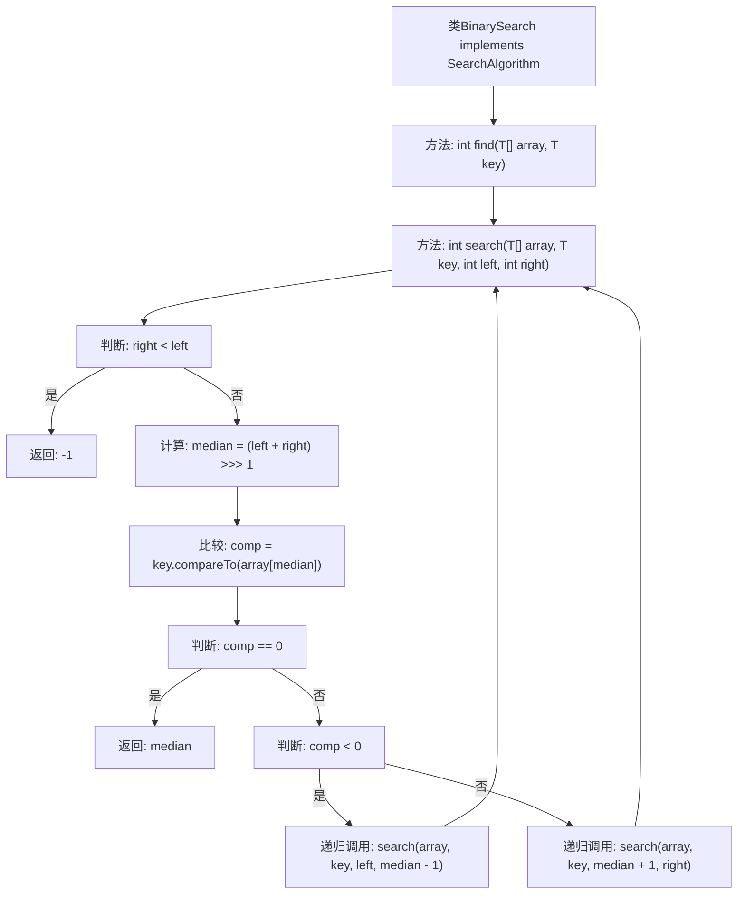

# 基础信息

|      |      |
|------|------|
| 名称 | BinarySearch |
| 编码语言 | .java |
| 代码路径 | Java/src/main/java/com/thealgorithms/searches/BinarySearch.java |
| 包名 | com.thealgorithms.searches |
| 依赖项 | ['com.thealgorithms.devutils.searches.SearchAlgorithm'] |
| 概述说明 | BinarySearch类实现泛型二分查找，递归定位目标元素。 |

# 说明

BinarySearch类实现了二分查找算法，适用于泛型数据，采用递归方式查找目标元素的位置。该算法通过不断缩小搜索范围，高效地定位目标元素，适用于有序数据集。

# 类列表 Class Summary

| 名称   | 类型  | 说明 |
|-------|------|-------------|
| BinarySearch | class | BinarySearch类实现二分查找算法，支持泛型，递归查找目标元素位置。 |

## 类 BinarySearch

|      |      |
|------|------|
| 访问范围 | None |
| 类型 | class |
| 名称 | BinarySearch |
| 说明 | BinarySearch类实现二分查找算法，支持泛型，递归查找目标元素位置。 |

### UML类图

类图描述：`BinarySearch` 类实现了 `SearchAlgorithm` 接口，提供了二分查找的功能。`BinarySearch` 类中包含一个公有方法 `find` 和一个私有方法 `search`，`find` 方法用于调用 `search` 方法进行递归查找。`search` 方法通过比较中间元素与目标值，逐步缩小查找范围，直到找到目标值或确定目标值不存在。

### 内部方法调用关系图

这段代码实现了二分查找算法，通过递归方式在有序数组中查找指定元素。首先，`find`方法调用`search`方法进行查找，`search`方法通过计算中间值并与目标值比较，决定继续在左半部分或右半部分进行查找，直到找到目标值或确定目标值不存在。流程图清晰地展示了这一递归过程。

### 字段列表 Field List

| 名称  | 类型  | 说明 |
|-------|-------|------|

### 方法列表 Method List

| 名称  | 类型  | 说明 |
|-------|-------|------|
| search | int | 递归二分查找数组中的元素，未找到返回-1。 |
| find | int | 重写find方法，在数组中二分查找指定元素。 |

