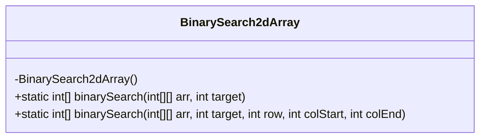
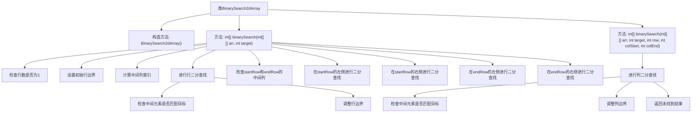

# 基础信息

|      |      |
|------|------|
| 名称 | BinarySearch2dArray |
| 编码语言 | .java |
| 代码路径 | Java/src/main/java/com/thealgorithms/searches/BinarySearch2dArray.java |
| 包名 | com.thealgorithms.searches |
| 依赖项 | [] |
| 概述说明 | 二维有序数组二分查找目标值，返回行列索引，未找到返回[-1,-1]。 |

# 说明

二维有序数组二分查找是一种高效的搜索算法，用于在有序的二维数组中查找目标值。该算法通过逐步缩小搜索范围，快速定位目标值所在的行和列索引。如果找到目标值，返回其行列索引；如果未找到，返回[-1, -1]。这种方法利用了数组的有序性，确保在时间复杂度上优于线性搜索。

# 类列表 Class Summary

| 名称   | 类型  | 说明 |
|-------|------|-------------|
| BinarySearch2dArray | class | 二维有序数组二分查找，返回目标值的行列索引，未找到返回[-1,-1]。 |

## 类 BinarySearch2dArray

|      |      |
|------|------|
| 访问范围 | public final |
| 类型 | class |
| 名称 | BinarySearch2dArray |
| 说明 | 二维有序数组二分查找，返回目标值的行列索引，未找到返回[-1,-1]。 |

### UML类图

**描述：**  
`BinarySearch2dArray` 类是一个工具类，用于在二维有序数组中进行二分查找。该类包含两个静态方法：`binarySearch(int[][], int)` 和 `binarySearch(int[][], int, int, int, int)`。第一个方法在二维数组中进行全局搜索，第二个方法在指定行和列范围内进行局部搜索。该类通过递归和迭代的方式实现了高效的二分查找算法，适用于在行和列都按升序排列的二维数组中查找目标值。

### 内部方法调用关系图

该流程图描述了`BinarySearch2dArray`类中的二分查找过程。首先，类包含一个私有构造方法和两个静态方法。`binarySearch`方法首先检查行数是否为1，然后设置初始行边界和中间列索引，进行行二分查找。如果未找到目标，则在特定行的左侧或右侧进行列二分查找。最终，如果未找到目标，则返回`[-1, -1]`。

### 字段列表 Field List

| 名称  | 类型  | 说明 |
|-------|-------|------|

### 方法列表 Method List

| 名称  | 类型  | 说明 |
|-------|-------|------|
| binarySearch | int[] | 二维数组二分查找，通过中间列确定行范围，再在特定行进行二分查找。 |
| binarySearch | int[] | 在二维数组指定行内二分查找目标值，返回位置或未找到标记。 |

