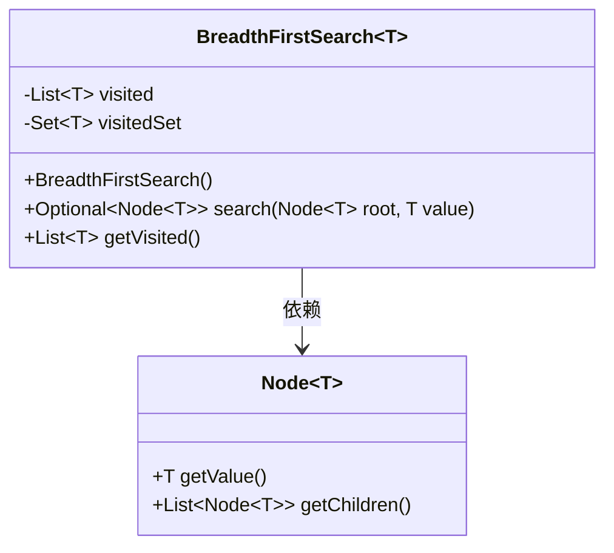
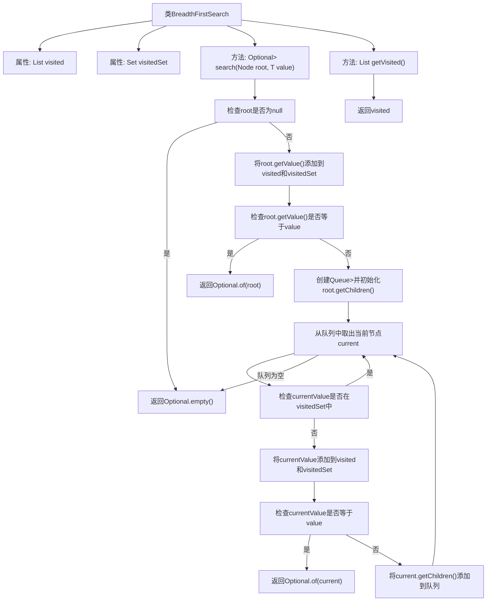

# 基础信息

|      |      |
|------|------|
| 名称 | BreadthFirstSearch |
| 编码语言 | .java |
| 代码路径 | Java/src/main/java/com/thealgorithms/searches/BreadthFirstSearch.java |
| 包名 | com.thealgorithms.searches |
| 依赖项 | ['com.thealgorithms.datastructures.Node', 'java.util.ArrayDeque', 'java.util.ArrayList', 'java.util.HashSet', 'java.util.List', 'java.util.Optional', 'java.util.Queue', 'java.util.Set'] |
| 概述说明 | 广度优先搜索类，查找指定节点并返回访问顺序。 |

# 说明

广度优先搜索类是一个用于在数据结构中查找指定值的节点的工具。它通过广度优先的搜索策略，从起始节点开始，逐层遍历所有相邻节点，直到找到目标节点或遍历完所有节点。该类的核心功能是返回节点访问的顺序列表，记录了搜索过程中节点的访问顺序。这种方法适用于需要按层次遍历或查找最短路径的场景。

# 类列表 Class Summary

| 名称   | 类型  | 说明 |
|-------|------|-------------|
| BreadthFirstSearch | class | 广度优先搜索类，用于查找指定值的节点，返回访问顺序列表。 |

## 类 BreadthFirstSearch

|      |      |
|------|------|
| 访问范围 | public |
| 类型 | class |
| 名称 | BreadthFirstSearch |
| 说明 | 广度优先搜索类，用于查找指定值的节点，返回访问顺序列表。 |

### UML类图

**描述：**  
`BreadthFirstSearch` 类实现了一个广度优先搜索算法，用于在树或图中查找特定值的节点。它包含两个私有成员：`visited` 和 `visitedSet`，分别用于记录访问过的节点和快速查找。`search` 方法从根节点开始，使用队列逐层遍历节点，直到找到目标值或遍历完所有节点。`getVisited` 方法返回访问顺序的节点列表。`Node` 类表示图中的节点，包含获取节点值和子节点的方法。

### 内部方法调用关系图

该流程图描述了`BreadthFirstSearch`类的广度优先搜索算法的执行过程。从根节点开始，首先检查节点是否为空，若为空则返回空Optional。否则，将节点值添加到已访问列表和集合中，并检查是否找到目标值。若未找到，则通过队列遍历子节点，重复检查、添加和比较操作，直到找到目标值或遍历完所有节点。最后，返回找到的节点或空Optional，并提供已访问节点列表的获取方法。

### 字段列表 Field List

| 名称  | 类型  | 说明 |
|-------|-------|------|
| visitedSet = new HashSet<>() | Set<T> | 私有集合变量visitedSet，用于存储已访问元素。 |
| visited = new ArrayList<>() | List<T> | 私有最终列表visited初始化为ArrayList。 |

### 方法列表 Method List

| 名称  | 类型  | 说明 |
|-------|-------|------|
| getVisited | List<T> | 获取已访问列表的方法。 |
| search | Optional<Node<T>> | 搜索树节点，返回匹配值的节点，使用队列和集合避免重复访问。 |

