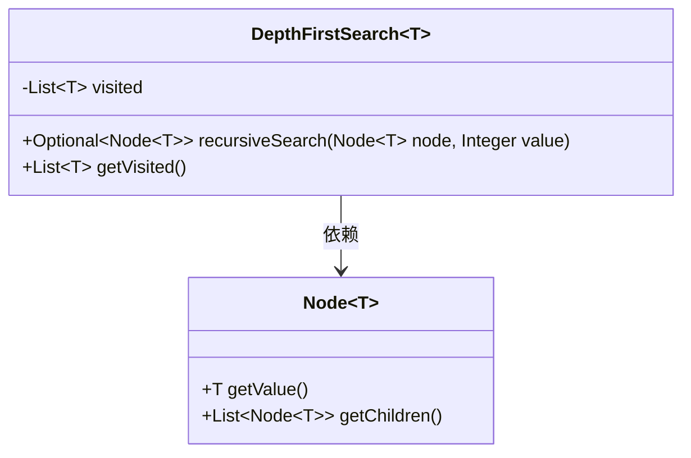
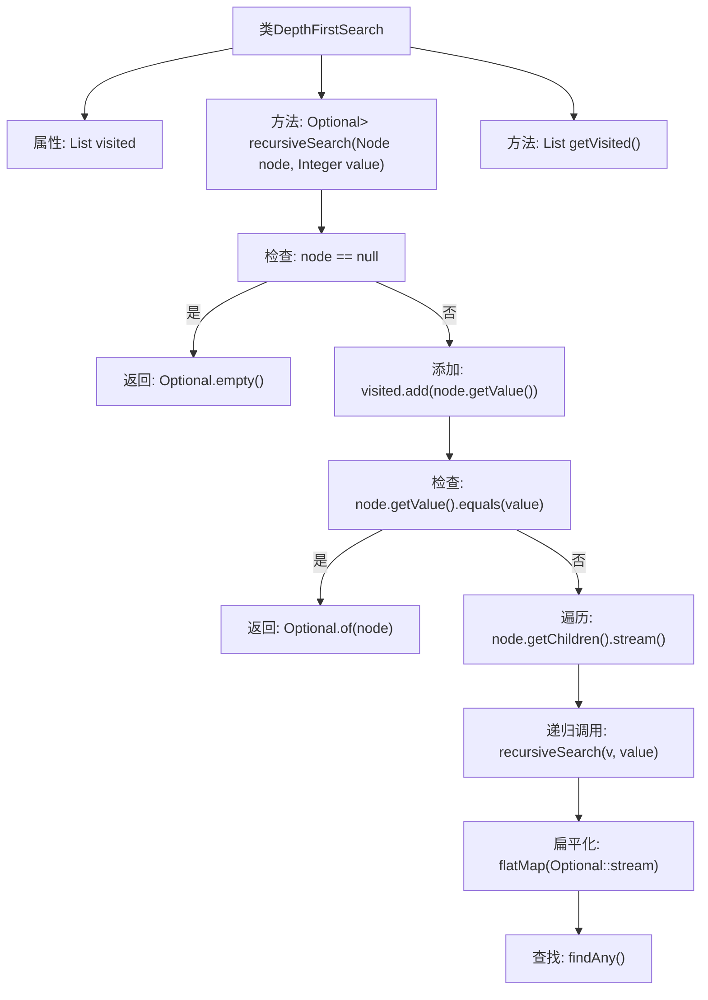

# 基础信息

|      |      |
|------|------|
| 名称 | DepthFirstSearch |
| 编码语言 | .java |
| 代码路径 | Java/src/main/java/com/thealgorithms/searches/DepthFirstSearch.java |
| 包名 | com.thealgorithms.searches |
| 依赖项 | ['com.thealgorithms.datastructures.Node', 'java.util.ArrayList', 'java.util.List', 'java.util.Optional'] |
| 概述说明 | 深度优先搜索类，支持递归遍历并记录路径。 |

# 说明

深度优先搜索类是一种用于遍历或搜索树或图数据结构的算法。它采用递归方式，从起始节点开始，沿着一条路径尽可能深入地访问节点，直到到达最深的节点，然后回溯并继续搜索其他路径。该类还支持记录访问路径，以便在搜索过程中跟踪已访问的节点顺序。这种搜索方式适用于需要探索所有可能路径的场景，如寻找特定节点或检测环路。

# 类列表 Class Summary

| 名称   | 类型  | 说明 |
|-------|------|-------------|
| DepthFirstSearch | class | 深度优先搜索类，支持递归搜索节点并记录访问路径。 |

## 类 DepthFirstSearch

|      |      |
|------|------|
| 访问范围 | public |
| 类型 | class |
| 名称 | DepthFirstSearch |
| 说明 | 深度优先搜索类，支持递归搜索节点并记录访问路径。 |

### UML类图

这段代码定义了一个泛型类 `DepthFirstSearch<T>`，用于实现深度优先搜索（DFS）算法。类中包含一个私有成员 `visited`，用于记录访问过的节点值。`recursiveSearch` 方法递归地遍历节点及其子节点，查找与给定值匹配的节点，并返回 `Optional` 类型的结果。`getVisited` 方法用于获取访问过的节点值列表。`Node<T>` 类表示图中的节点，包含获取节点值和子节点的方法。`DepthFirstSearch` 类依赖于 `Node` 类来实现深度优先搜索功能。

### 内部方法调用关系图

这段代码实现了一个深度优先搜索（DFS）算法，用于在树结构中查找特定值的节点。`DepthFirstSearch`类包含一个`visited`列表，用于记录访问过的节点值。`recursiveSearch`方法递归地遍历节点的子节点，直到找到目标值或遍历完所有节点。如果找到目标值，返回包含该节点的`Optional`；否则返回`Optional.empty()`。`getVisited`方法返回访问过的节点值列表。

### 字段列表 Field List

| 名称  | 类型  | 说明 |
|-------|-------|------|
| visited = new ArrayList<>() | List<T> | 私有变量visited初始化为ArrayList类型。 |

### 方法列表 Method List

| 名称  | 类型  | 说明 |
|-------|-------|------|
| getVisited | List<T> | 返回已访问对象的列表。 |
| recursiveSearch | Optional<Node<T>> | 递归搜索节点，匹配值返回节点，否则返回空。 |

