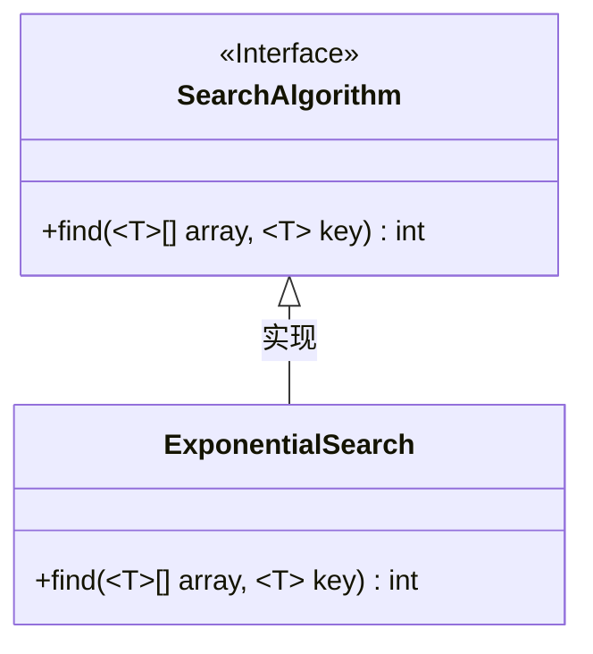
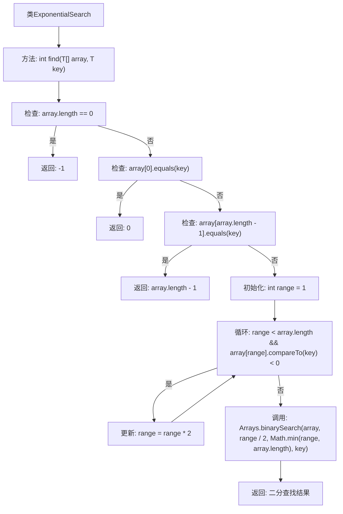

# 基础信息

|      |      |
|------|------|
| 名称 | ExponentalSearch |
| 编码语言 | .java |
| 代码路径 | Java/src/main/java/com/thealgorithms/searches/ExponentalSearch.java |
| 包名 | com.thealgorithms.searches |
| 依赖项 | ['com.thealgorithms.devutils.searches.SearchAlgorithm', 'java.util.Arrays'] |
| 概述说明 | 指数搜索用于在有序数组中查找元素索引，未找到返回-1。 |

# 说明

指数搜索是一种用于在有序数组中查找指定元素索引的算法。该算法通过指数级递增的步长快速缩小搜索范围，确定目标元素可能存在的区间，然后在该区间内进行二分查找。如果找到目标元素，则返回其索引；如果未找到，则返回-1。这种方法结合了快速定位和精确查找的优点，适用于大规模有序数组的搜索场景。

# 类列表 Class Summary

| 名称   | 类型  | 说明 |
|-------|------|-------------|
| ExponentialSearch | class | 指数搜索在有序数组中查找指定元素的索引，未找到返回-1。 |

## 类 ExponentialSearch

|      |      |
|------|------|
| 访问范围 | None |
| 类型 | class |
| 名称 | ExponentialSearch |
| 说明 | 指数搜索在有序数组中查找指定元素的索引，未找到返回-1。 |

### UML类图

**描述：**  
`ExponentialSearch`类实现了`SearchAlgorithm`接口，提供了一个泛型方法`find`，用于在已排序的数组中查找指定元素的索引。该方法首先检查数组的边界条件，然后通过指数搜索确定搜索范围，最后使用二分查找在确定的范围内查找目标元素。如果找到目标元素，返回其索引；否则返回-1。

### 内部方法调用关系图

这段代码实现了指数搜索算法，用于在已排序的数组中查找指定元素的索引。首先检查数组是否为空，然后检查首尾元素是否匹配。如果不匹配，通过指数增长确定搜索范围，最后在该范围内进行二分查找。流程图展示了从初始检查到最终返回结果的完整过程。

### 字段列表 Field List

| 名称  | 类型  | 说明 |
|-------|-------|------|

### 方法列表 Method List

| 名称  | 类型  | 说明 |
|-------|-------|------|
| find | int | 该代码实现了一个扩展二分查找算法，用于在有序数组中查找指定元素的位置。 |

