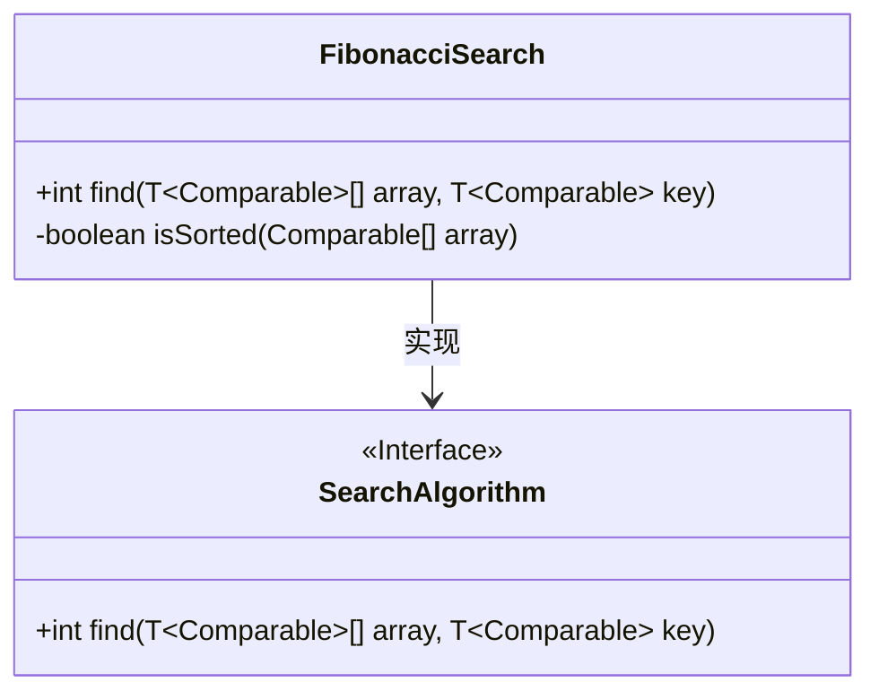
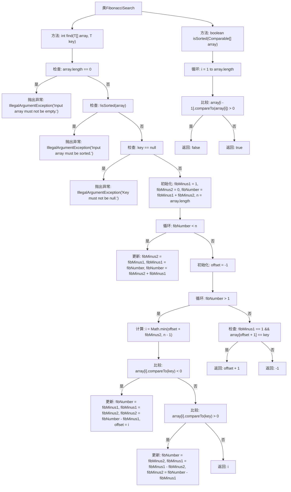

# 基础信息

|      |      |
|------|------|
| 名称 | FibonacciSearch |
| 编码语言 | .java |
| 代码路径 | Java/src/main/java/com/thealgorithms/searches/FibonacciSearch.java |
| 包名 | com.thealgorithms.searches |
| 依赖项 | ['com.thealgorithms.devutils.searches.SearchAlgorithm'] |
| 概述说明 | FibonacciSearch类用斐波那契数列在有序数组中查找元素，返回索引或-1。 |

# 说明

FibonacciSearch类实现了一种基于斐波那契数列的搜索算法，用于在有序数组中查找指定元素。该算法通过利用斐波那契数列的特性，逐步缩小搜索范围，最终确定目标元素的位置。如果找到目标元素，则返回其索引；若未找到，则返回-1。这种方法在特定情况下比二分查找更高效，尤其适用于大规模数据集。

# 类列表 Class Summary

| 名称   | 类型  | 说明 |
|-------|------|-------------|
| FibonacciSearch | class | FibonacciSearch类实现搜索算法，通过斐波那契数列在有序数组中查找指定元素，返回索引或-1。 |

## 类 FibonacciSearch

|      |      |
|------|------|
| 访问范围 | public |
| 类型 | class |
| 名称 | FibonacciSearch |
| 说明 | FibonacciSearch类实现搜索算法，通过斐波那契数列在有序数组中查找指定元素，返回索引或-1。 |

### UML类图

**描述：**  
`FibonacciSearch` 类实现了 `SearchAlgorithm` 接口，提供了斐波那契搜索算法的实现。该算法用于在已排序的数组中查找指定元素的索引。`find` 方法接收一个泛型数组和键值，返回键值在数组中的索引，若未找到则返回 -1。`isSorted` 方法用于检查数组是否已排序。代码中包含了输入验证，确保数组不为空、已排序且键值不为空。

### 内部方法调用关系图

这段代码实现了斐波那契搜索算法，用于在有序数组中查找指定元素的索引。首先，代码检查输入数组是否为空、是否有序以及搜索键是否为空，若不符合条件则抛出异常。接着，代码通过斐波那契数列来确定搜索范围，并在循环中不断缩小搜索范围，直到找到目标元素或确定其不存在。最后，代码返回目标元素的索引或-1表示未找到。

### 字段列表 Field List

| 名称  | 类型  | 说明 |
|-------|-------|------|

### 方法列表 Method List

| 名称  | 类型  | 说明 |
|-------|-------|------|
| isSorted | boolean | 检查数组是否已按升序排列。 |
| find | int | 实现斐波那契搜索，要求数组非空、有序且键值非空。 |

