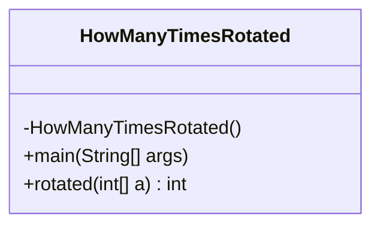
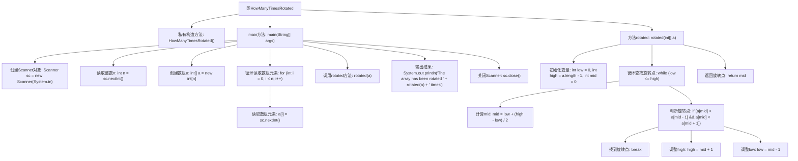

# 基础信息

|      |      |
|------|------|
| 名称 | HowManyTimesRotated |
| 编码语言 | .java |
| 代码路径 | Java/src/main/java/com/thealgorithms/searches/HowManyTimesRotated.java |
| 包名 | com.thealgorithms.searches |
| 依赖项 | ['java.util.Scanner'] |
| 概述说明 | Java程序通过二分查找确定数组旋转次数。 |

# 说明

该内容描述了一个Java程序，其功能是计算数组的旋转次数。程序通过二分查找算法来确定数组中的旋转点，从而计算出旋转的次数。二分查找是一种高效的搜索方法，能够在有序或部分有序的数组中快速定位目标元素或特定位置。在此场景中，旋转点是指数组从有序状态被旋转后的分界点，通过找到这个点，程序可以准确地计算出数组被旋转的次数。这一过程充分利用了二分查找的优势，提高了计算效率。

# 类列表 Class Summary

| 名称   | 类型  | 说明 |
|-------|------|-------------|
| HowManyTimesRotated | class | Java程序计算数组旋转次数，使用二分查找确定旋转点。 |

## 类 HowManyTimesRotated

|      |      |
|------|------|
| 访问范围 | final |
| 类型 | class |
| 名称 | HowManyTimesRotated |
| 说明 | Java程序计算数组旋转次数，使用二分查找确定旋转点。 |

### UML类图

**描述：**  
`HowManyTimesRotated` 类是一个工具类，用于计算一个已排序数组被旋转的次数。该类包含一个私有的构造函数，防止实例化。`main` 方法从标准输入读取数组并调用 `rotated` 方法计算旋转次数，然后输出结果。`rotated` 方法使用二分查找算法来确定数组的旋转点，并返回旋转次数。该类没有依赖其他类，功能独立且简洁。

### 内部方法调用关系图

这段代码定义了一个名为`HowManyTimesRotated`的类，用于计算一个已排序数组被旋转的次数。代码通过二分查找算法在数组中寻找旋转点，并返回该点的索引。`main`方法负责读取用户输入的数组并调用`rotated`方法进行计算，最后输出旋转次数。

### 字段列表 Field List

| 名称  | 类型  | 说明 |
|-------|-------|------|

### 方法列表 Method List

| 名称  | 类型  | 说明 |
|-------|-------|------|
| main | void | Java程序读取数组并输出旋转次数。 |
| rotated | int | 使用二分查找法在旋转数组中查找最小值的索引。 |

