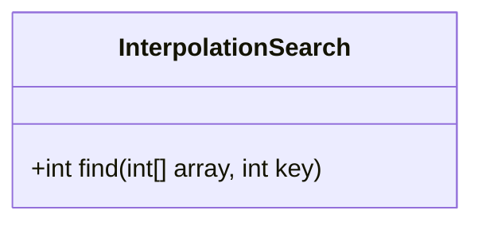
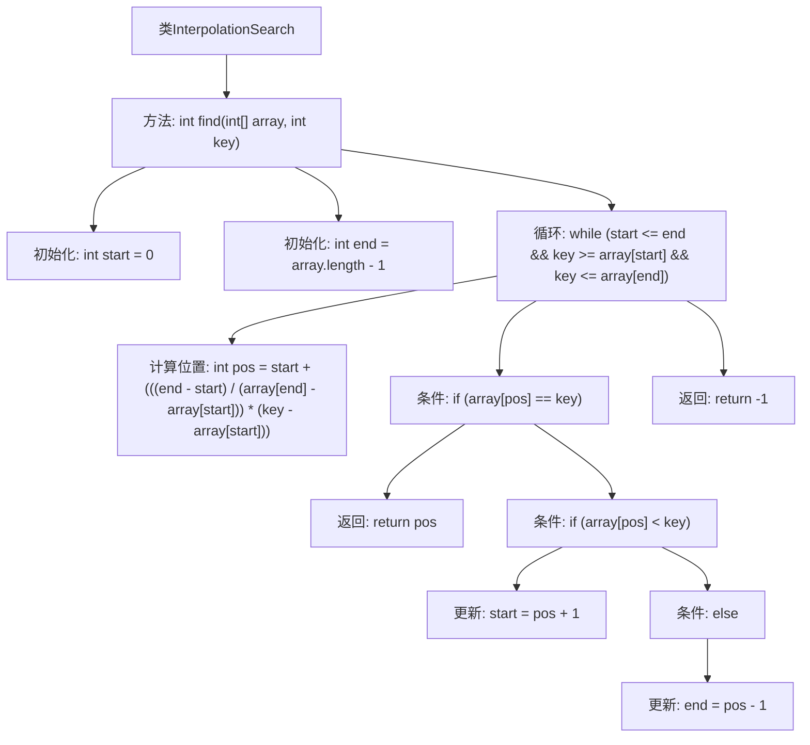

# 基础信息

|      |      |
|------|------|
| 名称 | InterpolationSearch |
| 编码语言 | .java |
| 代码路径 | Java/src/main/java/com/thealgorithms/searches/InterpolationSearch.java |
| 包名 | com.thealgorithms.searches |
| 依赖项 | [] |
| 概述说明 | 插值搜索在有序数组中查找值，未找到返回-1。 |

# 说明

插值搜索算法是一种用于在有序数组中查找指定值索引的搜索方法。该算法通过估算目标值在数组中的可能位置来进行搜索，从而减少查找次数。如果找到目标值，则返回其索引；如果未找到，则返回-1。插值搜索算法在处理均匀分布的数据时效率较高，但在数据分布不均匀时可能表现不佳。

# 类列表 Class Summary

| 名称   | 类型  | 说明 |
|-------|------|-------------|
| InterpolationSearch | class | 插值搜索算法在有序数组中查找指定值的索引，未找到返回-1。 |

## 类 InterpolationSearch

|      |      |
|------|------|
| 访问范围 | None |
| 类型 | class |
| 名称 | InterpolationSearch |
| 说明 | 插值搜索算法在有序数组中查找指定值的索引，未找到返回-1。 |

### UML类图

这段代码定义了一个名为 `InterpolationSearch` 的类，其中包含一个公有方法 `find`，用于在已排序的数组中通过插值搜索算法查找指定键值的索引。该方法首先确定搜索范围的起始和结束位置，然后根据键值与数组元素的分布情况计算出一个预估位置。如果该位置的元素与键值匹配，则返回该位置；否则，根据键值的大小调整搜索范围，直到找到键值或搜索范围无效为止。最终，如果找到键值则返回其索引，否则返回 -1。

### 内部方法调用关系图

这段代码实现了插值搜索算法，用于在已排序的数组中查找指定键值的索引。通过初始化起始和结束位置，并在循环中计算插值位置，逐步缩小搜索范围。如果找到键值，则返回其索引；否则返回-1。该算法在均匀分布的数组中具有较高的效率。

### 字段列表 Field List

| 名称  | 类型  | 说明 |
|-------|-------|------|

### 方法列表 Method List

| 名称  | 类型  | 说明 |
|-------|-------|------|
| find | int | 在有序数组中通过插值查找特定键的位置。 |

