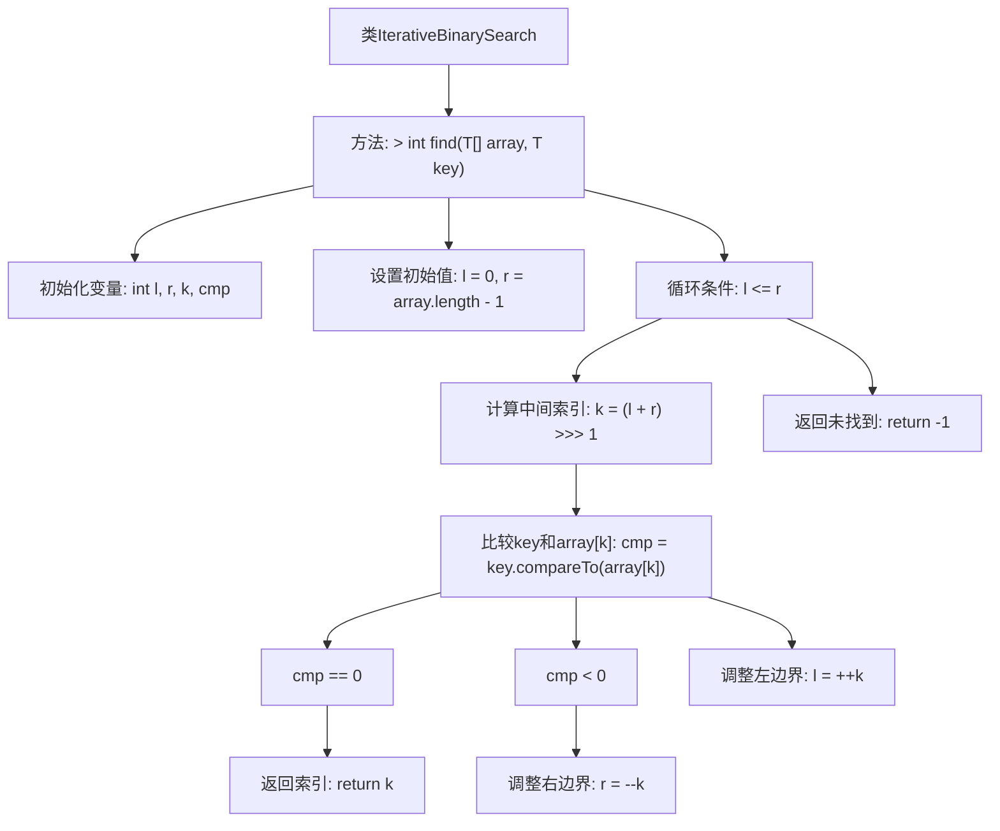

# 基础信息

|      |      |
|------|------|
| 名称 | IterativeBinarySearch |
| 编码语言 | .java |
| 代码路径 | Java/src/main/java/com/thealgorithms/searches/IterativeBinarySearch.java |
| 包名 | com.thealgorithms.searches |
| 依赖项 | ['com.thealgorithms.devutils.searches.SearchAlgorithm'] |
| 概述说明 | 迭代二分查找，返回目标索引或-1。 |

# 说明

实现迭代二分查找算法，用于在有序数组中查找目标元素。该算法通过不断缩小查找范围，逐步逼近目标元素的位置。如果找到目标元素，则返回其索引；如果未找到，则返回-1。该算法避免了递归调用，通过循环结构实现，提高了效率并减少了栈空间的使用。适用于大规模数据集的快速查找。

# 类列表 Class Summary

| 名称   | 类型  | 说明 |
|-------|------|-------------|
| IterativeBinarySearch | class | 实现迭代二分查找算法，返回目标元素索引或-1。 |


## 类 IterativeBinarySearch

|      |      |
|------|------|
| 访问范围 | public final |
| 类型 | class |
| 名称 | IterativeBinarySearch |
| 说明 | 实现迭代二分查找算法，返回目标元素索引或-1。 |


### UML类图

```mermaid
classDiagram
    class SearchAlgorithm {
        <<Interface>>
        +find(~T~[] array, ~T~ key) int
    }

    class IterativeBinarySearch {
        +find(~T~[] array, ~T~ key) int
    }

    SearchAlgorithm <|.. IterativeBinarySearch // 实现关系
```

**描述**：  
`IterativeBinarySearch` 类实现了 `SearchAlgorithm` 接口，提供了一个迭代版本的二分查找算法。该算法通过比较中间元素与目标值，逐步缩小搜索范围，直到找到目标值或确定其不存在。`find` 方法接受一个泛型数组和目标值作为参数，返回目标值的索引或 -1（如果未找到）。


### 内部方法调用关系图



这段代码实现了一个迭代版本的二分查找算法。它通过初始化左右边界并在循环中不断调整边界来查找目标元素。每次迭代计算中间索引并与目标元素比较，根据比较结果调整边界。如果找到目标元素，则返回其索引；否则返回-1表示未找到。该算法适用于已排序的数组，具有较高的查找效率。

### 字段列表 Field List

| 名称  | 类型  | 说明 |
|-------|-------|------|

### 方法列表 Method List

| 名称  | 类型  | 说明 |
|-------|-------|------|
| find | int | 实现二分查找，返回目标元素索引或-1。 |


