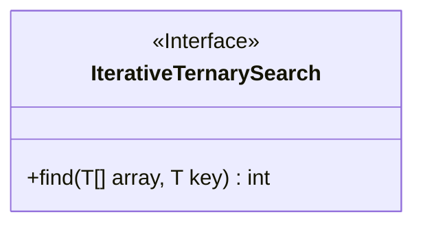
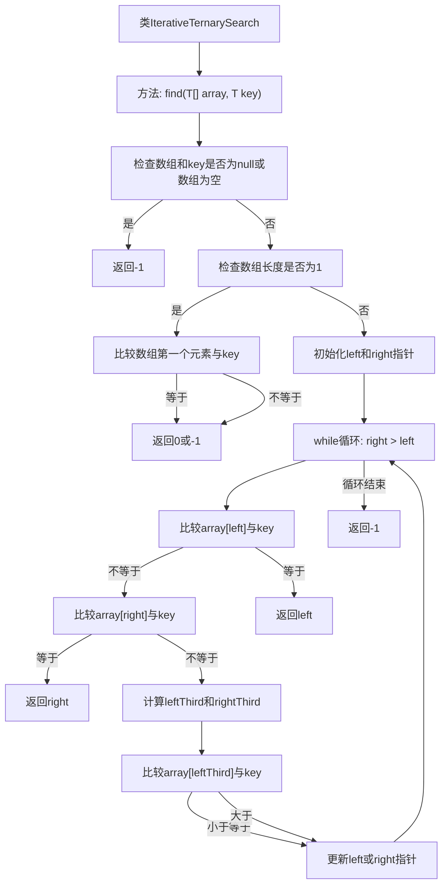

# 基础信息

|      |      |
|------|------|
| 名称 | IterativeTernarySearch |
| 编码语言 | .java |
| 代码路径 | Java/src/main/java/com/thealgorithms/searches/IterativeTernarySearch.java |
| 包名 | com.thealgorithms.searches |
| 依赖项 | ['com.thealgorithms.devutils.searches.SearchAlgorithm'] |
| 概述说明 | 迭代三分搜索算法用于查找数组中的指定元素。 |

# 说明

迭代三分搜索算法是一种用于在数组中查找指定元素的高效方法。该算法通过将数组分为三个部分，每次迭代排除其中两个部分，从而缩小搜索范围。这种方法比传统的二分搜索更快，因为它每次迭代减少的搜索范围更大。算法通过不断比较目标元素与数组中的中间值，确定目标元素可能存在的区域，直到找到目标元素或确定其不存在。该实现适用于有序数组，能够有效提高搜索效率。

# 类列表 Class Summary

| 名称   | 类型  | 说明 |
|-------|------|-------------|
| IterativeTernarySearch | class | 迭代三分搜索算法实现，用于查找数组中指定元素。 |

## 类 IterativeTernarySearch

|      |      |
|------|------|
| 访问范围 | public |
| 类型 | class |
| 名称 | IterativeTernarySearch |
| 说明 | 迭代三分搜索算法实现，用于查找数组中指定元素。 |

### UML类图

**描述：**
`IterativeTernarySearch` 类实现了 `SearchAlgorithm` 接口，提供了一个泛型方法 `find`，用于在有序数组中使用迭代的三分查找算法查找指定元素。该方法首先检查数组和键的有效性，然后通过不断缩小搜索范围来查找目标元素。如果找到目标元素，则返回其索引；否则返回 -1。

### 内部方法调用关系图

这段代码实现了一个迭代的三分搜索算法，用于在有序数组中查找指定元素。代码首先检查输入数组和键值是否为null或数组是否为空，如果是则返回-1。如果数组长度为1，则直接比较唯一元素与键值。否则，初始化左右指针，通过循环不断缩小搜索范围，直到找到目标元素或确定其不存在。流程图展示了代码的主要逻辑流程和条件判断。

### 字段列表 Field List

| 名称  | 类型  | 说明 |
|-------|-------|------|

### 方法列表 Method List

| 名称  | 类型  | 说明 |
|-------|-------|------|
| find | int | 实现查找数组中指定元素的二分法变种，支持泛型和空值检查。 |

