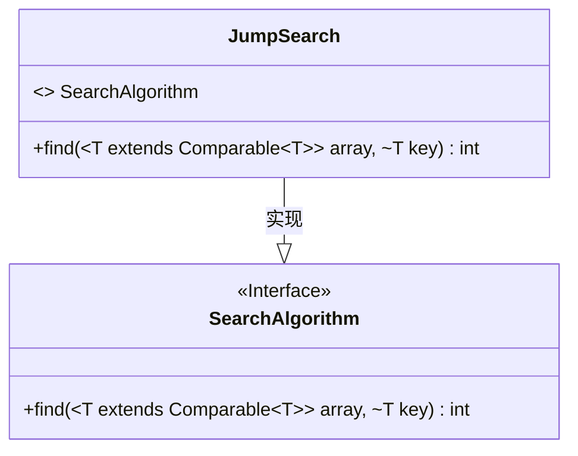
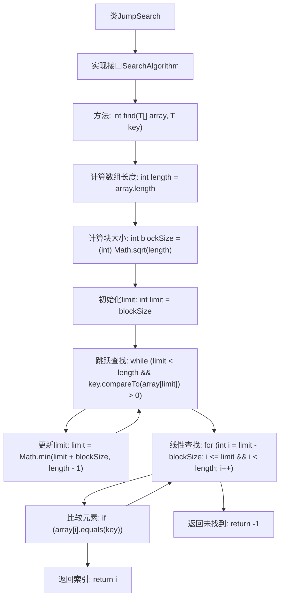

# 基础信息

|      |      |
|------|------|
| 名称 | JumpSearch |
| 编码语言 | .java |
| 代码路径 | Java/src/main/java/com/thealgorithms/searches/JumpSearch.java |
| 包名 | com.thealgorithms.searches |
| 依赖项 | ['com.thealgorithms.devutils.searches.SearchAlgorithm'] |
| 概述说明 | 跳转搜索算法用于在有序数组中快速查找目标元素。 |

# 说明

跳转搜索算法是一种用于在有序数组中查找目标元素的高效方法。该算法通过将数组分成固定大小的块，并逐步跳跃式地检查每个块的最后一个元素，以确定目标元素可能存在的范围。一旦确定目标元素所在的块，算法再在该块内进行线性搜索，以找到目标元素的具体位置。这种方法结合了跳跃和线性搜索的优点，适用于大规模有序数组的查找任务，能够显著减少搜索时间，提高查找效率。

# 类列表 Class Summary

| 名称   | 类型  | 说明 |
|-------|------|-------------|
| JumpSearch | class | 跳转搜索算法实现，用于在有序数组中查找元素。 |

## 类 JumpSearch

|      |      |
|------|------|
| 访问范围 | public |
| 类型 | class |
| 名称 | JumpSearch |
| 说明 | 跳转搜索算法实现，用于在有序数组中查找元素。 |

### UML类图

**类图描述**：  
`JumpSearch` 类实现了 `SearchAlgorithm` 接口，提供了 `find` 方法用于在排序数组中执行跳跃搜索。跳跃搜索通过先跳跃确定可能包含目标元素的块，然后在该块内进行线性搜索，以提高搜索效率。该方法适用于有序数组，时间复杂度为 O(√n)。

### 内部方法调用关系图

这段代码实现了跳跃查找算法，用于在已排序的数组中查找指定元素。首先计算数组的块大小，然后通过跳跃查找确定目标元素可能所在的块，最后在该块内进行线性查找。如果找到目标元素，返回其索引；否则返回-1。

### 字段列表 Field List

| 名称  | 类型  | 说明 |
|-------|-------|------|

### 方法列表 Method List

| 名称  | 类型  | 说明 |
|-------|-------|------|
| find | int | 实现跳块搜索，先定位块再线性查找目标值。 |

