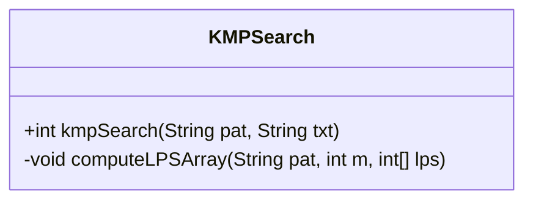
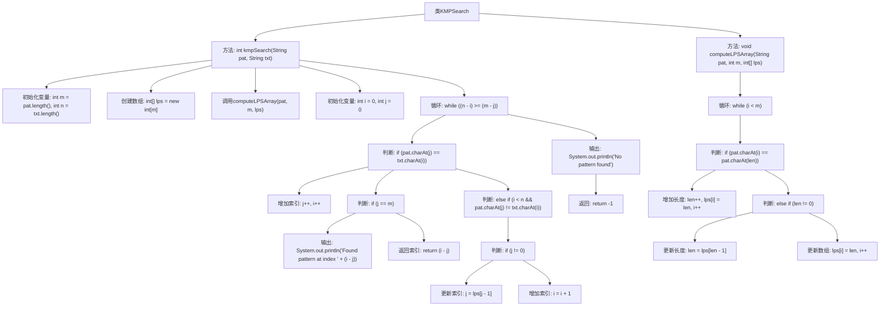

# 基础信息

|      |      |
|------|------|
| 名称 | KMPSearch |
| 编码语言 | .java |
| 代码路径 | Java/src/main/java/com/thealgorithms/searches/KMPSearch.java |
| 包名 | com.thealgorithms.searches |
| 依赖项 | [] |
| 概述说明 | KMP算法通过预处理模式串实现高效字符串匹配并返回匹配索引。 |

# 说明

KMP算法是一种高效的字符串匹配算法，通过预处理模式串，构建部分匹配表，利用该表在匹配过程中跳过不必要的字符比较，从而提高匹配效率。算法最终返回模式串在目标字符串中的匹配索引。

# 类列表 Class Summary

| 名称   | 类型  | 说明 |
|-------|------|-------------|
| KMPSearch | class | KMP算法实现字符串匹配，预处理模式串并返回匹配索引。 |

## 类 KMPSearch

|      |      |
|------|------|
| 访问范围 | None |
| 类型 | class |
| 名称 | KMPSearch |
| 说明 | KMP算法实现字符串匹配，预处理模式串并返回匹配索引。 |

### UML类图

**描述：**  
`KMPSearch` 类实现了KMP（Knuth-Morris-Pratt）字符串搜索算法，用于在文本中查找模式字符串的位置。该类包含两个方法：`kmpSearch` 用于执行搜索并返回模式在文本中的起始索引，`computeLPSArray` 用于预处理模式字符串，生成最长前缀后缀数组（LPS数组）。KMP算法通过利用LPS数组避免不必要的字符比较，从而提高搜索效率。

### 内部方法调用关系图

这段代码实现了KMP（Knuth-Morris-Pratt）字符串匹配算法。`kmpSearch`方法用于在文本中查找模式字符串的位置，`computeLPSArray`方法用于预处理模式字符串，生成最长前缀后缀数组（LPS）。流程图展示了方法的调用顺序和逻辑判断过程，清晰地展示了算法的执行流程。

### 字段列表 Field List

| 名称  | 类型  | 说明 |
|-------|-------|------|

### 方法列表 Method List

| 名称  | 类型  | 说明 |
|-------|-------|------|
| kmpSearch | int | KMP算法实现字符串匹配，返回匹配位置或-1。 |
| computeLPSArray | void | 计算模式串的最长前缀后缀数组。 |

