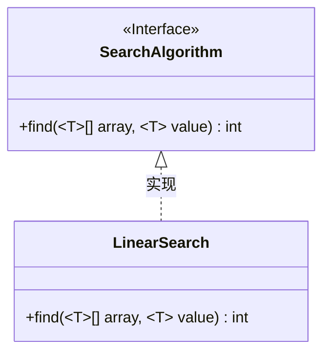
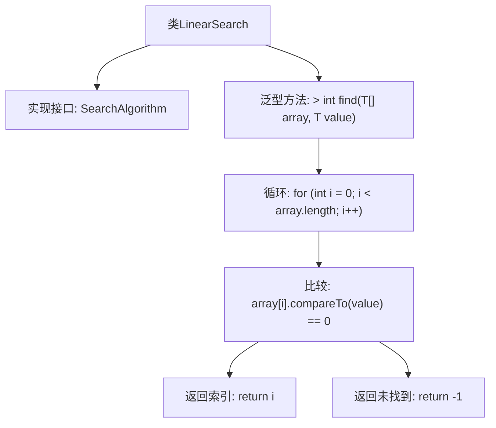

# 基础信息

|      |      |
|------|------|
| 名称 | LinearSearch |
| 编码语言 | .java |
| 代码路径 | Java/src/main/java/com/thealgorithms/searches/LinearSearch.java |
| 包名 | com.thealgorithms.searches |
| 依赖项 | ['com.thealgorithms.devutils.searches.SearchAlgorithm'] |
| 概述说明 | 线性搜索遍历数组查找目标值，返回位置或未找到时返回-1。 |

# 说明

线性搜索是一种简单的查找算法，通过逐个遍历数组中的元素来寻找目标值。算法从数组的第一个元素开始，依次检查每个元素是否与目标值匹配。如果找到匹配的元素，则返回该元素在数组中的位置；如果遍历完整个数组仍未找到目标值，则返回-1表示未找到。这种方法适用于任何类型的数组，但效率较低，特别是在数组规模较大时。

# 类列表 Class Summary

| 名称   | 类型  | 说明 |
|-------|------|-------------|
| LinearSearch | class | 线性搜索实现，遍历数组查找目标值，返回位置或-1。 |

## 类 LinearSearch

|      |      |
|------|------|
| 访问范围 | public |
| 类型 | class |
| 名称 | LinearSearch |
| 说明 | 线性搜索实现，遍历数组查找目标值，返回位置或-1。 |

### UML类图

这段代码定义了一个泛型线性搜索类 `LinearSearch`，它实现了 `SearchAlgorithm` 接口。`LinearSearch` 类中的 `find` 方法接受一个泛型数组和一个泛型值作为参数，通过遍历数组来查找与给定值相等的元素，并返回其索引。如果未找到，则返回 -1。该代码展示了如何使用泛型和接口来实现一个简单的线性搜索算法。

### 内部方法调用关系图

这段代码定义了一个名为 `LinearSearch` 的类，该类实现了 `SearchAlgorithm` 接口。类中包含一个泛型方法 `find`，用于在数组中线性搜索指定的值。方法通过遍历数组，逐个比较元素与目标值，如果找到匹配项则返回其索引，否则返回 -1。流程图展示了类与方法的层级关系以及方法内部的逻辑流程。

### 字段列表 Field List

| 名称  | 类型  | 说明 |
|-------|-------|------|

### 方法列表 Method List

| 名称  | 类型  | 说明 |
|-------|-------|------|
| find | int | 泛型方法在数组中查找指定元素，返回索引或-1。 |

