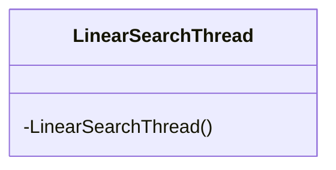
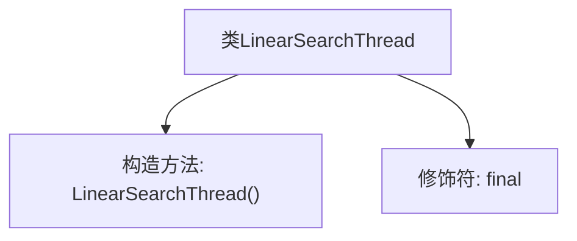
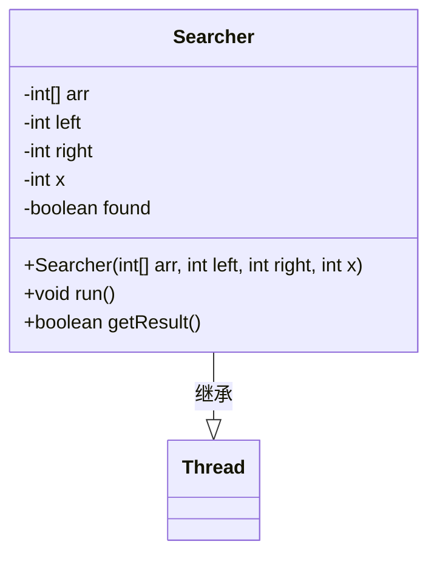
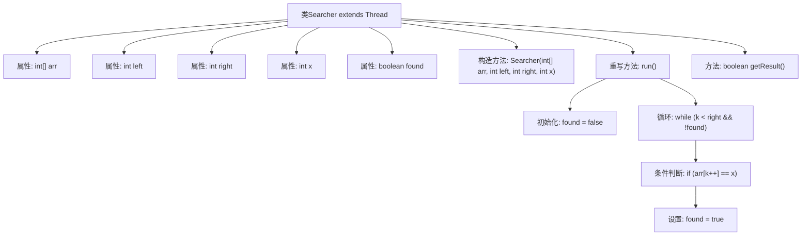

# 基础信息

|      |      |
|------|------|
| 名称 | LinearSearchThread |
| 编码语言 | .java |
| 代码路径 | Java/src/main/java/com/thealgorithms/searches/LinearSearchThread.java |
| 包名 | com.thealgorithms.searches |
| 依赖项 | [] |
| 概述说明 | LinearSearchThread不可继承，Searcher继承Thread用于数组段搜索。 |

# 说明

LinearSearchThread是一个不可继承的最终类，且没有公共构造函数。Searcher类继承自Thread类，专门用于在线程中执行线性搜索任务，针对数组的特定段查找指定数字。

# 类列表 Class Summary

| 名称   | 类型  | 说明 |
|-------|------|-------------|
| LinearSearchThread | class | LinearSearchThread为不可继承的最终类，无公共构造函数。 |
| Searcher | class | Searcher类继承Thread，用于在线程中线性搜索数组段中的指定数字。 |

## 类 LinearSearchThread

|      |      |
|------|------|
| 访问范围 | public final |
| 类型 | class |
| 名称 | LinearSearchThread |
| 说明 | LinearSearchThread为不可继承的最终类，无公共构造函数。 |

### UML类图

这段代码定义了一个名为 `LinearSearchThread` 的最终类，该类包含一个私有的构造函数。由于构造函数是私有的，该类无法被外部实例化，通常用于实现单例模式或工具类。这种设计确保了类的不可变性，并且避免了外部创建对象实例的可能性。

### 内部方法调用关系图

这段代码定义了一个名为 `LinearSearchThread` 的最终类，该类包含一个私有的构造方法。由于类被声明为 `final`，它不能被继承。私有构造方法的存在意味着该类无法被外部实例化，通常用于实现单例模式或工具类。该类的设计表明它可能用于某种线程相关的线性搜索操作，但具体功能需要结合更多上下文来确定。

### 字段列表 Field List

| 名称  | 类型  | 说明 |
|-------|-------|------|

### 方法列表 Method List

| 名称  | 类型  | 说明 |
|-------|-------|------|

## 类 Searcher

|      |      |
|------|------|
| 访问范围 | None |
| 类型 | class |
| 名称 | Searcher |
| 说明 | Searcher类继承Thread，用于在线程中线性搜索数组段中的指定数字。 |

### UML类图

**描述：**  
`Searcher` 类继承自 `Thread`，用于在多线程环境中执行线性搜索任务。该类包含一个整数数组 `arr`、搜索范围的起始索引 `left` 和结束索引 `right`、要搜索的数字 `x` 以及一个布尔标志 `found` 来表示是否找到目标数字。`run` 方法在指定范围内执行线性搜索，若找到目标数字则设置 `found` 为 `true`。`getResult` 方法用于返回搜索结果。

### 内部方法调用关系图

这段代码定义了一个`Searcher`类，继承自`Thread`，用于在多线程环境中对数组进行线性搜索。`Searcher`类包含构造方法初始化搜索参数，`run`方法执行搜索逻辑，`getResult`方法返回搜索结果。流程图展示了类的结构及其内部方法的调用关系，清晰地描述了搜索过程的执行流程。

### 字段列表 Field List

| 名称  | 类型  | 说明 |
|-------|-------|------|
| arr | int[] | 声明一个私有的整型数组变量arr。 |
| x | int | 私有整型常量x。 |
| right | int | 声明一个私有且不可变的整型变量right。 |
| found | boolean | 定义了一个私有的布尔变量found。 |
| left | int | 定义一个私有的不可变整型变量left。 |

### 方法列表 Method List

| 名称  | 类型  | 说明 |
|-------|-------|------|
| getResult | boolean | 返回布尔值found的方法getResult。 |
| run | void | 重写run方法，遍历数组查找指定元素，找到后标记为true。 |

