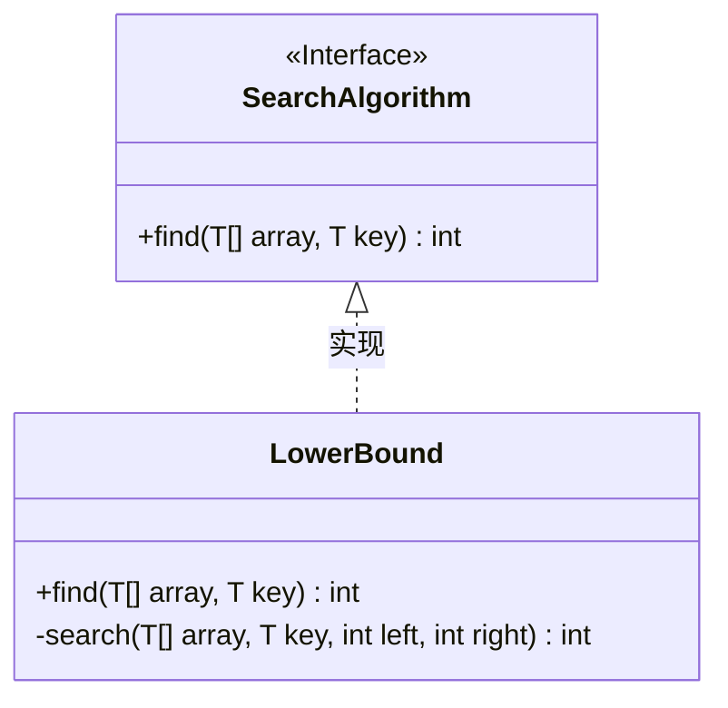
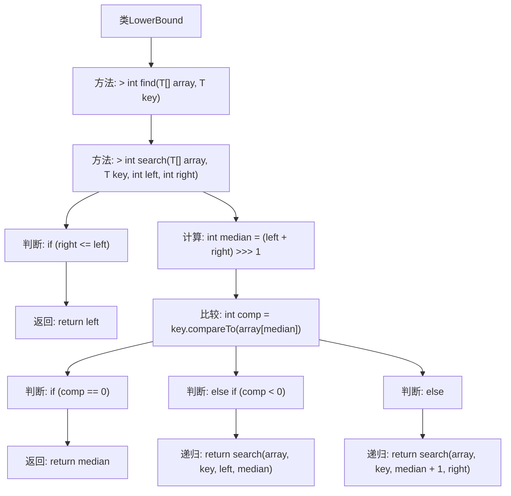

# 基础信息

|      |      |
|------|------|
| 名称 | LowerBound |
| 编码语言 | .java |
| 代码路径 | Java/src/main/java/com/thealgorithms/searches/LowerBound.java |
| 包名 | com.thealgorithms.searches |
| 依赖项 | ['com.thealgorithms.devutils.searches.SearchAlgorithm'] |
| 概述说明 | LowerBound类实现二分搜索，查找有序数组中目标元素的下界位置。 |

# 说明

LowerBound类实现了二分搜索算法，专门用于在有序数组中查找目标元素的下界位置。该算法通过逐步缩小搜索范围，高效地确定目标元素在数组中的最低可能位置，确保在有序数组中进行快速且准确的查找。

# 类列表 Class Summary

| 名称   | 类型  | 说明 |
|-------|------|-------------|
| LowerBound | class | LowerBound类实现二分搜索算法，用于在有序数组中查找目标元素的下界位置。 |

## 类 LowerBound

|      |      |
|------|------|
| 访问范围 | None |
| 类型 | class |
| 名称 | LowerBound |
| 说明 | LowerBound类实现二分搜索算法，用于在有序数组中查找目标元素的下界位置。 |

### UML类图

**描述：**
该代码定义了一个 `LowerBound` 类，它实现了 `SearchAlgorithm` 接口。`LowerBound` 类通过二分查找算法来查找数组中给定元素的第一个不小于它的位置。`find` 方法是公有方法，接受一个数组和一个键值，返回该键值的下界索引。`search` 方法是私有方法，用于递归执行二分查找，确定键值在数组中的位置。类图展示了 `LowerBound` 类与 `SearchAlgorithm` 接口之间的实现关系。

### 内部方法调用关系图

这段代码实现了一个泛型的二分查找算法，用于在有序数组中查找某个元素的下界。`find`方法作为入口，调用`search`方法进行递归查找。`search`方法通过计算中间值并与目标值比较，逐步缩小查找范围，直到找到目标值或确定其下界位置。整个过程通过递归实现，确保高效地定位目标元素的下界。

### 字段列表 Field List

| 名称  | 类型  | 说明 |
|-------|-------|------|

### 方法列表 Method List

| 名称  | 类型  | 说明 |
|-------|-------|------|
| search | int | 私有方法实现二分查找，返回目标位置或插入点。 |
| find | int | 重写find方法，使用泛型搜索数组中的元素。 |

