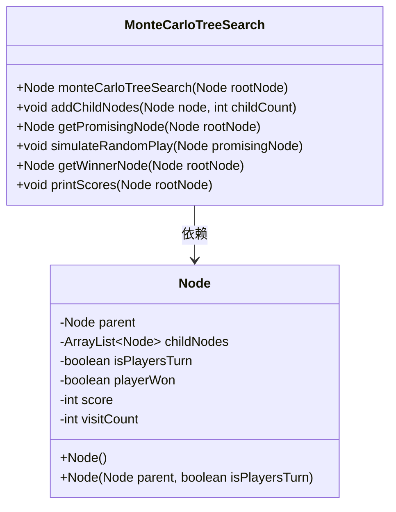
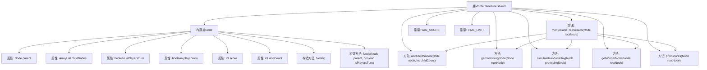
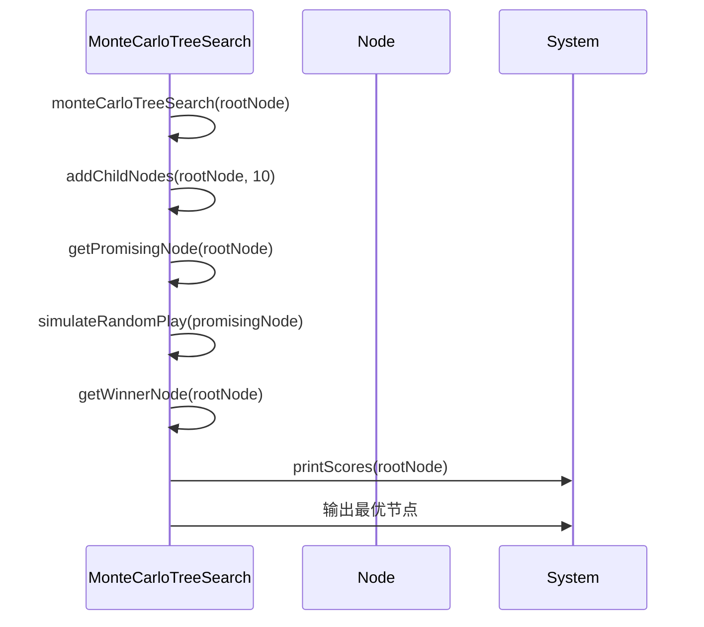

# 基础信息

|      |      |
|------|------|
| 名称 | MonteCarloTreeSearch |
| 编码语言 | .java |
| 代码路径 | Java/src/main/java/com/thealgorithms/searches/MonteCarloTreeSearch.java |
| 包名 | com.thealgorithms.searches |
| 依赖项 | ['java.util.ArrayList', 'java.util.Collections', 'java.util.Comparator', 'java.util.Random'] |
| 概述说明 | MonteCarloTreeSearch通过模拟随机游戏选择最优节点。 |

# 说明

MonteCarloTreeSearch是一种实现MCTS算法的方法，通过模拟随机游戏来选择最优节点。该算法通过多次随机模拟来评估每个节点的潜在价值，从而在决策树中逐步优化选择路径。MCTS的核心思想是通过平衡探索与利用，逐步收敛到最优解。它广泛应用于游戏AI和复杂决策问题中，能够在不确定环境中做出高效的决策。

# 类列表 Class Summary

| 名称   | 类型  | 说明 |
|-------|------|-------------|
| MonteCarloTreeSearch | class | MonteCarloTreeSearch实现MCTS算法，通过模拟随机游戏选择最优节点。 |

## 类 MonteCarloTreeSearch

|      |      |
|------|------|
| 访问范围 | public |
| 类型 | class |
| 名称 | MonteCarloTreeSearch |
| 说明 | MonteCarloTreeSearch实现MCTS算法，通过模拟随机游戏选择最优节点。 |

### UML类图

这段代码实现了一个蒙特卡洛树搜索（MCTS）算法，用于在游戏树中寻找最优的下一步行动。`MonteCarloTreeSearch` 类包含了核心的搜索逻辑，包括节点的扩展、模拟随机游戏、使用UCT算法选择最有潜力的节点以及最终选择最优节点。`Node` 类表示游戏树中的一个节点，包含父节点、子节点列表、玩家回合标志、玩家胜利标志、得分和访问次数等信息。MCTS算法通过反复扩展和模拟游戏树，最终选择得分最高的节点作为最优解。

### 内部方法调用关系图

这段代码实现了一个蒙特卡洛树搜索（MCTS）算法，用于在游戏树中寻找最优的节点。代码首先定义了内部类`Node`，用于表示树中的节点，包含父节点、子节点列表、玩家回合标志、玩家胜利标志、分数和访问次数等属性。`MonteCarloTreeSearch`类中的`monteCarloTreeSearch`方法通过不断扩展和模拟随机游戏来探索树，直到达到时间限制。`getPromisingNode`方法使用UCT算法选择最有潜力的节点进行扩展，`simulateRandomPlay`方法模拟随机游戏并回溯更新节点分数，最后`getWinnerNode`方法返回得分最高的子节点。

### 字段列表 Field List

| 名称  | 类型  | 说明 |
|-------|-------|------|
| WIN_SCORE = 10 | int | 定义常量WIN_SCORE，值为10。 |
| TIME_LIMIT = 500 | int | 定义常量TIME_LIMIT，值为500。 |

### 方法列表 Method List

| 名称  | 类型  | 说明 |
|-------|-------|------|
| printScores | void | 打印根节点子节点的得分和访问次数。 |
| getWinnerNode | Node | 获取根节点子节点中得分最高的节点。 |
| simulateRandomPlay | void | 模拟随机游戏结果，更新节点访问次数和得分。 |
| getPromisingNode | Node | 通过UCT算法从根节点递归选择最优子节点。 |
| monteCarloTreeSearch | Node | 蒙特卡洛树搜索算法，扩展节点并模拟随机游戏，返回最优节点。 |
| addChildNodes | void | 为节点添加指定数量的子节点，子节点继承父节点并反转玩家回合状态。 |

