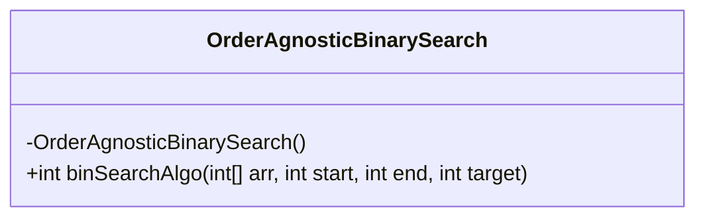
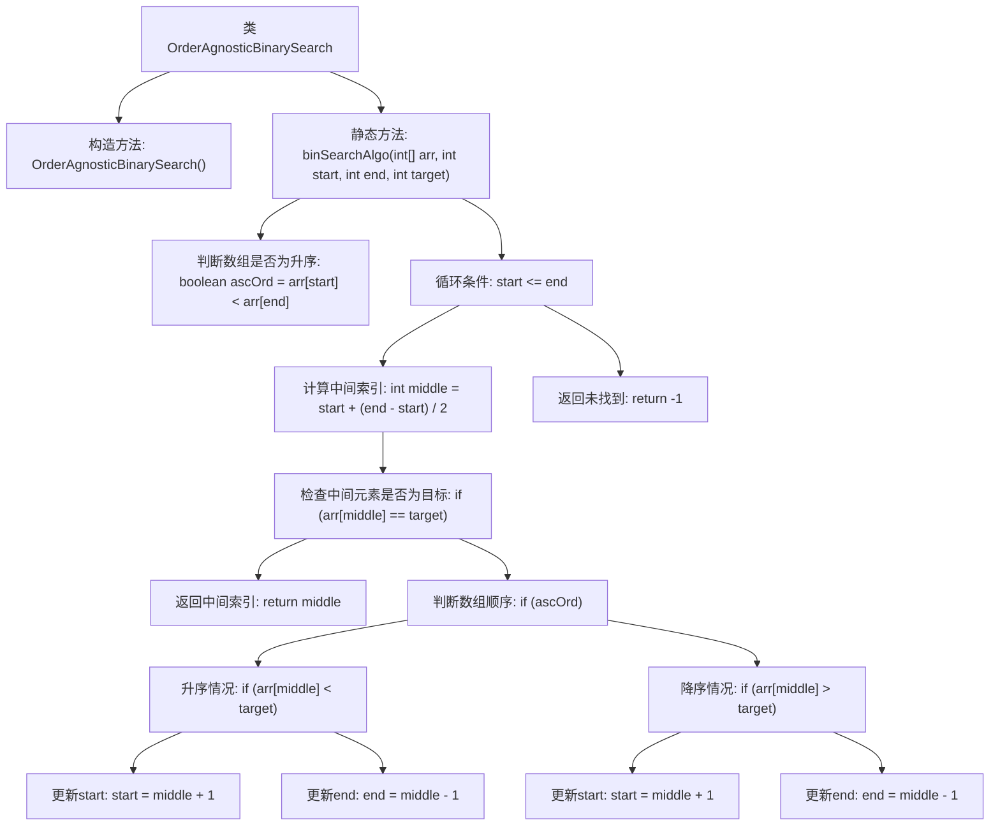

# 基础信息

|      |      |
|------|------|
| 名称 | OrderAgnosticBinarySearch |
| 编码语言 | .java |
| 代码路径 | Java/src/main/java/com/thealgorithms/searches/OrderAgnosticBinarySearch.java |
| 包名 | com.thealgorithms.searches |
| 依赖项 | [] |
| 概述说明 | 实现无序数组二分查找，支持升序和降序。 |

# 说明

该内容描述了一个实现无序数组的二分查找算法的需求，要求该算法能够支持升序和降序两种排列方式。二分查找通常用于有序数组，但此处特别强调了无序数组的支持，意味着算法需要在查找前对数组进行排序处理。此外，算法需要灵活应对升序和降序两种不同的排序方式，确保在不同情况下都能正确执行查找操作。

# 类列表 Class Summary

| 名称   | 类型  | 说明 |
|-------|------|-------------|
| OrderAgnosticBinarySearch | class | 实现无序数组的二分查找算法，支持升序和降序。 |

## 类 OrderAgnosticBinarySearch

|      |      |
|------|------|
| 访问范围 | public final |
| 类型 | class |
| 名称 | OrderAgnosticBinarySearch |
| 说明 | 实现无序数组的二分查找算法，支持升序和降序。 |

### UML类图

类图描述：`OrderAgnosticBinarySearch` 是一个不可继承的类，包含一个私有的构造函数和一个公有的静态方法 `binSearchAlgo`。该方法用于在给定的数组中执行二分查找，无论数组是升序还是降序排列。方法通过检查数组的起始和结束元素来确定排序顺序，并根据目标值与中间元素的比较结果调整查找范围。如果找到目标元素，则返回其索引；否则返回 -1。

### 内部方法调用关系图

这段代码实现了一个与顺序无关的二分查找算法。它首先判断数组是升序还是降序，然后根据数组的顺序调整查找逻辑。通过不断缩小查找范围，最终返回目标元素的索引，如果未找到则返回-1。该算法适用于任何有序数组，无论其是升序还是降序排列。

### 字段列表 Field List

| 名称  | 类型  | 说明 |
|-------|-------|------|

### 方法列表 Method List

| 名称  | 类型  | 说明 |
|-------|-------|------|
| binSearchAlgo | int | 二分查找算法，支持升序和降序数组，返回目标元素索引或-1。 |

