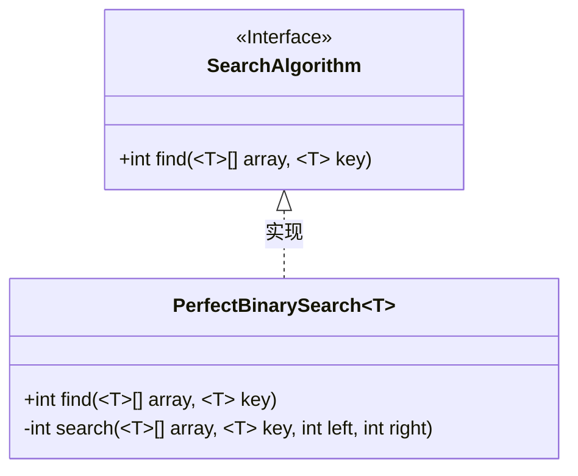
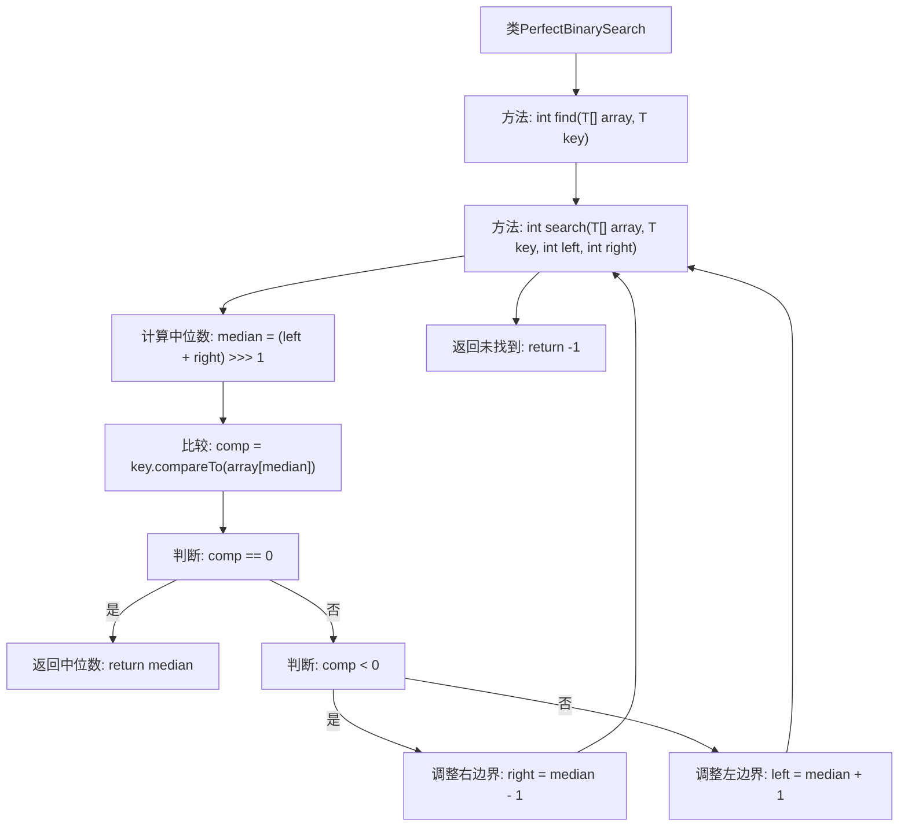

# 基础信息

|      |      |
|------|------|
| 名称 | PerfectBinarySearch |
| 编码语言 | .java |
| 代码路径 | Java/src/main/java/com/thealgorithms/searches/PerfectBinarySearch.java |
| 包名 | com.thealgorithms.searches |
| 依赖项 | ['com.thealgorithms.devutils.searches.SearchAlgorithm'] |
| 概述说明 | 实现泛型二分查找，返回元素索引或-1。 |

# 说明

实现泛型二分查找算法，旨在在有序数组中查找指定元素。若找到该元素，则返回其索引；若未找到，则返回-1。该算法通过不断将搜索范围缩小一半，逐步逼近目标元素，确保查找过程高效且准确。适用于各种数据类型，具有通用性和灵活性。

# 类列表 Class Summary

| 名称   | 类型  | 说明 |
|-------|------|-------------|
| PerfectBinarySearch | class | 实现泛型二分查找算法，返回元素索引或-1。 |

## 类 PerfectBinarySearch

|      |      |
|------|------|
| 访问范围 | public |
| 类型 | class |
| 名称 | PerfectBinarySearch |
| 说明 | 实现泛型二分查找算法，返回元素索引或-1。 |

### UML类图

**描述：**  
该代码定义了一个泛型类 `PerfectBinarySearch<T>`，它实现了 `SearchAlgorithm` 接口。`PerfectBinarySearch` 类提供了二分查找算法的实现，通过 `find` 方法在有序数组中查找指定元素。`search` 方法是私有的递归实现，用于在给定的范围内进行二分查找。如果找到元素，则返回其索引；否则返回 -1。该设计支持任何可比较的泛型类型，具有良好的可扩展性和通用性。

### 内部方法调用关系图

这段代码实现了一个泛型的二分查找算法。`PerfectBinarySearch`类包含两个方法：`find`和`search`。`find`方法调用`search`方法进行实际的查找操作。`search`方法通过迭代方式在数组中查找目标元素，计算中位数并与目标元素比较，根据比较结果调整查找范围，直到找到目标元素或确定其不存在。最终返回目标元素的索引或-1表示未找到。

### 字段列表 Field List

| 名称  | 类型  | 说明 |
|-------|-------|------|

### 方法列表 Method List

| 名称  | 类型  | 说明 |
|-------|-------|------|
| search | int | 实现二分查找，返回匹配元素的索引，未找到返回-1。 |
| find | int | 重写find方法，使用泛型实现数组查找。 |

