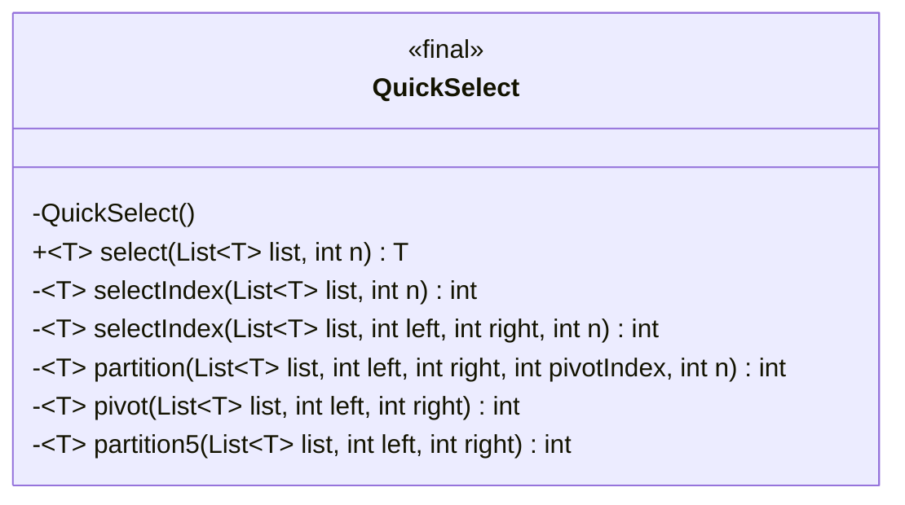
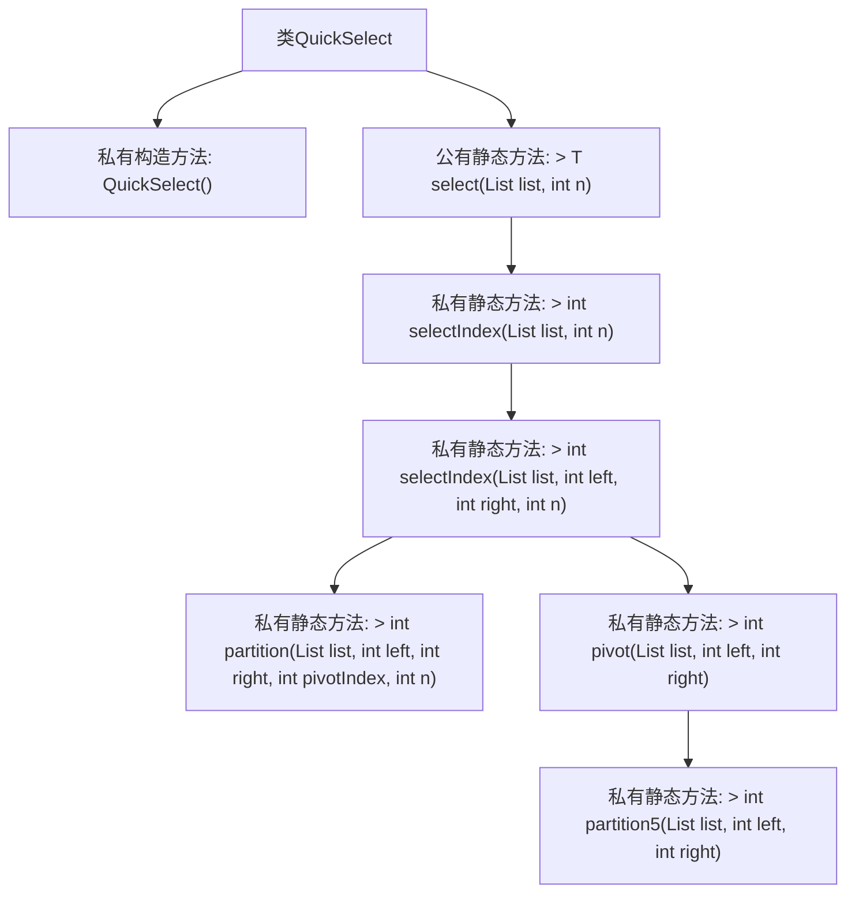

# 基础信息

|      |      |
|------|------|
| 名称 | QuickSelect |
| 编码语言 | .java |
| 代码路径 | Java/src/main/java/com/thealgorithms/searches/QuickSelect.java |
| 包名 | com.thealgorithms.searches |
| 依赖项 | ['java.util.Collections', 'java.util.Comparator', 'java.util.List', 'java.util.Objects'] |
| 概述说明 | QuickSelect类实现快速选择算法，返回列表中第n大元素，并处理异常。 |

# 说明

QuickSelect类实现了快速选择算法，用于在列表中查找第n大的元素。该类具备处理空列表和索引越界等异常情况的能力，确保在异常输入时能够正确响应。通过该算法，用户可以高效地获取列表中指定顺序的元素，同时避免因输入错误导致的程序崩溃。

# 类列表 Class Summary

| 名称   | 类型  | 说明 |
|-------|------|-------------|
| QuickSelect | class | QuickSelect类实现快速选择算法，返回列表中第n大元素，支持空列表、索引越界等异常处理。 |

## 类 QuickSelect

|      |      |
|------|------|
| 访问范围 | public final |
| 类型 | class |
| 名称 | QuickSelect |
| 说明 | QuickSelect类实现快速选择算法，返回列表中第n大元素，支持空列表、索引越界等异常处理。 |

### UML类图

这段代码定义了一个名为 `QuickSelect` 的最终类，该类实现了快速选择算法，用于在未排序的列表中找到第 `n` 大的元素。类中的 `select` 方法是公有方法，负责参数校验并调用私有方法 `selectIndex` 来执行实际的查找操作。`selectIndex` 方法通过递归和分区操作来确定目标元素的位置。`partition` 方法用于分区操作，`pivot` 方法用于选择分区点，`partition5` 方法用于在子列表中进行排序并返回中位数。这些方法共同协作，确保快速选择算法的高效执行。

### 内部方法调用关系图

这段代码实现了一个名为 `QuickSelect` 的类，用于在未排序的列表中找到第 `n` 大的元素。`select` 方法是入口点，负责验证输入参数并调用 `selectIndex` 方法来找到目标元素的索引。`selectIndex` 方法通过递归调用和分区操作来确定目标元素的位置。`partition` 方法用于将列表划分为小于和大于枢轴值的两部分，而 `pivot` 方法则用于选择枢轴值。`partition5` 方法用于在小子集中找到中位数。整个流程通过多次分区和选择操作，最终找到第 `n` 大的元素。

### 字段列表 Field List

| 名称  | 类型  | 说明 |
|-------|-------|------|

### 方法列表 Method List

| 名称  | 类型  | 说明 |
|-------|-------|------|
| partition | int | 实现快速排序分区，交换元素并返回分区索引。 |
| select | T | 从列表中按索引选择元素，确保列表非空且索引有效。 |
| partition5 | int | 私有静态方法partition5对列表子区间排序并返回中间索引。 |
| selectIndex | int | 私有静态方法selectIndex返回列表中第n个元素的索引。 |
| selectIndex | int | 私有静态方法selectIndex用于在列表中查找第n个元素的索引，通过循环和分区操作实现。 |
| pivot | int | 私有方法计算列表枢轴值，基于子列表分区和选择索引。 |

