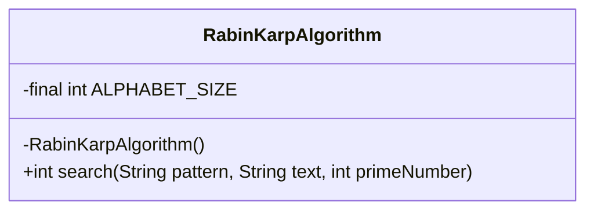
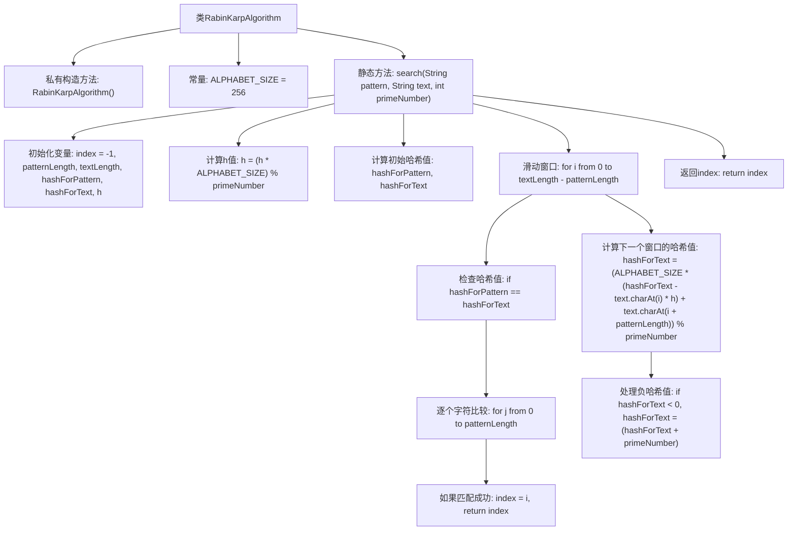

# 基础信息

|      |      |
|------|------|
| 名称 | RabinKarpAlgorithm |
| 编码语言 | .java |
| 代码路径 | Java/src/main/java/com/thealgorithms/searches/RabinKarpAlgorithm.java |
| 包名 | com.thealgorithms.searches |
| 依赖项 | [] |
| 概述说明 | Rabin-Karp算法通过哈希值快速匹配字符串位置。 |

# 说明

Rabin-Karp算法是一种高效的字符串匹配技术，通过计算模式串和文本子串的哈希值来进行快速匹配。该算法首先计算模式串的哈希值，然后在文本中滑动窗口计算每个子串的哈希值，若哈希值匹配则进一步验证字符是否相同。这种方法在平均情况下具有较好的时间复杂度，适用于大规模文本匹配场景。

# 类列表 Class Summary

| 名称   | 类型  | 说明 |
|-------|------|-------------|
| RabinKarpAlgorithm | class | Rabin-Karp算法用于字符串匹配，通过哈希值快速定位模式串在文本中的位置。 |

## 类 RabinKarpAlgorithm

|      |      |
|------|------|
| 访问范围 | public final |
| 类型 | class |
| 名称 | RabinKarpAlgorithm |
| 说明 | Rabin-Karp算法用于字符串匹配，通过哈希值快速定位模式串在文本中的位置。 |

### UML类图

**描述：**  
`RabinKarpAlgorithm` 类实现了一个用于字符串匹配的 Rabin-Karp 算法。该算法通过计算模式字符串和文本字符串的哈希值来快速定位匹配位置。类中包含一个私有常量 `ALPHABET_SIZE` 表示字符集大小，以及一个私有的构造函数防止实例化。`search` 方法是核心功能，接受模式字符串、文本字符串和一个质数作为参数，返回模式在文本中首次出现的位置索引，若未找到则返回 -1。

### 内部方法调用关系图

这段代码实现了Rabin-Karp算法，用于在文本中搜索模式字符串。首先初始化变量并计算初始哈希值，然后通过滑动窗口逐个检查哈希值是否匹配。如果哈希值匹配，则进一步逐个字符比较。如果匹配成功，则返回模式在文本中的起始位置；否则继续滑动窗口并更新哈希值。最终返回模式在文本中的位置，若未找到则返回-1。

### 字段列表 Field List

| 名称  | 类型  | 说明 |
|-------|-------|------|
| ALPHABET_SIZE = 256 | int | 定义了一个私有的静态常量ALPHABET_SIZE，值为256。 |

### 方法列表 Method List

| 名称  | 类型  | 说明 |
|-------|-------|------|
| search | int | 实现字符串模式匹配的哈希算法，返回匹配起始索引或-1。 |

