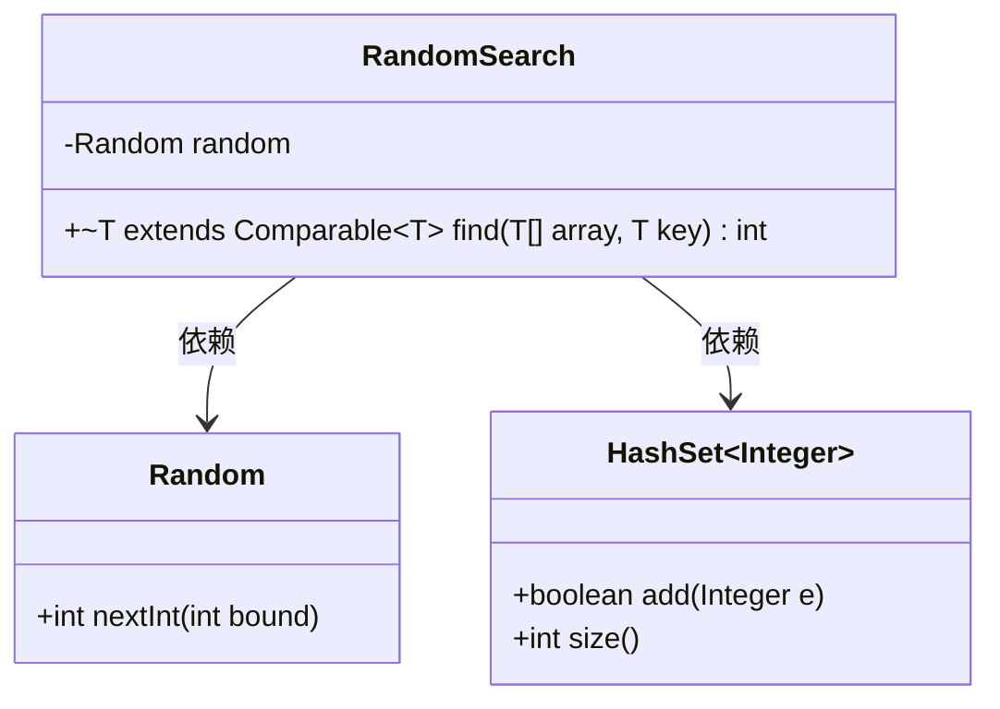
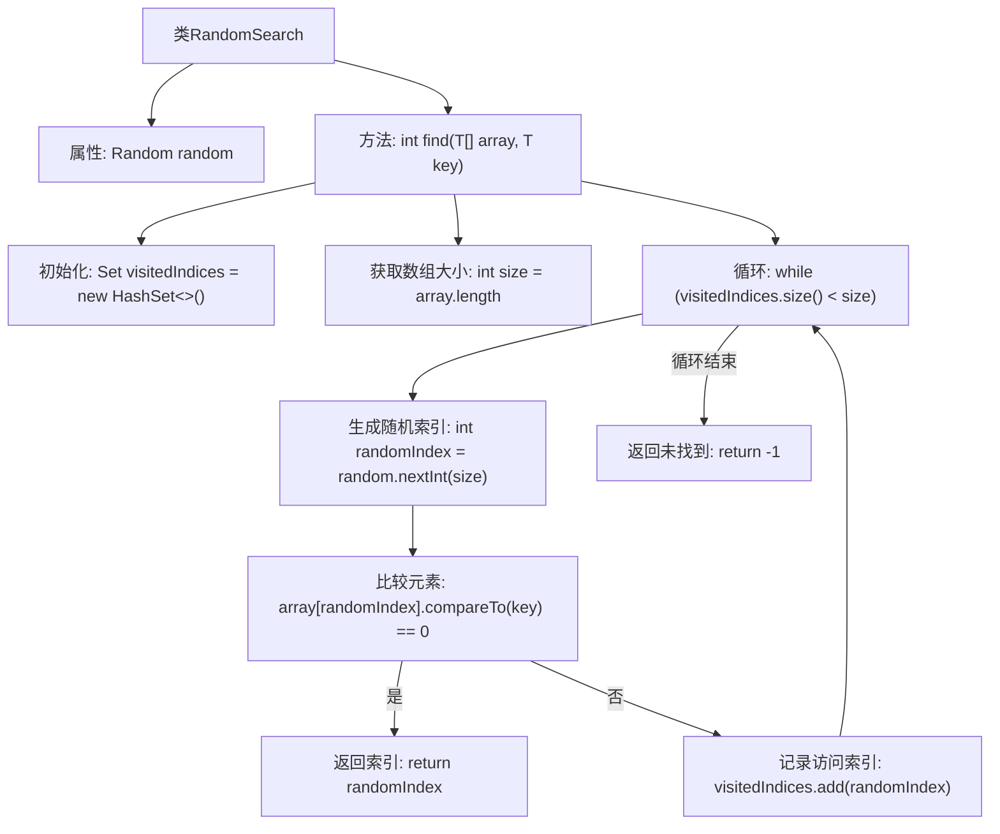

# 基础信息

|      |      |
|------|------|
| 名称 | RandomSearch |
| 编码语言 | .java |
| 代码路径 | Java/src/main/java/com/thealgorithms/searches/RandomSearch.java |
| 包名 | com.thealgorithms.searches |
| 依赖项 | ['com.thealgorithms.devutils.searches.SearchAlgorithm', 'java.util.HashSet', 'java.util.Random', 'java.util.Set'] |
| 概述说明 | 随机搜索算法通过随机索引查找数组元素，未找到返回-1。 |

# 说明

随机搜索算法是一种通过随机选择索引来查找数组中特定元素的方法。该算法首先随机生成一个索引，然后检查该索引对应的数组元素是否与目标值匹配。如果匹配，则返回该索引；如果不匹配，则继续随机生成新的索引进行查找。如果经过多次尝试仍未找到目标元素，则算法返回-1，表示未找到。这种方法简单但效率较低，适用于小规模数据集或对搜索速度要求不高的场景。

# 类列表 Class Summary

| 名称   | 类型  | 说明 |
|-------|------|-------------|
| RandomSearch | class | 随机搜索算法实现，通过随机索引查找数组元素，未找到返回-1。 |

## 类 RandomSearch

|      |      |
|------|------|
| 访问范围 | public |
| 类型 | class |
| 名称 | RandomSearch |
| 说明 | 随机搜索算法实现，通过随机索引查找数组元素，未找到返回-1。 |

### UML类图

**描述**：  
`RandomSearch` 类实现了随机搜索算法，用于在数组中查找指定元素的索引。它依赖于 `Random` 类生成随机索引，并使用 `HashSet` 记录已访问的索引，确保每个索引只被访问一次。如果找到目标元素，返回其索引；否则返回 -1。该算法通过随机访问数组元素来提高搜索效率，适用于无序数组。

### 内部方法调用关系图

这段代码实现了一个随机搜索算法，用于在数组中查找指定元素的索引。代码首先初始化一个空的哈希集合来记录已访问的索引，然后通过随机生成索引来访问数组中的元素，直到找到目标元素或所有索引都被访问过。如果找到目标元素，返回其索引；否则返回-1。流程图清晰地展示了这一过程，包括初始化、循环、随机索引生成、元素比较和结果返回等步骤。

### 字段列表 Field List

| 名称  | 类型  | 说明 |
|-------|-------|------|
| random = new Random() | Random | 声明并初始化一个私有的随机数生成器实例。 |

### 方法列表 Method List

| 名称  | 类型  | 说明 |
|-------|-------|------|
| find | int | 该方法在数组中随机查找指定元素，返回其索引或-1。 |

