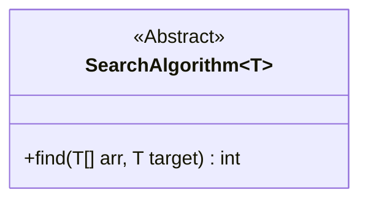
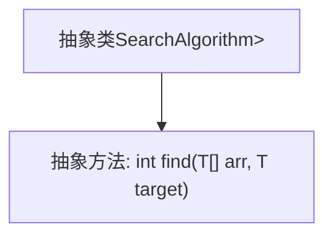
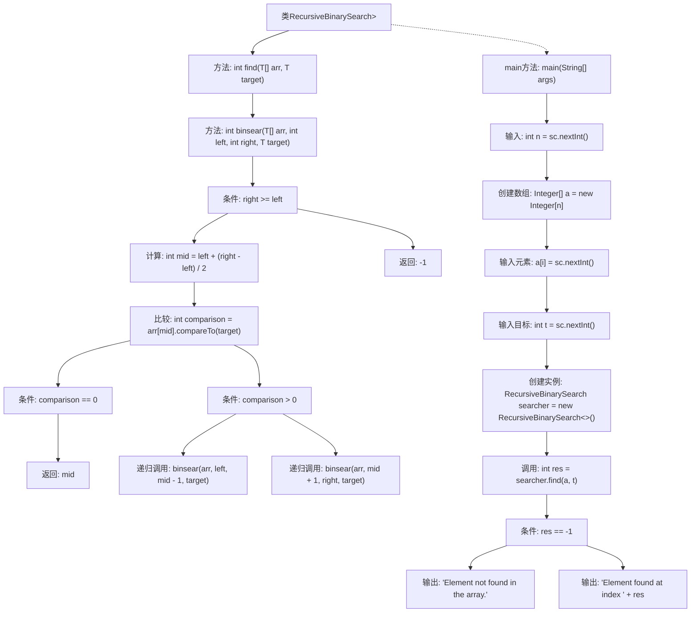

# 基础信息

|      |      |
|------|------|
| 名称 | RecursiveBinarySearch |
| 编码语言 | .java |
| 代码路径 | Java/src/main/java/com/thealgorithms/searches/RecursiveBinarySearch.java |
| 包名 | com.thealgorithms.searches |
| 依赖项 | ['java.util.Scanner'] |
| 概述说明 | 抽象类定义泛型查找算法，子类实现递归二分查找。 |

# 说明

抽象类SearchAlgorithm定义了一个泛型查找算法，要求子类必须实现find方法。递归二分查找类是该抽象类的具体实现，支持泛型，并通过递归方式查找目标元素的索引。

# 类列表 Class Summary

| 名称   | 类型  | 说明 |
|-------|------|-------------|
| SearchAlgorithm | class | 抽象类SearchAlgorithm定义泛型查找算法，子类需实现find方法。 |
| RecursiveBinarySearch | class | 递归二分查找类实现，支持泛型，通过递归查找目标元素索引。 |


## 类 SearchAlgorithm

|      |      |
|------|------|
| 访问范围 | abstract |
| 类型 | class |
| 名称 | SearchAlgorithm |
| 说明 | 抽象类SearchAlgorithm定义泛型查找算法，子类需实现find方法。 |


### UML类图



这段代码定义了一个名为 `SearchAlgorithm` 的抽象泛型类，其中泛型 `T` 必须实现 `Comparable` 接口。该类包含一个抽象方法 `find`，该方法接受一个 `T` 类型的数组和一个 `T` 类型的目标值作为参数，并返回一个整数。该类的子类需要实现 `find` 方法，以提供具体的搜索算法实现。这个类为不同的搜索算法提供了一个统一的接口，使得子类可以根据具体需求实现不同的搜索逻辑。


### 内部方法调用关系图



这段代码定义了一个名为`SearchAlgorithm`的抽象类，该类包含一个泛型类型参数`T`，且`T`必须实现`Comparable<T>`接口。抽象类中声明了一个抽象方法`find`，该方法接受一个类型为`T`的数组`arr`和一个目标元素`target`，并返回一个整数。该抽象方法需要由`SearchAlgorithm`的子类具体实现，用于在数组中查找目标元素的位置。

### 字段列表 Field List

| 名称  | 类型  | 说明 |
|-------|-------|------|

### 方法列表 Method List

| 名称  | 类型  | 说明 |
|-------|-------|------|
| find | int | 抽象方法find用于在数组arr中查找目标元素target。 |


## 类 RecursiveBinarySearch

|      |      |
|------|------|
| 访问范围 | public |
| 类型 | class |
| 名称 | RecursiveBinarySearch |
| 说明 | 递归二分查找类实现，支持泛型，通过递归查找目标元素索引。 |


### UML类图

```mermaid
classDiagram
    class SearchAlgorithm~T~ {
        <<Interface>>
        +int find(T[] arr, T target)
    }

    class RecursiveBinarySearch~T~ {
        -T~Comparable~[] arr
        -int left
        -int right
        -T~Comparable~ target
        +int find(T[] arr, T target)
        +int binsear(T[] arr, int left, int right, T target)
        +static void main(String[] args)
    }

    SearchAlgorithm~T~ <|-- RecursiveBinarySearch~T~ // 实现
```

**描述：**  
`RecursiveBinarySearch` 类实现了 `SearchAlgorithm` 接口，提供了一个递归的二分查找算法。该类通过 `find` 方法调用 `binsear` 方法，在已排序的数组中查找目标元素。`binsear` 方法通过递归调用自身，不断缩小查找范围，直到找到目标元素或确定其不存在。`main` 方法允许用户输入数组和目标元素，并输出查找结果。


### 内部方法调用关系图



这段代码实现了一个递归的二分查找算法。`RecursiveBinarySearch`类继承了`SearchAlgorithm`类，并重写了`find`方法。`find`方法调用`binsear`方法进行递归查找。`binsear`方法通过比较中间元素与目标值，决定在左子数组或右子数组中继续查找，直到找到目标值或确定目标值不存在。`main`方法负责从用户输入中获取数组和目标值，并调用`find`方法进行查找，最后输出查找结果。

### 字段列表 Field List

| 名称  | 类型  | 说明 |
|-------|-------|------|

### 方法列表 Method List

| 名称  | 类型  | 说明 |
|-------|-------|------|
| find | int | 重写find方法，调用递归二分查找函数binsear。 |
| main | void | Java程序：用户输入数组元素并执行递归二分查找。 |
| binsear | int | 二分查找递归实现，返回目标元素索引，未找到返回-1。 |


