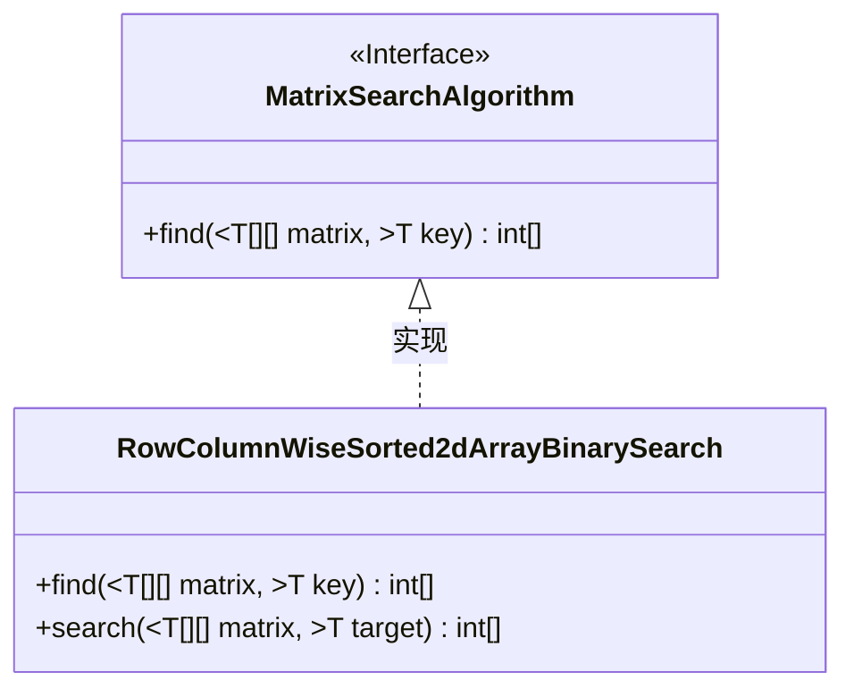
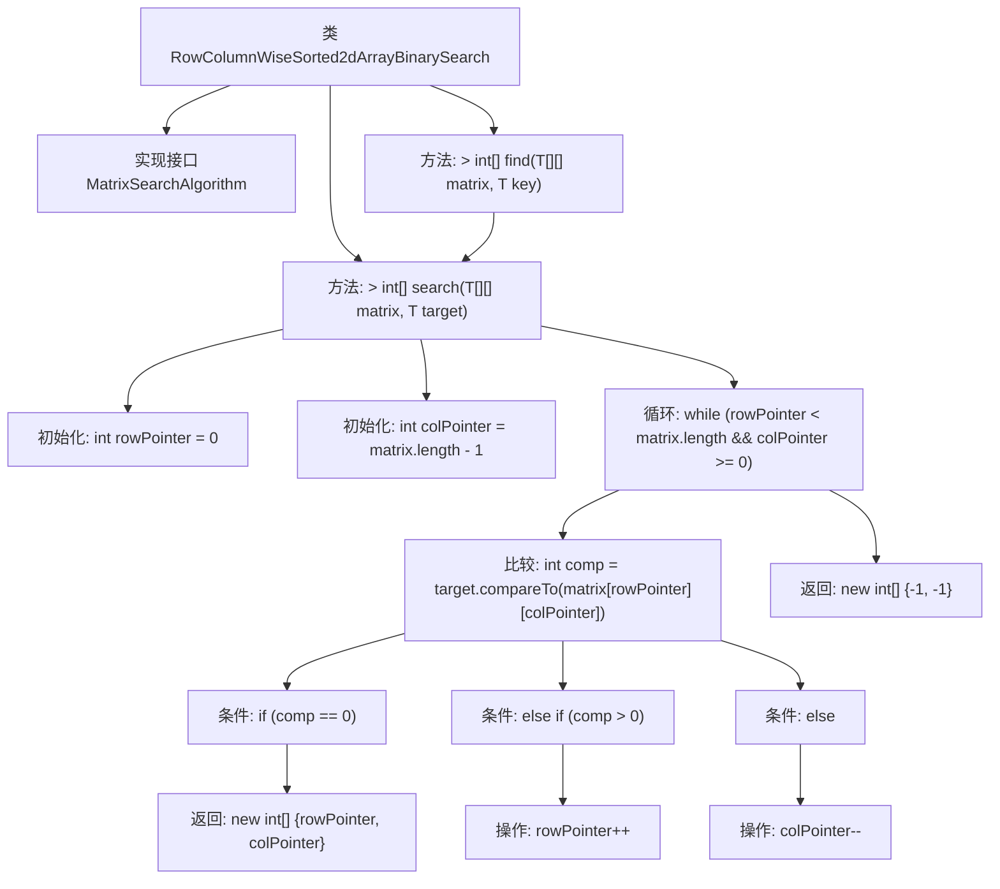

# 基础信息

|      |      |
|------|------|
| 名称 | RowColumnWiseSorted2dArrayBinarySearch |
| 编码语言 | .java |
| 代码路径 | Java/src/main/java/com/thealgorithms/searches/RowColumnWiseSorted2dArrayBinarySearch.java |
| 包名 | com.thealgorithms.searches |
| 依赖项 | ['com.thealgorithms.devutils.searches.MatrixSearchAlgorithm'] |
| 概述说明 | 二维数组行列排序后应用二分查找算法。 |

# 说明

实现二维数组行列排序后的二分查找算法，首先需要对二维数组进行行列排序，确保每一行和每一列都按照升序排列。排序完成后，采用二分查找算法在排序后的二维数组中查找目标元素。该算法通过不断缩小查找范围，利用行列排序的特性，高效地定位目标元素。整个过程包括初始化、范围划分、中间值比较和范围调整等步骤，最终确定目标元素是否存在及其位置。

# 类列表 Class Summary

| 名称   | 类型  | 说明 |
|-------|------|-------------|
| RowColumnWiseSorted2dArrayBinarySearch | class | 实现二维数组行列排序后的二分查找算法。 |

## 类 RowColumnWiseSorted2dArrayBinarySearch

|      |      |
|------|------|
| 访问范围 | public |
| 类型 | class |
| 名称 | RowColumnWiseSorted2dArrayBinarySearch |
| 说明 | 实现二维数组行列排序后的二分查找算法。 |

### UML类图

类图描述：  
`RowColumnWiseSorted2dArrayBinarySearch` 类实现了 `MatrixSearchAlgorithm` 接口，提供了在二维有序数组中查找目标元素的功能。该类包含两个方法：`find` 方法用于调用 `search` 方法，`search` 方法通过行指针和列指针的移动，逐步缩小搜索范围，最终返回目标元素的位置或未找到的标识。

### 内部方法调用关系图

这段代码实现了一个在二维数组中进行二分查找的算法。类`RowColumnWiseSorted2dArrayBinarySearch`实现了`MatrixSearchAlgorithm`接口，并提供了`find`和`search`两个方法。`search`方法通过初始化行指针和列指针，逐步比较目标值与当前指针指向的元素，根据比较结果移动指针，直到找到目标值或遍历完整个数组。如果找到目标值，返回其位置；否则返回`{-1, -1}`表示未找到。

### 字段列表 Field List

| 名称  | 类型  | 说明 |
|-------|-------|------|

### 方法列表 Method List

| 名称  | 类型  | 说明 |
|-------|-------|------|
| find | int[] | 重写find方法，使用泛型比较矩阵元素并返回搜索结果。 |
| search | int[] | 二维矩阵中查找目标值的行列指针搜索算法。 |

