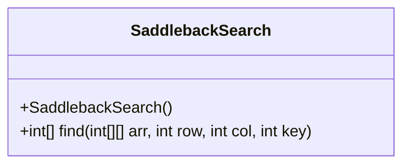
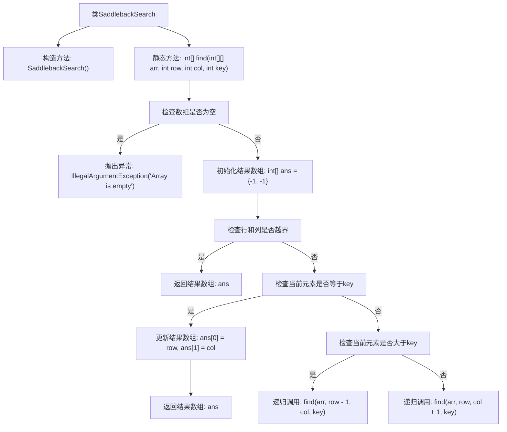

# 基础信息

|      |      |
|------|------|
| 名称 | SaddlebackSearch |
| 编码语言 | .java |
| 代码路径 | Java/src/main/java/com/thealgorithms/searches/SaddlebackSearch.java |
| 包名 | com.thealgorithms.searches |
| 依赖项 | [] |
| 概述说明 | SaddlebackSearch类通过递归查找有序二维数组中元素的索引。 |

# 说明

SaddlebackSearch类设计用于在有序的二维数组中递归查找特定元素的索引。该算法通过递归方式遍历数组，利用数组的有序特性，逐步缩小搜索范围，最终定位目标元素的位置并返回其索引。这种方法在处理有序二维数组时，能够高效地找到所需元素，适用于需要快速检索的场景。

# 类列表 Class Summary

| 名称   | 类型  | 说明 |
|-------|------|-------------|
| SaddlebackSearch | class | SaddlebackSearch类实现递归查找有序二维数组中元素的索引。 |

## 类 SaddlebackSearch

|      |      |
|------|------|
| 访问范围 | public final |
| 类型 | class |
| 名称 | SaddlebackSearch |
| 说明 | SaddlebackSearch类实现递归查找有序二维数组中元素的索引。 |

### UML类图

**描述：**  
`SaddlebackSearch` 类是一个用于在二维排序数组中执行鞍背搜索的工具类。该类包含一个私有构造函数，防止实例化，以及一个静态方法 `find`，用于在给定的二维数组中查找指定元素的位置。如果数组为空，方法会抛出 `IllegalArgumentException`。方法通过递归地在数组中进行搜索，根据当前元素与目标值的大小关系，决定向上或向右移动，最终返回找到的元素的行列索引，若未找到则返回 `[-1, -1]`。

### 内部方法调用关系图

这段代码实现了Saddleback搜索算法，用于在二维排序数组中查找特定元素。代码首先检查数组是否为空，若为空则抛出异常。接着初始化结果数组，并检查当前元素是否等于目标值。若等于，则返回当前索引；若当前元素大于目标值，则向上递归搜索；否则向右递归搜索。流程图清晰地展示了算法的执行流程和递归调用关系。

### 字段列表 Field List

| 名称  | 类型  | 说明 |
|-------|-------|------|

### 方法列表 Method List

| 名称  | 类型  | 说明 |
|-------|-------|------|
| find | int[] | 查找二维数组中指定元素的位置，递归实现。 |

