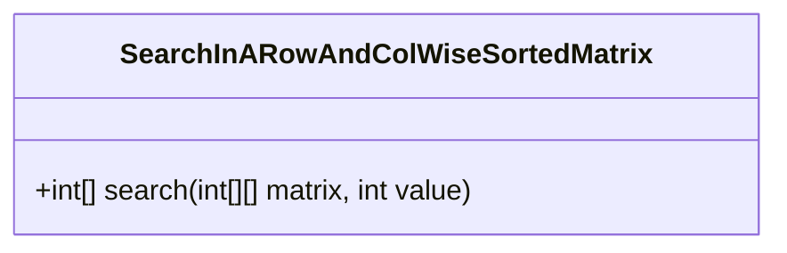
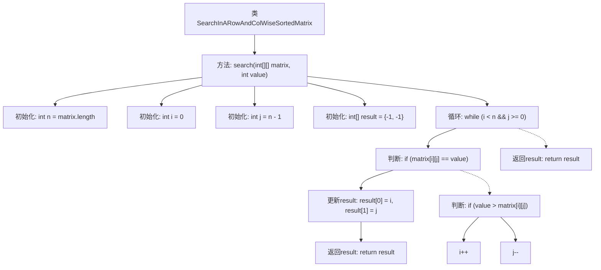

# 基础信息

|      |      |
|------|------|
| 名称 | SearchInARowAndColWiseSortedMatrix |
| 编码语言 | .java |
| 代码路径 | Java/src/main/java/com/thealgorithms/searches/SearchInARowAndColWiseSortedMatrix.java |
| 包名 | com.thealgorithms.searches |
| 依赖项 | [] |
| 概述说明 | 行列排序矩阵中搜索指定值的高效算法。 |

# 说明

在行列排序矩阵中搜索指定值的算法是一种高效的搜索方法，适用于矩阵中每行和每列都按升序排列的情况。该算法通过从矩阵的右上角或左下角开始，逐步缩小搜索范围。每次比较当前元素与目标值，若当前元素大于目标值，则向左移动一列；若小于目标值，则向下移动一行。通过这种方式，算法能够快速定位目标值或确定其不存在，时间复杂度为O(m+n)，其中m和n分别为矩阵的行数和列数。

# 类列表 Class Summary

| 名称   | 类型  | 说明 |
|-------|------|-------------|
| SearchInARowAndColWiseSortedMatrix | class | 在行列排序矩阵中搜索指定值的算法。 |

## 类 SearchInARowAndColWiseSortedMatrix

|      |      |
|------|------|
| 访问范围 | public |
| 类型 | class |
| 名称 | SearchInARowAndColWiseSortedMatrix |
| 说明 | 在行列排序矩阵中搜索指定值的算法。 |

### UML类图

这段代码定义了一个名为 `SearchInARowAndColWiseSortedMatrix` 的类，其中包含一个公有方法 `search`，用于在行和列都已排序的二维矩阵中查找特定的值。该方法通过从矩阵的右上角开始，逐步缩小搜索范围，最终返回目标值的位置。如果未找到目标值，则返回 `[-1, -1]`。该算法的时间复杂度为 O(n)，其中 n 是矩阵的行数或列数。

### 内部方法调用关系图

该流程图描述了在行列有序的二维矩阵中搜索特定值的过程。首先初始化矩阵的行数和列数，然后从矩阵的右上角开始搜索。如果当前元素等于目标值，则返回其位置；如果目标值大于当前元素，则向下移动一行；否则向左移动一列。如果遍历完矩阵仍未找到目标值，则返回默认的无效位置。该算法利用了矩阵的有序性，通过逐步缩小搜索范围来提高效率。

### 字段列表 Field List

| 名称  | 类型  | 说明 |
|-------|-------|------|

### 方法列表 Method List

| 名称  | 类型  | 说明 |
|-------|-------|------|
| search | int[] | 二维矩阵中查找指定值的行列索引。 |

