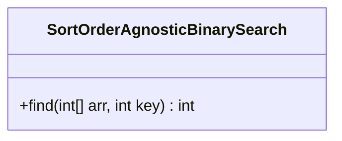
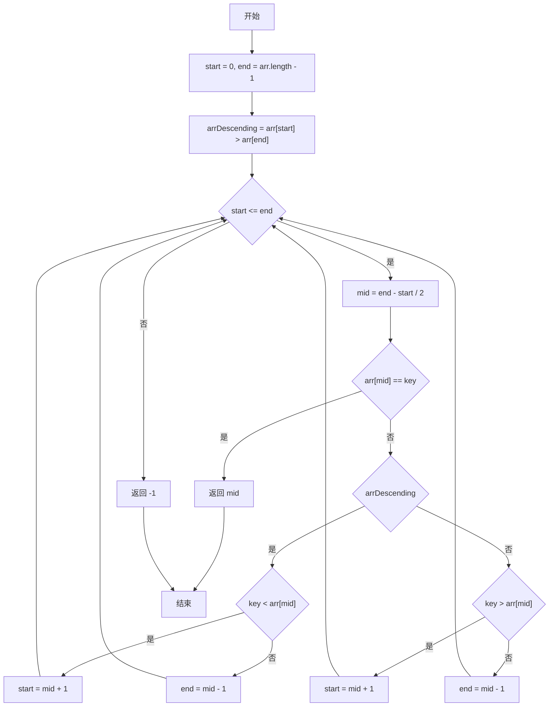
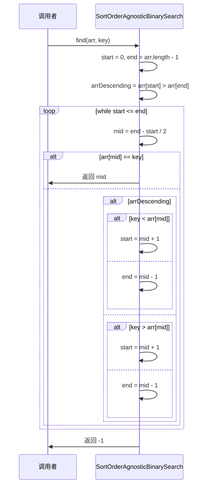
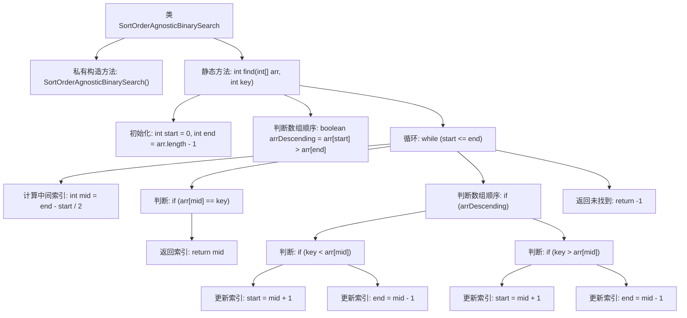

# 基础信息

|      |      |
|------|------|
| 名称 | SortOrderAgnosticBinarySearch |
| 编码语言 | .java |
| 代码路径 | Java/src/main/java/com/thealgorithms/searches/SortOrderAgnosticBinarySearch.java |
| 包名 | com.thealgorithms.searches |
| 依赖项 | [] |
| 概述说明 | 忽略顺序的二分查找实现。 |

# 说明

忽略排序顺序的二分查找实现是一种改进的二分查找算法，它不依赖于输入数组的排序状态。传统二分查找要求数组必须有序，而这种实现通过调整查找策略，能够在未排序的数组中有效定位目标元素。该算法通过逐步缩小搜索范围，结合特定的比较逻辑，确保即使数组无序也能准确找到目标。这种方法在某些场景下提高了查找效率，尤其适用于无法预先排序或排序成本较高的数据集。

# 类列表 Class Summary

| 名称   | 类型  | 说明 |
|-------|------|-------------|
| SortOrderAgnosticBinarySearch | class | 忽略排序顺序的二分查找实现。 |

## 类 SortOrderAgnosticBinarySearch

|      |      |
|------|------|
| 访问范围 | public final |
| 类型 | class |
| 名称 | SortOrderAgnosticBinarySearch |
| 说明 | 忽略排序顺序的二分查找实现。 |

### UML类图

**描述：**  
`SortOrderAgnosticBinarySearch` 类提供了一个静态方法 `find`，用于在不确定数组排序顺序的情况下进行二分查找。该方法首先检查数组是升序还是降序，然后根据排序顺序调整查找逻辑。如果找到目标值，则返回其索引；否则返回 -1。流程图和时序图详细展示了该方法的执行过程，包括初始条件设置、循环查找以及不同排序顺序下的分支处理。

### 内部方法调用关系图

这段代码实现了一个与排序顺序无关的二分查找算法。首先，代码通过比较数组的第一个和最后一个元素来判断数组是升序还是降序。然后，根据数组的顺序调整查找逻辑，在每次迭代中计算中间索引并与目标值比较，直到找到目标值或搜索范围缩小到零。如果找到目标值，返回其索引；否则返回-1。

### 字段列表 Field List

| 名称  | 类型  | 说明 |
|-------|-------|------|

### 方法列表 Method List

| 名称  | 类型  | 说明 |
|-------|-------|------|
| find | int | 二分查找算法，支持升序和降序数组。 |

