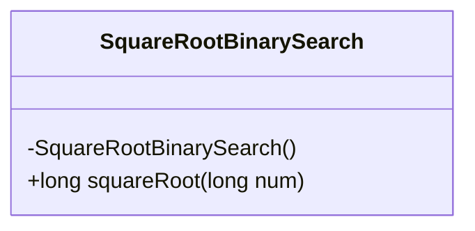
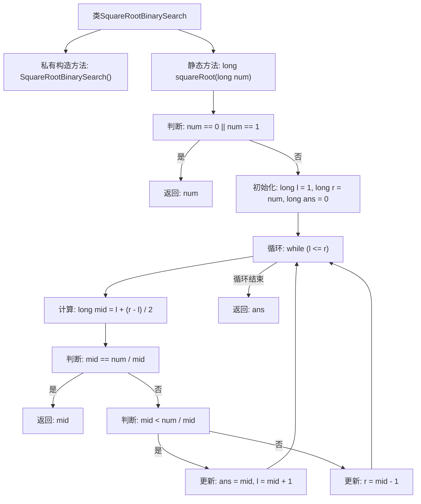

# 基础信息

|      |      |
|------|------|
| 名称 | SquareRootBinarySearch |
| 编码语言 | .java |
| 代码路径 | Java/src/main/java/com/thealgorithms/searches/SquareRootBinarySearch.java |
| 包名 | com.thealgorithms.searches |
| 依赖项 | [] |
| 概述说明 | 二分查找算法计算平方根整数部分。 |

# 说明

该方法利用二分查找算法计算给定数字的平方根的整数部分。通过不断缩小查找范围，确定平方根所在区间，最终找到最接近且不大于实际平方根的整数。该算法具有较高的效率，适用于大规模计算，确保结果准确且计算过程优化。

# 类列表 Class Summary

| 名称   | 类型  | 说明 |
|-------|------|-------------|
| SquareRootBinarySearch | class | 使用二分查找算法计算数字的平方根整数部分。 |

## 类 SquareRootBinarySearch

|      |      |
|------|------|
| 访问范围 | public final |
| 类型 | class |
| 名称 | SquareRootBinarySearch |
| 说明 | 使用二分查找算法计算数字的平方根整数部分。 |

### UML类图

这段代码定义了一个名为 `SquareRootBinarySearch` 的类，该类包含一个私有构造函数和一个静态方法 `squareRoot`。`squareRoot` 方法通过二分查找算法计算给定数字的平方根的整数部分。该方法首先处理特殊情况（`num` 为 0 或 1），然后通过二分查找逐步缩小范围，最终返回最接近的平方根值。该类的设计确保其不能被实例化，所有功能通过静态方法提供。

### 内部方法调用关系图

这段代码实现了一个通过二分查找算法计算给定数字的平方根的函数。代码首先检查输入数字是否为0或1，如果是则直接返回该数字。否则，它初始化左右边界和答案变量，然后在循环中计算中间值并根据中间值与目标值的关系更新边界和答案。最终，循环结束后返回计算得到的平方根。

### 字段列表 Field List

| 名称  | 类型  | 说明 |
|-------|-------|------|

### 方法列表 Method List

| 名称  | 类型  | 说明 |
|-------|-------|------|
| squareRoot | long | 静态方法计算长整型数的平方根，使用二分查找法。 |

