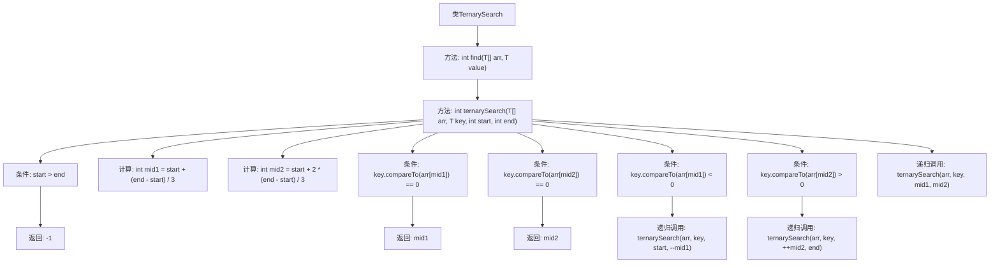

# 基础信息

|      |      |
|------|------|
| 名称 | TernarySearch |
| 编码语言 | .java |
| 代码路径 | Java/src/main/java/com/thealgorithms/searches/TernarySearch.java |
| 包名 | com.thealgorithms.searches |
| 依赖项 | ['com.thealgorithms.devutils.searches.SearchAlgorithm'] |
| 概述说明 | TernarySearch类实现二分查找，返回有序数组中元素索引或-1。 |

# 说明

TernarySearch类实现了一种改进的二分查找算法，专门用于在有序数组中查找特定元素。该算法通过将搜索区间分为三部分，而非传统的两部分，从而在某些情况下能更高效地定位目标元素。如果找到目标元素，则返回其在数组中的索引；如果未找到，则返回-1表示元素不存在。该方法适用于需要快速查找的有序数据集。

# 类列表 Class Summary

| 名称   | 类型  | 说明 |
|-------|------|-------------|
| TernarySearch | class | TernarySearch类实现二分查找，支持在有序数组中查找元素，返回索引或-1。 |


## 类 TernarySearch

|      |      |
|------|------|
| 访问范围 | public |
| 类型 | class |
| 名称 | TernarySearch |
| 说明 | TernarySearch类实现二分查找，支持在有序数组中查找元素，返回索引或-1。 |


### UML类图

```mermaid
classDiagram
    class SearchAlgorithm {
        <<Interface>>
        +find(T[] arr, T value) int
    }

    class TernarySearch {
        +find(T[] arr, T value) int
        -ternarySearch(T[] arr, T key, int start, int end) int
    }

    SearchAlgorithm <|.. TernarySearch // 实现
```

**描述：**  
`TernarySearch` 类实现了 `SearchAlgorithm` 接口，提供了三元搜索算法的实现。三元搜索算法通过将数组分为三个部分来递归地查找目标值。`find` 方法是公有方法，调用私有的 `ternarySearch` 方法进行递归搜索。`ternarySearch` 方法根据目标值与数组中间两个边界值的比较结果，决定在数组的哪一部分继续搜索。如果找到目标值，返回其索引；否则返回 -1。


### 内部方法调用关系图



这段代码实现了一个三分查找算法，用于在已排序的数组中查找指定元素。`find`方法调用`ternarySearch`方法进行递归查找，`ternarySearch`方法通过将数组分为三个部分来缩小查找范围，直到找到目标元素或确定元素不存在。流程图展示了方法的调用关系和递归逻辑，清晰地描述了算法的执行流程。

### 字段列表 Field List

| 名称  | 类型  | 说明 |
|-------|-------|------|

### 方法列表 Method List

| 名称  | 类型  | 说明 |
|-------|-------|------|
| find | int | 重写find方法，使用三元搜索查找数组中的指定值。 |
| ternarySearch | int | 三分搜索算法，递归查找数组中指定元素的位置。 |


