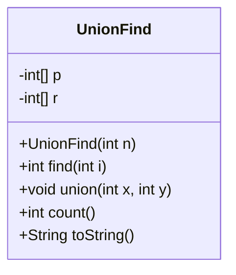
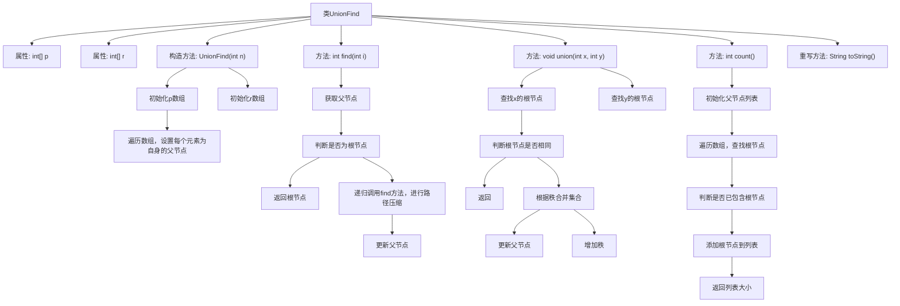

# 基础信息

|      |      |
|------|------|
| 名称 | UnionFind |
| 编码语言 | .java |
| 代码路径 | Java/src/main/java/com/thealgorithms/searches/UnionFind.java |
| 包名 | com.thealgorithms.searches |
| 依赖项 | ['java.util.ArrayList', 'java.util.Arrays', 'java.util.List'] |
| 概述说明 | 并查集支持初始化、查找、合并和计数操作。 |

# 说明

并查集是一种数据结构，主要用于处理不相交集合的合并与查询问题。它支持初始化操作，用于创建并初始化多个独立的集合。查找操作用于确定某个元素所属的集合，通常通过路径压缩优化以提高效率。合并操作用于将两个集合合并为一个集合，通常通过按秩合并或按大小合并优化。计数操作用于统计当前集合的总数或某个集合的大小。并查集广泛应用于图论、网络连接和动态连通性等问题中。

# 类列表 Class Summary

| 名称   | 类型  | 说明 |
|-------|------|-------------|
| UnionFind | class | 并查集数据结构，支持初始化、查找、合并和计数操作。 |

## 类 UnionFind

|      |      |
|------|------|
| 访问范围 | public |
| 类型 | class |
| 名称 | UnionFind |
| 说明 | 并查集数据结构，支持初始化、查找、合并和计数操作。 |

### UML类图

这段代码定义了一个 `UnionFind` 类，用于实现并查集数据结构。并查集主要用于处理不相交集合的合并与查询问题。类中包含两个私有数组 `p` 和 `r`，分别表示每个元素的父节点和秩（树的深度）。`find` 方法通过路径压缩优化查找操作，`union` 方法通过按秩合并优化合并操作，`count` 方法用于计算不相交集合的数量，`toString` 方法用于输出当前并查集的状态。该类提供了高效的集合合并与查询操作，适用于需要动态维护集合关系的场景。

### 内部方法调用关系图

这段代码实现了一个并查集（Union-Find）数据结构，用于管理元素的集合合并与查询操作。代码通过路径压缩和按秩合并来优化性能，使得查找和合并操作的时间复杂度接近常数。流程图展示了类的结构、方法的调用关系以及每个方法内部的详细步骤，帮助理解代码的执行流程。

### 字段列表 Field List

| 名称  | 类型  | 说明 |
|-------|-------|------|
| r | int[] | 声明一个私有的整型数组变量r。 |
| p | int[] | 声明一个私有且不可变的整型数组p。 |

### 方法列表 Method List

| 名称  | 类型  | 说明 |
|-------|-------|------|
| count | int | 该方法统计并返回列表中不同根节点的数量。 |
| toString | String | 重写toString方法，返回p和r数组的字符串表示。 |
| union | void | 合并操作：通过秩优化，将两个集合合并，避免树过高。 |
| find | int | 该方法实现路径压缩，递归查找父节点并更新父节点为根节点。 |

