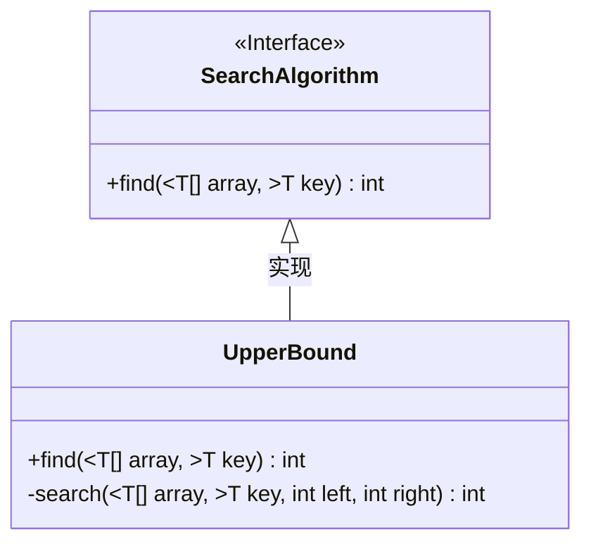
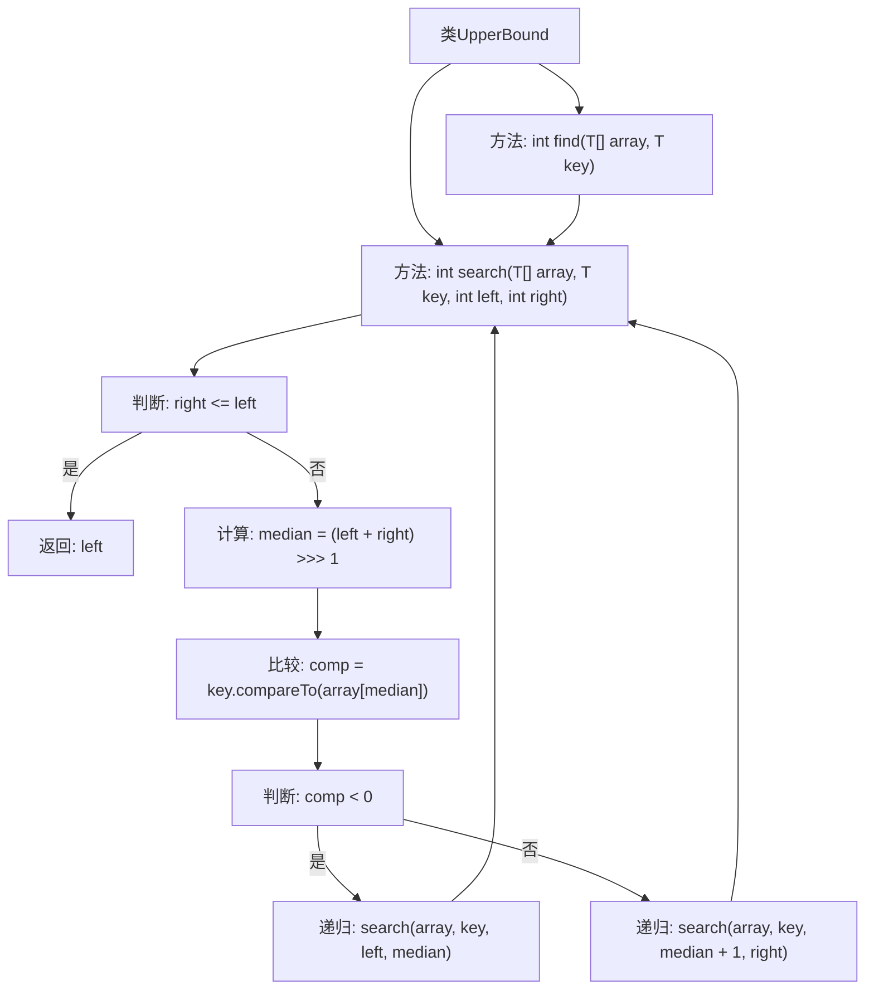

# 基础信息

|      |      |
|------|------|
| 名称 | UpperBound |
| 编码语言 | .java |
| 代码路径 | Java/src/main/java/com/thealgorithms/searches/UpperBound.java |
| 包名 | com.thealgorithms.searches |
| 依赖项 | ['com.thealgorithms.devutils.searches.SearchAlgorithm'] |
| 概述说明 | UpperBound类通过二分查找算法在有序数组中确定目标值的上界位置。 |

# 说明

UpperBound类实现了二分查找算法，专门用于在有序数组中查找目标值的上界位置。该算法通过高效地缩小搜索范围，快速定位目标值在数组中的上界，确保在有序数组中的查找操作具有较高的性能。

# 类列表 Class Summary

| 名称   | 类型  | 说明 |
|-------|------|-------------|
| UpperBound | class | UpperBound类实现二分查找算法，用于在有序数组中查找目标值的上界位置。 |

## 类 UpperBound

|      |      |
|------|------|
| 访问范围 | None |
| 类型 | class |
| 名称 | UpperBound |
| 说明 | UpperBound类实现二分查找算法，用于在有序数组中查找目标值的上界位置。 |

### UML类图

这段代码定义了一个名为 `UpperBound` 的类，该类实现了 `SearchAlgorithm` 接口。`UpperBound` 类中的 `find` 方法用于在给定数组中查找某个元素的“上界”位置，即第一个大于该元素的索引。该方法通过调用私有的 `search` 方法实现了一个泛型的二分查找算法。`search` 方法递归地在数组的左右边界之间查找目标元素，并根据比较结果调整搜索范围。最终，`search` 方法返回目标元素的上界位置。这段代码展示了如何使用二分查找算法高效地解决查找问题。

### 内部方法调用关系图

这段代码实现了一个泛型的上界查找算法，基于二分查找的思想。`UpperBound`类包含两个方法：`find`和`search`。`find`方法调用`search`方法，`search`方法通过递归不断缩小查找范围，直到找到上界或确定不存在。流程图展示了方法的调用关系和递归过程，帮助理解算法的执行流程。

### 字段列表 Field List

| 名称  | 类型  | 说明 |
|-------|-------|------|

### 方法列表 Method List

| 名称  | 类型  | 说明 |
|-------|-------|------|
| search | int | 递归二分查找，返回目标位置或插入点。 |
| find | int | 重写find方法，使用泛型搜索数组中指定元素。 |

