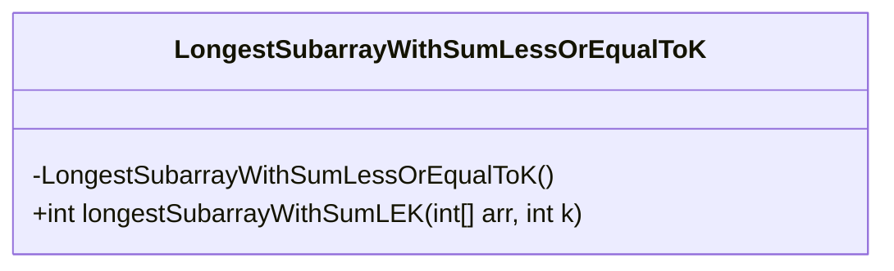
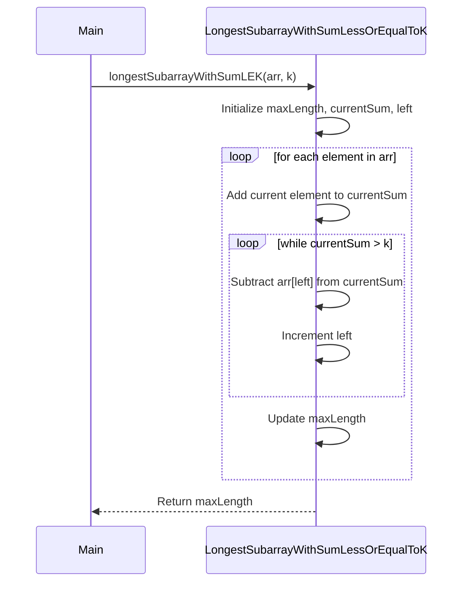
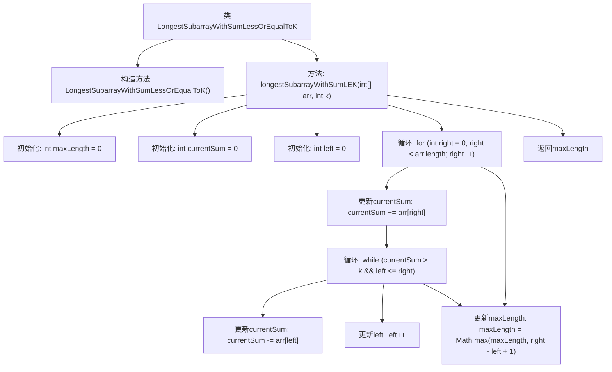

# 基础信息

|      |      |
|------|------|
| 名称 | LongestSubarrayWithSumLessOrEqualToK |
| 编码语言 | .java |
| 代码路径 | Java/src/main/java/com/thealgorithms/slidingwindow/LongestSubarrayWithSumLessOrEqualToK.java |
| 包名 | com.thealgorithms.slidingwindow |
| 依赖项 | [] |
| 概述说明 | 求数组中和不超过k的最长子数组长度。 |

# 说明

该问题要求在一个数组中找到一个子数组，使得该子数组的元素之和小于或等于给定的整数k，并且该子数组的长度是所有满足条件的子数组中最长的。解决这个问题需要遍历数组，计算不同子数组的和，并比较这些子数组的长度，以确定最长的符合条件的子数组。关键在于高效地计算子数组和，并确保在遍历过程中找到最优解。

# 类列表 Class Summary

| 名称   | 类型  | 说明 |
|-------|------|-------------|
| LongestSubarrayWithSumLessOrEqualToK | class | 查找数组中子数组和小于等于k的最长长度。 |

## 类 LongestSubarrayWithSumLessOrEqualToK

|      |      |
|------|------|
| 访问范围 | public final |
| 类型 | class |
| 名称 | LongestSubarrayWithSumLessOrEqualToK |
| 说明 | 查找数组中子数组和小于等于k的最长长度。 |

### UML类图

**描述：**  
`LongestSubarrayWithSumLessOrEqualToK` 类包含一个静态方法 `longestSubarrayWithSumLEK`，用于计算给定数组中满足子数组和小于或等于 `k` 的最长子数组的长度。该方法使用滑动窗口技术，通过调整窗口的左右边界来确保子数组和不超过 `k`，并在每次调整后更新最大长度。最终返回找到的最大长度。

### 内部方法调用关系图

这段代码实现了一个滑动窗口算法，用于找到数组中子数组和小于或等于给定值k的最长子数组的长度。代码通过维护一个滑动窗口来动态调整窗口的大小，确保窗口内的和始终小于或等于k。通过不断更新窗口的左右边界，并计算当前窗口的长度，最终返回满足条件的最长子数组的长度。

### 字段列表 Field List

| 名称  | 类型  | 说明 |
|-------|-------|------|

### 方法列表 Method List

| 名称  | 类型  | 说明 |
|-------|-------|------|
| longestSubarrayWithSumLEK | int | 滑动窗口算法求和不大于k的最长子数组长度。 |

