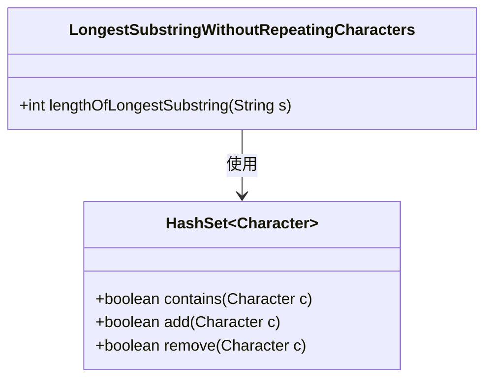
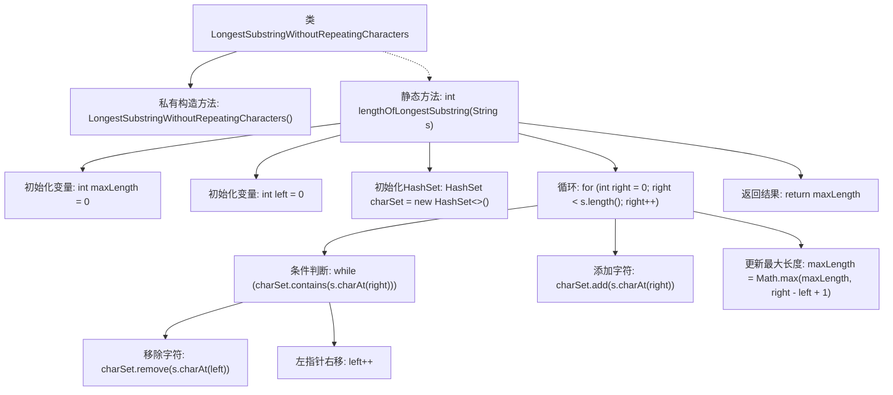

# 基础信息

|      |      |
|------|------|
| 名称 | LongestSubstringWithoutRepeatingCharacters |
| 编码语言 | .java |
| 代码路径 | Java/src/main/java/com/thealgorithms/slidingwindow/LongestSubstringWithoutRepeatingCharacters.java |
| 包名 | com.thealgorithms.slidingwindow |
| 依赖项 | ['java.util.HashSet'] |
| 概述说明 | 计算字符串中无重复字符的最长子串长度。 |

# 说明

该方法旨在计算给定字符串中不包含重复字符的最长子串的长度。通过遍历字符串，动态跟踪当前子串的字符及其位置，确保无重复字符出现。当检测到重复字符时，调整子串的起始位置，并继续搜索更长的不重复子串。最终，该方法返回最长无重复字符子串的长度。该算法适用于需要查找字符串中连续唯一字符序列的场景。

# 类列表 Class Summary

| 名称   | 类型  | 说明 |
|-------|------|-------------|
| LongestSubstringWithoutRepeatingCharacters | class | 该方法计算字符串中无重复字符的最长子串长度。 |

## 类 LongestSubstringWithoutRepeatingCharacters

|      |      |
|------|------|
| 访问范围 | public final |
| 类型 | class |
| 名称 | LongestSubstringWithoutRepeatingCharacters |
| 说明 | 该方法计算字符串中无重复字符的最长子串长度。 |

### UML类图

**描述：**
`LongestSubstringWithoutRepeatingCharacters` 类包含一个静态方法 `lengthOfLongestSubstring`，用于计算字符串中最长无重复字符子串的长度。该方法使用 `HashSet` 来存储字符，并通过滑动窗口技术来维护当前无重复字符的子串。`HashSet` 提供了高效的字符查找、添加和删除操作，确保算法的时间复杂度为 O(n)。

### 内部方法调用关系图

这段代码实现了一个名为 `LongestSubstringWithoutRepeatingCharacters` 的类，其中包含一个静态方法 `lengthOfLongestSubstring`，用于计算给定字符串中最长无重复字符子串的长度。该方法通过使用滑动窗口和哈希集合来跟踪字符的出现情况，确保子串中不包含重复字符。代码通过不断调整窗口的左右边界，更新最大长度，并最终返回结果。

### 字段列表 Field List

| 名称  | 类型  | 说明 |
|-------|-------|------|

### 方法列表 Method List

| 名称  | 类型  | 说明 |
|-------|-------|------|
| lengthOfLongestSubstring | int | 计算字符串中最长无重复字符子串的长度。 |

