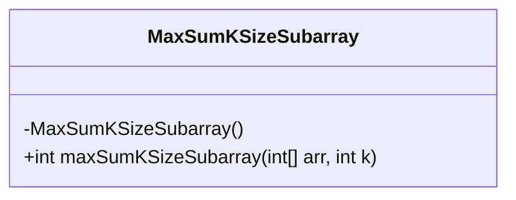
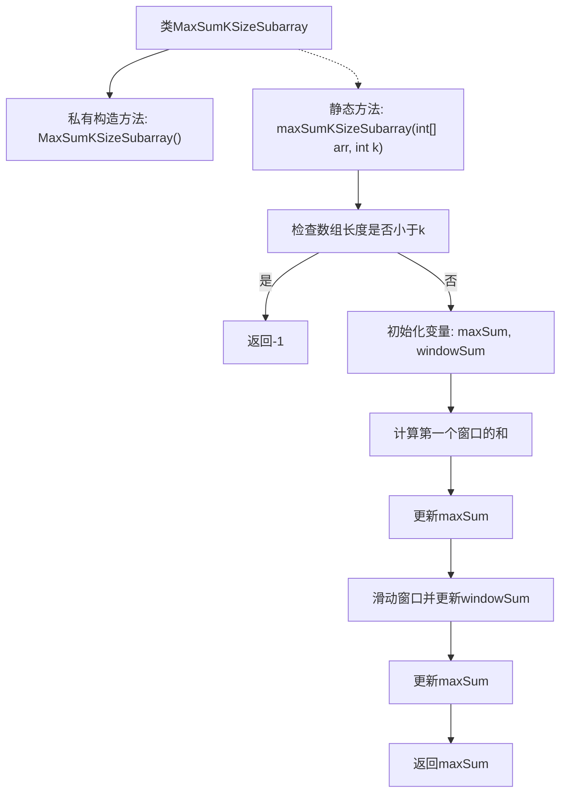

# 基础信息

|      |      |
|------|------|
| 名称 | MaxSumKSizeSubarray |
| 编码语言 | .java |
| 代码路径 | Java/src/main/java/com/thealgorithms/slidingwindow/MaxSumKSizeSubarray.java |
| 包名 | com.thealgorithms.slidingwindow |
| 依赖项 | [] |
| 概述说明 | 查找长度为k的子数组的最大和。 |

# 说明

查找大小为k的子数组的最大和，即在一个给定数组中，寻找所有长度为k的连续子数组，并计算这些子数组的元素之和，最终确定其中的最大值。这个问题通常用于处理需要分析固定长度窗口内数据的情况，例如在时间序列分析或滑动窗口算法中。解决该问题的方法包括暴力枚举所有可能的子数组并计算其和，或者通过优化算法如滑动窗口技术来减少计算复杂度，从而提高效率。

# 类列表 Class Summary

| 名称   | 类型  | 说明 |
|-------|------|-------------|
| MaxSumKSizeSubarray | class | 查找大小为k的子数组的最大和。 |

## 类 MaxSumKSizeSubarray

|      |      |
|------|------|
| 访问范围 | public final |
| 类型 | class |
| 名称 | MaxSumKSizeSubarray |
| 说明 | 查找大小为k的子数组的最大和。 |

### UML类图

**描述：**  
`MaxSumKSizeSubarray` 类是一个工具类，用于计算给定数组中大小为 `k` 的子数组的最大和。该类包含一个私有构造函数，防止实例化，并提供了一个静态方法 `maxSumKSizeSubarray`，该方法接收一个整数数组和子数组大小 `k` 作为参数，返回最大子数组和。方法首先处理边缘情况（数组长度小于 `k`），然后通过滑动窗口技术计算并更新最大和。

### 内部方法调用关系图

这段代码实现了一个名为`MaxSumKSizeSubarray`的类，该类包含一个静态方法`maxSumKSizeSubarray`，用于计算给定数组中大小为`k`的子数组的最大和。方法首先检查数组长度是否小于`k`，如果是则返回`-1`。接着，它计算第一个窗口的和，然后通过滑动窗口的方式更新窗口和，并最终返回最大和。流程图展示了该方法的执行流程，包括检查、初始化、计算、滑动窗口和返回结果等步骤。

### 字段列表 Field List

| 名称  | 类型  | 说明 |
|-------|-------|------|

### 方法列表 Method List

| 名称  | 类型  | 说明 |
|-------|-------|------|
| maxSumKSizeSubarray | int | 计算数组中长度为k的连续子数组的最大和。 |

