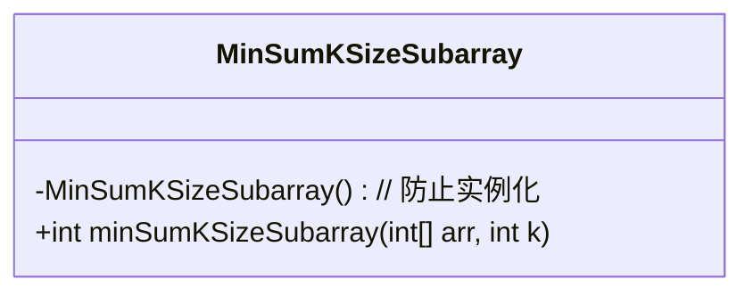
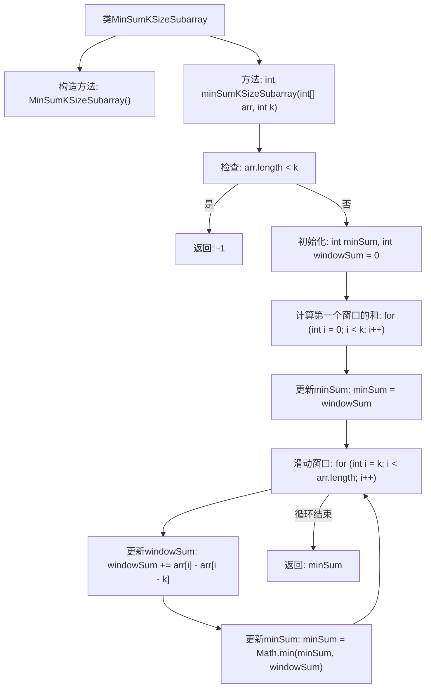

# 基础信息

|      |      |
|------|------|
| 名称 | MinSumKSizeSubarray |
| 编码语言 | .java |
| 代码路径 | Java/src/main/java/com/thealgorithms/slidingwindow/MinSumKSizeSubarray.java |
| 包名 | com.thealgorithms.slidingwindow |
| 依赖项 | [] |
| 概述说明 | 查找长度为k的子数组的最小和。 |

# 说明

查找大小为k的子数组的最小和，即在一个给定的数组中，寻找连续k个元素组成的子数组，使得这些元素的和最小。该问题要求遍历数组，计算所有可能的k大小子数组的和，并找出其中的最小值。关键在于高效地计算每个子数组的和，避免重复计算，通常可以通过滑动窗口技术来优化性能。最终目标是返回最小和的子数组的起始位置或和值。

# 类列表 Class Summary

| 名称   | 类型  | 说明 |
|-------|------|-------------|
| MinSumKSizeSubarray | class | 查找大小为k的子数组的最小和。 |

## 类 MinSumKSizeSubarray

|      |      |
|------|------|
| 访问范围 | public final |
| 类型 | class |
| 名称 | MinSumKSizeSubarray |
| 说明 | 查找大小为k的子数组的最小和。 |

### UML类图

这段代码定义了一个名为 `MinSumKSizeSubarray` 的类，该类包含一个私有构造函数以防止实例化，并提供了一个静态方法 `minSumKSizeSubarray`，用于计算给定数组中大小为 `k` 的子数组的最小和。该方法首先处理边缘情况，即数组长度小于 `k` 时返回 `-1`，然后通过滑动窗口技术计算每个窗口的和，并返回最小和。

### 内部方法调用关系图

这段代码实现了一个名为 `MinSumKSizeSubarray` 的类，其中包含一个静态方法 `minSumKSizeSubarray`，用于查找给定数组中大小为 `k` 的子数组的最小和。代码首先检查数组长度是否小于 `k`，如果是则返回 `-1`。接着，计算第一个窗口的和，然后通过滑动窗口的方式更新窗口和，并不断更新最小和。最终返回最小和。流程图展示了从类定义到方法执行的完整流程，包括边缘情况处理、窗口初始化和滑动窗口的过程。

### 字段列表 Field List

| 名称  | 类型  | 说明 |
|-------|-------|------|

### 方法列表 Method List

| 名称  | 类型  | 说明 |
|-------|-------|------|
| minSumKSizeSubarray | int | 计算数组中长度为k的子数组的最小和。 |

